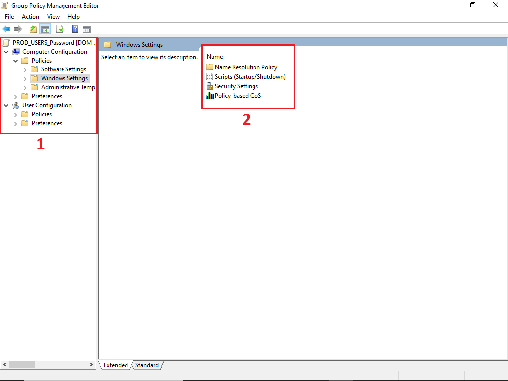
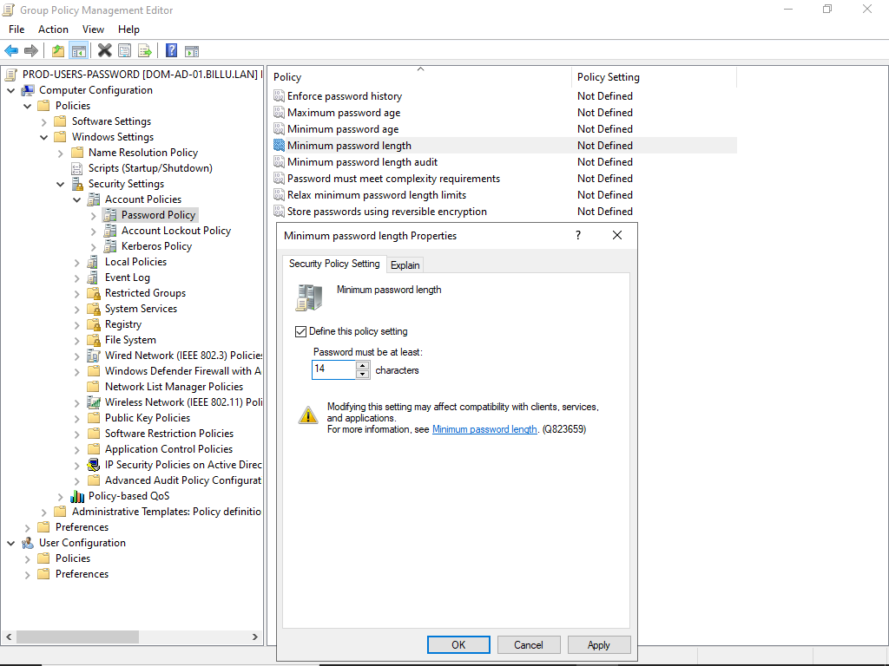
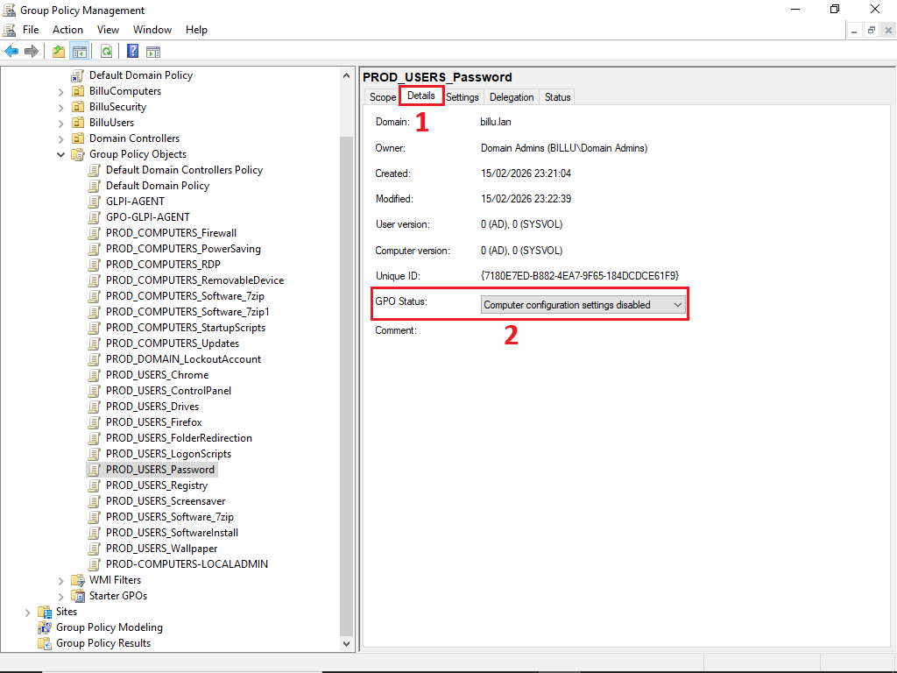

# Sommaire

1. [Structure organisationnelle (OU)](#1-structure-organisationnelle-ou)
   - [1.1 Arborescence des OU](#11-arborescence-des-ou)
      - [1.1.1 Sous-OU de BilluComputers](#111-sous-ou-de-billucomputers)
      - [1.1.2 Sous-OU de BilluUsers](#112-sous-ou-de-billuusers)
   - [1.2 Création des OU](#12-creation-des-ou)
   - [1.3 Création des sous-OU](#13-creation-des-sous-ou)
      - [1.3.1 Sous-OU de BilluComputers](#131-sous-ou-de-billucomputers)
      - [1.3.2 Sous-OU de BilluUsers](#132-sous-ou-de-billuusers)

2. [Création des utilisateurs](#2-creation-des-utilisateurs)
   - [2.1 Préparation du fichier CSV](#21-preparation-du-fichier-csv)
   - [2.2 Configuration du script](#22-configuration-du-script)
   - [2.3 Exécution du script](#23-execution-du-script)
   - [2.4 Vérification](#24-verification)

3. [Création des groupes](#3-creation-des-groupes)
   - [3.1 Arborescence des groupes de sécurité](#31-arborescence-des-groupes-de-securite)
   - [3.2 Création d’un groupe](#32-creation-dun-groupe)
   - [3.3 Liste des groupes à créer](#33-liste-des-groupes-a-creer)

4. [Stratégies de groupe (GPO)](#4-strategies-de-groupe-gpo)
   - [4.1 Création de GPO](#41-creation-de-gpo)
   - [4.2 GPO de sécurité](#42-gpo-de-securite)
   - [4.3 GPO standard](#43-gpo-standard)

5. [Délégation d’administration](#5-delegation-dadministration)

6. [Test et validation](#6-test-et-validation)


## 1. Structure organisationnelle (OU)

L'arborescence des Unités d'Organisation (OU) du domaine billu.lan a été conçue selon une approche fonctionnelle. La structure repose sur trois **OU** principales permettant une séparation claire des objets Active Directory par type et fonction.
#### 1.1 Arborescence des OU

| OU                 | Chemin DN                         | Objets contenus                                                  |
| ------------------ | --------------------------------- | ---------------------------------------------------------------- |
| **BilluComputers** | OU=BilluComputers,DC=billu,DC=lan | Comptes ordinateurs (workstations, laptops, serveurs membres)    |
| **BilluUsers**     | OU=BilluUsers,DC=billu,DC=lan     | Comptes utilisateurs (tous services confondus)                   |
| **BilluSecurity**  | OU=BilluSecurity,DC=billu,DC=lan  | Groupes de sécurité, groupes de distribution, comptes de service |

#### 1.1.1 Arborescense des sous-OU de BilluComputers

| Sous-OU           | Chemin DN                                          | Service                                |
| ----------------- | -------------------------------------------------- | -------------------------------------- |
| **DEV**           | OU=DEV,OU=BilluComputers,DC=billu,DC=lan           | Développement                          |
| **COMMERCIAL**    | OU=COMMERCIAL,OU=BilluComputers,DC=billu,DC=lan    | Commercial                             |
| **COMMUNICATION** | OU=COMMUNICATION,OU=BilluComputers,DC=billu,DC=lan | Communication                          |
| **JURIDIQUE**     | OU=JURIDIQUE,OU=BilluComputers,DC=billu,DC=lan     | Juridique                              |
| **DIRECTION**     | OU=DIRECTION,OU=BilluComputers,DC=billu,DC=lan     | Direction                              |
| **COMPTABILITE**  | OU=COMPTABILITE,OU=BilluComputers,DC=billu,DC=lan  | Comptabilité                           |
| **QHSE**          | OU=QHSE,OU=BilluComputers,DC=billu,DC=lan          | Qualité Hygiène Sécurité Environnement |
| **RH**            | OU=RH,OU=BilluComputers,DC=billu,DC=lan            | Ressources Humaines                    |
| **DSI**           | OU=DSI,OU=BilluComputers,DC=billu,DC=lan           | Direction des Systèmes d'Information   |

#### 1.1.2 Arborescence des sous-OU de BilluUsers

| Sous-OU           | Chemin DN                                      | Service                                |
| ----------------- | ---------------------------------------------- | -------------------------------------- |
| **DEV**           | OU=DEV,OU=BilluUsers,DC=billu,DC=lan           | Développement                          |
| **COMMERCIAL**    | OU=COMMERCIAL,OU=BilluUsers,DC=billu,DC=lan    | Commercial                             |
| **COMMUNICATION** | OU=COMMUNICATION,OU=BilluUsers,DC=billu,DC=lan | Communication                          |
| **JURIDIQUE**     | OU=JURIDIQUE,OU=BilluUsers,DC=billu,DC=lan     | Juridique                              |
| **DIRECTION**     | OU=DIRECTION,OU=BilluUsers,DC=billu,DC=lan     | Direction                              |
| **COMPTABILITE**  | OU=COMPTABILITE,OU=BilluUsers,DC=billu,DC=lan  | Comptabilité                           |
| **QHSE**          | OU=QHSE,OU=BilluUsers,DC=billu,DC=lan          | Qualité Hygiène Sécurité Environnement |
| **RH**            | OU=RH,OU=BilluUsers,DC=billu,DC=lan            | Ressources Humaines                    |
| **DSI**           | OU=DSI,OU=BilluUsers,DC=billu,DC=lan           | Direction des Systèmes d'Information   |

### 1.2 Création des OU

Dans le Server Manager ==> Dashboard :
- Cliquer sur **"Tools"** et **"Active Directory Users and Computers"**


- Dans le volet de gauche , clic droit sur **"billu.lan"**
- Sélectionner **"New"** ==> **"Organizational Unit"**


Dans la fênetre qui s'ouvre :
- Case **"Name"** : **"BilluComputers"**
- Cocher **"Protect container from accidental deletion"**
- Cliquer sur **"OK"**


**"OU"** BilluComputers à été créé.

Même procédure pour les autres **"OU"**
- Case **"Name"** : **"BilluUsers"**
- Case **"Name"** : **"BilluSecurity"**


Voila nos **"OU"** de créés dans la forêt de **"billu.lan"**.

#### 1.3 Création des sous-OU
#### 1.3.1 Création des sous-OU de BilluComputers

- Dans le volet de gauche , clic droit sur **"billuComputers"**
- Sélectionner **"New"** ==> **"Organizational Unit"**


Dans la fênetre qui s'ouvre :
- Case **"Name"** : **"DEV"**
- Cocher **"Protect container from accidental deletion"**
- Cliquer sur **"OK"**


La **"SOUS-OU"** **"DEV"** a été créé dans **"OU"** BilluComputers.

Même procédure pour les autres **"SOUS-OU"**
- Case **"Name"** : **"COMMERCIAL"**
- Case **"Name"** : **"COMMUNICATION"**
- Case **"Name"** : **"JURIDIQUE"**
-  Case **"Name"** : **"DIRECTION"**
-  Case **"Name"** : **"COMPTABILITE"**
-  Case **"Name"** : **"QHSE"**
-  Case **"Name"** : **"RH"**
-  Case **"Name"** : **"DSI"**


Voilà nos **"SOUS-OU"** de créés dans **"OU"** **"BilluComputers"**.

#### 1.3.2 Création des sous-OU de BilluUsers

- Dans le volet de gauche , clic droit sur **"billuUsers"**
- Sélectionner **"New"** ==> **"Organizational Unit"**


Dans la fênetre qui s'ouvre :
- Case **"Name"** : **"COMMERCIAL"**
- Cocher **"Protect container from accidental deletion"**
- Cliquer sur **"OK"**


La **"SOUS-OU"** **"COMMERCIAL"** a été créé dans **"OU"** BilluUsers.

Même procédure pour les autres **"SOUS-OU"**
-  Case **"Name"** : **"COMMUNICATION"**
-  Case **"Name"** : **"COMPTABILITE"**
-  Case **"Name"** : **"DEV"**
-  Case **"Name"** : **"DIRECTION"**
-  Case **"Name"** : **"DSI"**
-  Case **"Name"** : **"JURIDIQUE"**
-  Case **"Name"** : **"QHSE"**
-  Case **"Name"** : **"RH"**


Voilà nos **"SOUS-OU"** de créés dans **"OU"** **"BilluUsers"**.

---

## 2. Création des utilisateurs

La création des utilisateurs est automatisée via un script PowerShell qui importe les données depuis un fichier CSV.

#### 2.1 Préparation du fichier CSV

Le fichier CSV doit respecter le format suivant :
- **Délimiteur** : point-virgule ( ; )
- **Encodage** : UTF-8

**Exemple de structure :**

```csv
Prenom;Nom;Departement;Service;fonction;Societe;Telephone fixe;Telephone portable;Manager-Prenom;Manager-Nom
Jean;Dupont;Service Commercial;ADV;Responsable ADV;BillU;01 23 45 67 89;06 12 34 56 78;Marie;Martin
Sophie;Lefebvre;DSI;Support;Technicien Support;BillU;01 23 45 67 90;;Jean;Dupont
```

**Colonnes du fichier CSV :**

| Colonne | Description | Obligatoire |
|---------|-------------|-------------|
| Prenom | Prénom de l'utilisateur | Oui |
| Nom | Nom de famille | Oui |
| Departement | Département (doit correspondre au mapping) | Oui |
| Service | Service dans le département | Oui |
| fonction | Poste/fonction | Oui |
| Societe | Nom de la société | Oui |
| Telephone fixe | Numéro de téléphone fixe | Non |
| Telephone portable | Numéro de téléphone portable | Non |
| Manager-Prenom | Prénom du manager | Non |
| Manager-Nom | Nom du manager | Non |

#### 2.2 Configuration du script

Modifier les variables suivantes au début du script selon votre environnement :

```powershell
$SourceCSV = "C:\Scripts\s01_BillU.csv"    # Chemin du fichier CSV
$DomainDN = "DC=billU,DC=lan"              # DN du domaine
$DomainName = "@billU.lan"                  # Suffixe email
$DefaultPassword = "Azerty1*"               # Mot de passe par défaut
```

**Mapping des départements et services :**

Le script utilise des tables de correspondance pour mapper les noms vers les OU. Si un nouveau département ou service est ajouté, il doit être référencé dans les hashtables `$DepartementMapping` et `$ServiceMapping` du script.

#### 2.3 Exécution du script

1. Ouvrir **PowerShell en tant qu'administrateur**
2. Se placer dans le répertoire du script :

```powershell
cd C:\
```

3. Exécuter le script :

```powershell
.\Create-ADUsers.ps1
```

**Fonctionnement du script :**

Le script effectue automatiquement les actions suivantes :
- Génération du **SamAccountName** : `prenom.nom` (minuscules, sans accents, max 20 caractères)
- Génération de l'**UPN** : `prenom.nom@billU.lan`
- Placement de l'utilisateur dans la **bonne OU** selon son département et service
- Attribution du **mot de passe par défaut** (changement obligatoire à la première connexion)
- Attribution du **manager** si renseigné dans le CSV (en 2e passe)

#### 2.4 Vérification

**Via l'interface graphique :**
1. Ouvrir **Active Directory Users and Computers**
2. Naviguer vers `billu.lan > BilluUsers`
3. Vérifier que les utilisateurs sont placés dans les bonnes OU


---
# 3. Création des groupes

## 3.1. Arborescence des groupes de sécurité

Tous les groupes doivent être créés dans l'arborescence suivante :

```
OU=BilluSecurity
      └── Groupes GRP_DEP_*
      └── Groupes GRP_SVC_*
```

## 3.2. Comment créer un groupe ?

### Nomenclature

| Préfixe | Description |
|---------|-------------|
| `GRP_DEP_` | Groupe de département (contient les groupes de services) |
| `GRP_SVC_` | Groupe de service (contient les utilisateurs) |

### Procédure de création

Dans Active Directory Users and Computers :

- Faire un clic droit sur l'OU **BilluSecurity**
- Sélectionner **New > Group**
- Remplir les paramètres suivants :

| Paramètre | Valeur |
|-----------|--------|
| **Nom du groupe** | Selon la nomenclature (voir tableau ci-dessus) |
| **Type de groupe** | **Sécurité** |
| **Étendue du groupe** | **Globale** |

- Cliquer sur **OK**
- Répéter l'opération pour chaque groupe à créer (voir liste ci-dessous)
- Une fois les groupes créés, ajouter les membres de chaque service dans le groupe correspondant

---

## 3.3. Liste des groupes à créer

### Groupes de départements

```
GRP_DEP_COMMERCIAL_USERS
GRP_DEP_COMMUNICATION_USERS
GRP_DEP_COMPTABILITE_USERS
GRP_DEP_DEV_USERS
GRP_DEP_DIRECTION_USERS
GRP_DEP_DSI_USERS
GRP_DEP_DSI_COMPUTERS
GRP_DEP_JURIDIQUE_USERS
GRP_DEP_QHSE_USERS
GRP_DEP_RH_USERS
GRP_SEC_ADMIN_USERS
```

### Services COMMERCIAL

```
GRP_SVC_ADMINISTRATION_DES_VENTES_USERS
GRP_SVC_B2B_USERS
GRP_SVC_SERVICE_ACHAT_USERS
GRP_SVC_SERVICE_CLIENT_USERS
```

### Services COMMUNICATION

```
GRP_SVC_COMMUNICATION_INTERNE_USERS
GRP_SVC_GESTION_DES_MARQUES_USERS
GRP_SVC_RELATIONS_MEDIA_USERS
```

### Services COMPTABILITÉ

```
GRP_SVC_FINANCE_USERS
GRP_SVC_FISCALITE_USERS
GRP_SVC_SERVICE_COMPTABILITE_USERS
```

### Services DÉVELOPPEMENT

```
GRP_SVC_ANALYSE_CONCEPTION_USERS
GRP_SVC_DEVELOPPEMENT_USERS
GRP_SVC_RECHERCHE_PROTOTYPAGE_USERS
GRP_SVC_TESTS_QUALITE_USERS
```

### Services DIRECTION

```
GRP_SVC_DIRECTION_USERS
```

### Services DSI

```
GRP_SVC_ADMIN_USERS
GRP_SVC_ANALYSE_CONCEPTION_USERS
GRP_SVC_DEVELOPPEMENT_INTEGRATION_USERS
GRP_SVC_EXPLOITATION_USERS
GRP_SVC_SUPPORT_USERS
```

### Services JURIDIQUE

```
GRP_SVC_DROITS_DES_SOCIETES_USERS
GRP_SVC_PROPRIETES_INTELLECTUELLES_USERS
GRP_SVC_PROTECTION_DONNEES_CONFORMITES_USERS
```

### Services QHSE

```
GRP_SVC_CERTIFICATION_USERS
GRP_SVC_CONTROLE_QUALITE_USERS
GRP_SVC_GESTION_ENVIRONNEMENTALE_USERS
```

### Services RESSOURCES HUMAINES

```
GRP_SVC_RH_USERS
```

## 4. Stratégies de groupe (GPO)

### 4.1 Création de GPO

 **Cette partie de création de GPO est à titre d'exemple, suivre l'exemple pour créer chaque GPO du chapitre 4.2 et 4.3**

#### 4.1.1 Accès au menu des GPO
- Dans `Server Manager` cliquer sur `Tools` et `Group Policy Management`


#### 4.1.2 Création d'une GPO
1) Faire `Clic droit` sur `Domain Controllers`
2) Sélectionner `Create a GPO in this domain, and Link it here...`


#### 4.1.3 Nommage de la GPO
- Entrer le nom de la GPO en suivant la convention de nommage


#### 4.1.4 Accès à l'éditeur de GPO
1) Faire `Clic droit` sur la GPO créée
2) Sélectionner `Edit...` pour faire apparaitre la console `Group Policy Management Editor`


#### 4.1.5 Navigation dans les paramètres de la GPO

1) Naviguer dans le menu pour trouver l'emplacement du paramètre
2) Double-cliquer pour ouvrir un paramètre et l'éditer



#### 4.1.6 Portée de la GPO

1) Sélectionner l'onglet **Scope**
2) Choisir l'OU de **Liaison** (Links)
3) Choisir le ou les groupes/Utilisateurs/Ordinateurs pour le filtrage de la GPO.

- La GPO sera appliquée à l'OU de liaison ainsi qu'au filtrage ajouté. 



#### 4.1.7 Statut de la GPO

1) Sélectionner l'onglet **Détails**
2) Ajuster le statut de la GPO



#### 4.1.8 Vérification de l'application des GPO

**Forcer la mise à jour des GPO sur un ordinateur :**
```cmd
gpupdate /force
```

**Vérifier les GPO appliquées à l'ordinateur :**
```cmd
gpresult /r
```

**Générer un rapport HTML détaillé des GPO appliquées :**
```cmd
gpresult /h rapport_gpo.html
```

---  

### 4.2 GPO de sécurité

#### 4.2.1 Politique de mot de passe

**Nom :** `PROD_COMPUTERS_Password`

**Chemin de configuration :**
> Computer Configuration > Policies > Windows Settings > Security Settings > Account Policies > Password Policy

**Paramètres :**

| Paramètre | Valeur | Note |
|-----------|--------|------|
| Enforce password history | `24 passwords` | Empêche la réutilisation des 24 derniers mots de passe |
| Maximum password age | `90 days` | Renouvellement obligatoire tous les 90 jours |
| Minimum password age | `1 day` | Empêche le changement immédiat du mot de passe |
| Minimum password length | `12 characters` | Longueur minimale requise |
| Minimum password length audit | `12 characters` | Audit de longueur minimale des mots de passe | 
| Password must meet complexity requirements | `Enabled` | Doit contenir : majuscules, minuscules, chiffres et caractères spéciaux |
| Store passwords using reversible encryption | `Disabled` | Stockage sécurisé des mots de passe |

**Portée :**

| Propriété | Valeur |
|-----------|--------|
| Liaison | `BillU` |
| Filtrage | Authenticated Users |
| Cible | Computers |
| Statut | User configuration settings disabled |

---

#### 4.2.2 Verrouillage de compte

**Nom :** `PROD_COMPUTERS_LockoutAccount`

**Chemin de configuration :**
> Computer Configuration > Policies > Windows Settings > Security Settings > Account Policies > Account Lockout Policy

**Paramètres :**

| Paramètre | Valeur | Note |
|-----------|--------|------|
| Account lockout duration | `15 minutes` | Durée de verrouillage du compte |
| Account lockout threshold | `3 invalid attempts` | Nombre de tentatives avant verrouillage |
| Reset account lockout counter after | `15 minutes` | Réinitialisation du compteur d'échecs |

**Portée :**

| Propriété | Valeur |
|-----------|--------|
| Liaison | `BillU` |
| Filtrage | Authenticated Users |
| Cible | Computers |
| Statut | User configuration settings disabled |

---

#### 4.2.3 Restriction d'installation de logiciels

**Nom :** `PROD_COMPUTERS_RestrictionSoftwareInstall`

**Chemin de configuration :**
> Computer Configuration > Policies > Administrative Templates > Windows Components > Windows Installer

**Paramètres :**

| Paramètre | Valeur | Note |
|-----------|--------|------|
| Turn off Windows Installer | `Enabled` > `For non-managed applications only` | Autorise seulement les programmes approuvés | 
| Prohibit User Installs | `Enabled` > `Hide User Installs` | Empêche les installations per-user |

**Portée :**

| Propriété | Valeur |
|-----------|--------|
| Liaison | |
| Filtrage | Authenticated Users (sauf la DSI) |
| Cible | Computers |
| Statut | User configuration settings disabled |

---

#### 4.2.4 Gestion de Windows Update

**Nom :** `PROD_COMPUTERS_ConfigurationUpdates`

**Chemin de configuration :**
> Computer Configuration > Policies > Administrative Templates > Windows Components > Windows Update

**Paramètres :**

| Paramètre | Valeur | Note |
|-----------|--------|------|
| Turn off auto-restart for updates during active hours | `Enabled` > `8 AM` et `6 PM` | Empêche les redémarrages automatique après une MAJ pendant les heures actives |

> Computer Configuration > Policies > Administrative Templates > Windows Components > Windows Update > Configure Automatic Updates

| Paramètre | Valeur | Note |
|-----------|--------|------|
| Configure Automatic Updates | `Enabled` | Active la configuration centralisée |
| Configure automatic updating | `4 - Auto download and schedule the install` | Téléchargement auto et installation planifiée |
| Scheduled install day | `4 - Every Wednesday` | Jour d'installation |
| Scheduled install time | `06:00` | Heure d'installation planifiée |
| | `Second week on the month` | Deuxième semaine du mois |

**Portée :**

| Propriété | Valeur |
|-----------|--------|
| Liaison | `BillU > BilluComputers` |
| Filtrage | |
| Cible | Computers |
| Statut | User configuration settings disabled |

---

#### 4.2.5 Blocage de l'accès à la base de registre

**Nom :** `PROD_USERS_BlockBaseRegistry`

**Chemin de configuration :**
> User Configuration > Policies > Administrative Templates > System

**Paramètres :**

| Paramètre | Valeur | Note |
|-----------|--------|------|
| Prevent access to registry editing tools | `Enabled` > `Yes` | Bloque l'accès à regedit.exe et reg.exe sans message d'avertissement |

**Portée :**

| Propriété | Valeur |
|-----------|--------|
| Liaison | `BillU > BilluUsers` |
| Filtrage | Authenticated Users (exclure `Domain Admins`) |
| Cible | Users |
| Statut | Computer configuration settings disabled |

---

#### 4.2.6 Blocage du panneau de configuration

**Nom :** `PROD_USERS_RestrictionControlPanel`

**Chemin de configuration :**
> User Configuration > Policies > Administrative Templates > Control Panel

**Paramètres :**

| Paramètre | Valeur | Note |
|-----------|--------|------|
| Prohibit access to Control Panel and PC settings | `Enabled` | Bloque complètement l'accès au panneau de configuration |

**Portée :**

| Propriété | Valeur |
|-----------|--------|
| Liaison | `BillU > BilluUsers` |
| Filtrage | Authenticated Users (exclure les Admins) |
| Cible | Users |
| Statut | Computer configuration settings disabled |

---

#### 4.2.7 Restriction des périphériques amovibles

**Nom :** `PROD_COMPUTERS_RestrictionRemoveDevices`

**Chemin de configuration :**
> Computer Configuration > Policies > Administrative Templates > System > Removable Storage Access

**Paramètres :**

| Paramètre | Valeur | Note |
|-----------|--------|------|
| All Removable Storage classes: Deny all access | `Enabled` | Bloque tous les périphériques amovibles |

**Portée :**

| Propriété | Valeur |
|-----------|--------|
| Liaison | `BillU > BilluComputers` |
| Filtrage | |
| Cible | Computers |
| Statut | User configuration settings disabled |

---

#### 4.2.8 Gestion du pare-feu

**Nom :** `PROD_COMPUTERS_Firewall`

**Chemin de configuration :**
> Computer Configuration > Policies > Windows Settings > Security Settings > Windows Defender Firewall with Advanced Security > Windows Defender Firewall with Advanced Security

Clic droit > **Properties**

**Paramètres :**

**Domain Profile :**

| Paramètre | Valeur | Note |
|-----------|--------|------|
| Firewall state | `On` | Active le pare-feu |
| Inbound connections | `Block (default)` | Bloque par défaut |
| Outbound connections | `Allow (default)` | Autorise par défaut |

**Private Profile :**

| Paramètre | Valeur | Note |
|-----------|--------|------|
| Firewall state | `On` | Active le pare-feu |
| Inbound connections | `Block (default)` | Bloque par défaut |
| Outbound connections | `Allow (default)` | Autorise par défaut |

**Public Profile :**

| Paramètre | Valeur | Note |
|-----------|--------|------|
| Firewall state | `On` | Active le pare-feu |
| Inbound connections | `Block (default)` | Bloque par défaut |
| Outbound connections | `Allow (default)` | Autorise par défaut |

**Portée :**

| Propriété | Valeur |
|-----------|--------|
| Liaison | `BillU > BilluComputers` |
| Filtrage | |
| Cible | Computers |
| Statut | User configuration settings disabled |

---

#### 4.2.9 Écran de veille avec mot de passe

**Nom :** `PROD_USERS_ScreenSaver`

**Chemin de configuration :**
> User Configuration > Policies > Administrative Templates > Control Panel > Personalization

**Paramètres :**

| Paramètre | Valeur | Note |
|-----------|--------|------|
| Enable screen saver | `Enabled` | Active l'écran de veille |
| Password protect the screen saver | `Enabled` | Demande le mot de passe à la sortie |
| Screen saver timeout | `Enabled` > `900` | Définit le délai d'activation |
| Prevent changing screen saver | `Enabled` | Empêche la modification des paramètres |

**Portée :**

| Propriété | Valeur |
|-----------|--------|
| Liaison | `BillU > BilluUsers` |
| Filtrage | |
| Cible | Users |
| Statut | Computer configuration settings disabled |

---

#### 4.2.10 Bureau à distance sécurisé

**Nom :** `PROD_COMPUTERS_RDP`

**Chemin de configuration :**
> Computer Configuration > Policies > Administrative Templates > Windows Components > Remote Desktop Services > Remote Desktop Session Host > Connections

**Paramètres :**

| Paramètre | Valeur | Note |
|-----------|--------|------|
| Allow users to connect remotely by using Remote Desktop Services | `Enabled` | Active le bureau à distance |

**Portée :**

| Propriété | Valeur |
|-----------|--------|
| Liaison | `BillU > BilluComputers` |
| Filtrage | Authenticated Users |
| Cible | Computers |
| Statut | User configuration settings disabled |

---

#### 4.2.11 Scripts de démarrage

**Nom :** `PROD_COMPUTERS_StartupScripts`

**Chemin de configuration :**
> Computer Configuration > Policies > Windows Settings > Scripts (Startup/Shutdown) > Startup

Clic droit > **Properties** > **Add**

**Paramètres :**

| Paramètre | Valeur | Note |
|-----------|--------|------|
| Script Name | `\\DOM-AD-01\share\scripts\startup.bat` | Chemin du script |

**Portée :**

| Propriété | Valeur |
|-----------|--------|
| Liaison | `BillU > BilluComputers` |
| Filtrage | |
| Cible | Computers |
| Statut | User configuration settings disabled |

---  

### 4.2.12 Accès aux postes d’administration – utilisateurs autorisés

**Nom :** `PROD_USERS_ConnectPCAdministration`

**Objectif :**  
Restreindre l’accès local aux postes d’administration afin que seuls les administrateurs autorisés puissent s’y connecter.

**Chemin de configuration :**

> Computer Configuration > Policies > Windows Settings > Security Settings > Local Policies > User Rights Assignment

**Paramètres :**

|Paramètre|Valeur|Note|
|---|---|---|
|Allow log on locally|`BILLU\GRP_SEC_ADMIN`, `BUILTIN\Administrators`|Autorise uniquement les administrateurs à ouvrir une session locale|

**Portée :**

|Propriété|Valeur|
|---|---|
|Liaison|OU `BilluComputers`|
|Filtrage de sécurité|Groupes administrateurs uniquement|
|Cible|Ordinateurs|
|Statut|User configuration settings disabled|

---

### 4.2.13 Accès local au VLAN DSI – utilisateurs autorisés

**Nom :** `PROD_USERS_ConnectVLANDSI`

**Objectif :**  
Autoriser l’accès local aux postes du VLAN DSI uniquement aux équipes habilitées et aux administrateurs.

**Chemin de configuration :**

> Computer Configuration > Policies > Windows Settings > Security Settings > Local Policies > User Rights Assignment

**Paramètres :**

|Paramètre|Valeur|Note|
|---|---|---|
|Allow log on locally|`BILLU\GRP_DEP_DSI`, `BILLU\GRP_SEC_ADMIN`, `BUILTIN\Administrators`|Accès limité aux équipes DSI et administrateurs|

**Portée :**

|Propriété|Valeur|
|---|---|
|Liaison|OU `DSI`|
|Filtrage de sécurité|Groupes DSI et sécurité|
|Cible|Ordinateurs|
|Statut|User configuration settings disabled|

---

### 4.3 GPO standard

#### 4.3.1 Fond d'écran

**Nom :** `PROD_USERS_Wallpaper`

**Chemin de configuration :**
> User Configuration > Policies > Administrative Templates > Desktop > Desktop

**Paramètres :**

| Paramètre | Valeur | Note |
|-----------|--------|------|
| Desktop Wallpaper | `\\DOM-AD-01\share\wallpaper.jpg` | Chemin du fichier image |
| Wallpaper Style | `Fill` |  |

**Portée :**

| Propriété | Valeur |
|-----------|--------|
| Liaison | `BillU > BilluUsers` |
| Filtrage | |
| Cible | Users |
| Statut | Computer configuration settings disabled |

---

#### 4.3.2 Mappage de lecteurs réseau

**Nom :** `PROD_USERS_Drives`

**Chemin de configuration :**
> User Configuration > Preferences > Windows Settings > Drive Maps

Clic droit > **New** > **Mapped Drive**

**Paramètres :**

| Paramètre | Valeur | Note |
|-----------|--------|------|
| Action | `Create` |  |
| Location | `\\DOM-AD-01\share` | Chemin du partage réseau |
| Reconnect | `Enabled` | Reconnecte le lecteur à chaque ouverture de session |
| Label as | `Documents` | Nom d'affichage du lecteur |
| Drive Letter | `H:` | Lettre de lecteur à utiliser |
| Hide/Show this drive | `No change` | Visibilité du lecteur |
| Hide/Show all drives | `No change` | Visibilité de tous les lecteurs |

**Portée :**

| Propriété | Valeur |
|-----------|--------|
| Liaison | `BillU > BilluUsers` |
| Filtrage | |
| Cible | Users |
| Statut | Computer configuration settings disabled |

---

#### 4.3.3 Gestion de l'alimentation

**Nom :** `PROD_COMPUTERS_PowerSaving`

**Chemin de configuration :**
> Computer Configuration > Policies > Administrative Templates > System > Power Management > Video and Display Settings

**Paramètres :**

| Paramètre | Valeur | Note |
|-----------|--------|------|
| Turn off the display (on battery) | `Enabled` > `300` | Active le paramètre sur secteur et éteint l'écran après 5 minutes |

> Computer Configuration > Policies > Administrative Templates > System > Power Management > Sleep Settings

| Paramètre | Valeur | Note |
|-----------|--------|------|
| Specify the system sleep timeout (plugged in) | `Enabled` > `900` | Active la mise en veille sur secteur |
| Require a password when a computer wakes (plugged in) | `Enabled` | Demande le mot de passe au réveil |
| Specify the system sleep timeout (on battery) | `Enabled` > `900` | Active la mise en veille sur secteur |
| Require a password when a computer wakes (on battery) | `Enabled` | Demande le mot de passe au réveil |

**Portée :**

| Propriété | Valeur |
|-----------|--------|
| Liaison | `BillU > BilluComputers` |
| Filtrage | |
| Cible | Computers |
| Statut | User configuration settings disabled |

---

#### 4.3.4 Déploiement de logiciels

**Nom :** `PROD_USERS_Software_7zip`

**Chemin de configuration :**
> User Configuration > Policies > Software Settings > Software installation

Clic droit > **New** > **Package**

**Paramètres :**

| Paramètre | Valeur | Note |
|-----------|--------|------|
| Package path | `\\DOM-AD-01\share\software\7z2501-x64.msi` | Chemin de fichier MSI 7zip |
| Deployment method | `Published` | L'application apparaît dans "Programmes et fonctionnalités" > "Installer un programme à partir du réseau" - l'utilisateur doit l'installer manuellement |
| Installation user interface options | `Basic` | |

**Portée :**

| Propriété | Valeur |
|-----------|--------|
| Liaison | `BillU > BilluUsers` |
| Filtrage | |
| Cible | Users |
| Statut | Computer configuration settings disabled |

---

#### 4.3.5 Redirection de dossiers

**Nom :** `PROD_USERS_FolderRedirection`

**Chemin de configuration :**
> User Configuration > Policies > Windows Settings > Folder Redirection > Documents

Clic droit > **Properties**

**Paramètres - Documents :**

| Paramètre | Valeur | Note |
|-----------|--------|------|
| Setting | `Basic - Redirect everyone's folder to the same location` | Type de redirection |
| Target folder location | `Create a folder for each user under the root path` | Organisation des dossiers |
| Root Path | `\\DOM-AD-01\share\users$\` | Chemin de redirection |
| Grant the user exclusive rights to Documents | `Enabled` | Droits NTFS exclusifs |
| Move the contents of Documents to the new location | `Enabled` | Déplace les fichiers existants |

**Paramètres - Desktop :**

> User Configuration > Policies > Windows Settings > Folder Redirection > Desktop

| Paramètre | Valeur | Note |
|-----------|--------|------|
| Setting | `Basic - Redirect everyone's folder to the same location` | Type de redirection |
| Root Path | `\\DOM-AD-01\share\users$\` | Chemin de redirection |
| Grant the user exclusive rights to Desktop | `Enabled` | Droits NTFS exclusifs |
| Move the contents of Desktop to the new location | `Enabled` | Déplace les fichiers existants |

**Portée :**

| Propriété | Valeur |
|-----------|--------|
| Liaison | `BillU > BilluUsers` |
| Filtrage | |
| Cible | Users |
| Statut | Computer configuration settings disabled |

---

#### 4.3.6 Configuration du navigateur

**Fichier requis pour la configuration de la GPO :**

1) Aller sur le lien github : https://github.com/mozilla/policy-templates/releases
2) Télécharger la dernière version des policy_templates
3) Copier les fichiers `firefox.admx` et `mozilla.admx` dans le dossier `C:\Windows\PolicyDefinitions`
4) Copier le contenu du dossier `en-US` (`firefox.adml` et `mozilla.adml`) dans le dossier `C:\Windows\PolicyDefinitions\en-US`

**Nom :** `PROD_USERS_Firefox`

**Chemin de configuration :**
> User Configuration > Policies > Administrative Templates > Mozilla > Firefox > Homepage

**Paramètres :**

| Paramètre | Valeur | Note |
|-----------|--------|------|
| Homepage | `Enabled` | Configure la page d'accueil |
| Homepage URL | `https://youtube.com` | URL de la page d'accueil |
| Lock Homepage | `Enabled` | Empêche la modification de la page d'accueil |

> User Configuration > Policies > Administrative Templates > Mozilla > Firefox

| Paramètre | Valeur | Note |
|-----------|--------|------|
| Disable Private Browsing | `Enabled` > `Disable Private Browsing Mode` | Désactive la navigation privée |
| Password Manager | `Disabled` | Désactive le gestionnaire de mots de passe |

**Portée :**

| Propriété | Valeur |
|-----------|--------|
| Liaison | `BillU > BilluUsers` |
| Filtrage | |
| Cible | Users |
| Statut | Computer configuration settings disabled |

---  

#### 4.3.7 Déploiement de GLPI Agent

**Nom :** `PROD_COMPUTERS_GLPI_Agent`

**Chemin de configuration :**
> Computer Configuration > Policies > Windows Settings > Scripts > Startup

Onglet **PowerShell Scripts** > **Add...**

**Paramètres :**

| Paramètre | Valeur | Note |
|-----------|--------|------|
| Script Name | `\\DOM-AD-01\share\software\Install-GLPIAgent.ps1` | Chemin du script PowerShell d'installation |

---

#### 4.3.8 Création automatique du dossier HOME

**Nom :** `GPO-FS-HOME-CREATE`

**Chemin de configuration :**
> User Configuration > Preferences > Windows Settings > Folders

Clic droit > **New** > **Folder**

**Paramètres :**

| Paramètre | Valeur | Note |
|-----------|--------|------|
| Action | `Create` | Crée le dossier s'il n'existe pas |
| Path | `\\DOM-FS-01\HOME\%USERNAME%` | Chemin du dossier personnel de l'utilisateur |

**Portée :**

| Propriété | Valeur |
|-----------|--------|
| Liaison | `BillU > BilluUsers` |
| Filtrage | Authenticated Users |
| Cible | Users |
| Statut | Computer configuration settings disabled |

---

#### 4.3.9 Mappage du lecteur HOME

**Nom :** `GPO-FS-HOME-I`

**Chemin de configuration :**
> User Configuration > Preferences > Windows Settings > Drive Maps

Clic droit > **New** > **Mapped Drive**

**Paramètres :**

| Paramètre | Valeur | Note |
|-----------|--------|------|
| Action | `Create` | Crée le mappage du lecteur |
| Location | `\\DOM-FS-01\HOME\%USERNAME%` | Chemin du dossier personnel de l'utilisateur |
| Reconnect | `Enabled` | Reconnecte le lecteur à chaque ouverture de session |
| Label as | `HOME` | Nom d'affichage du lecteur |
| Drive Letter | `I:` | Lettre de lecteur à utiliser |

**Portée :**

| Propriété | Valeur |
|-----------|--------|
| Liaison | `BillU > BilluUsers` |
| Filtrage | Authenticated Users |
| Cible | Users |
| Statut | Computer configuration settings disabled |

---

**Portée :**

| Propriété | Valeur |
|-----------|--------|
| Liaison | `BillU > BilluComputers` |
| Filtrage | |
| Cible | Computers |
| Statut | User configuration settings disabled |

---
## 5. Délégation d'administration

---
## 6. Test et validation

---
