1. [Structure organisationnelle (OU)](#1-structure-organisationnelle-ou) 
	- [1.1 Arborescence des OU](#11-arborescence-des-ou) 
		- [1.1.1 Arborescence des sous- OU de BilluComputers](#111-arborescense-des-sous-ou-de-billucomputers) 
		-  [1.1.2 Arborescence des sous- OU de BilluUsers](#112-arborescence-des-sous-ou-de-billuusers)
	- [1.2 Création des OU](#12-création-des-ou) 
	- [1.3 Création des sous-OU](#13-création-des-sous-ou) 
		- [1.3.1 Création des sous-OU-BilluComputers](#131-création-des-sous-ou-de-billucomputers)
		- [1.3.2 Création des sous-OU-BilluUsers](#132-création-des-sous-ou-de-billuusers)

2. [Création des utilisateurs](#2-création-des-utilisateurs)
	- [2.1 Utilisateurs administrateurs](#21-utilisateurs-administrateurs) 
	- [2.2 Utilisateurs par service](#22-utilisateurs-par-service) 
3. [Création des groupes](#3-création-des-groupes) 
	- [3.1 Groupes de sécurité](#31-groupes-de-sécurité) 
	- [3.2 Groupes de distribution](#32-groupes-de-distributions) 
4. [Stratégies de groupe (GPO)](#4-stratégies-de-groupe-gpo)
	- [4.1 Création de GPO](#41-création-de-gpo) 
	- [4.2 GPO de sécurité](#42-gpo-de-sécurité) 
	- [4.3 GPO standard](#43-gpo-standard)
5. [Délégation d'administration](#5-délégation-dadministration) 
6. [Tests et validation](#6-test-et-validation)

## 1. Structure organisationnelle (OU)

L'arborescence des Unités d'Organisation (OU) du domaine billu.lan a été conçue selon une approche fonctionnelle. La structure repose sur trois **OU** principales permettant une séparation claire des objets Active Directory par type et fonction.
#### 1.1 Arborescence des OU

| OU                 | Chemin DN                         | Objets contenus                                                  |
| ------------------ | --------------------------------- | ---------------------------------------------------------------- |
| **BilluComputers** | OU=BilluComputers,DC=billu,DC=lan | Comptes ordinateurs (workstations, laptops, serveurs membres)    |
| **BilluUsers**     | OU=BilluUsers,DC=billu,DC=lan     | Comptes utilisateurs (tous services confondus)                   |
| **BilluSecurity**  | OU=BilluSecurity,DC=billu,DC=lan  | Groupes de sécurité, groupes de distribution, comptes de service |

#### 1.1.1 Arborescense des sous-OU de BilluComputers

| Sous-OU           | Chemin DN                                          | Service                                |
| ----------------- | -------------------------------------------------- | -------------------------------------- |
| **DEV**           | OU=DEV,OU=BilluComputers,DC=billu,DC=lan           | Développement                          |
| **COMMERCIAL**    | OU=COMMERCIAL,OU=BilluComputers,DC=billu,DC=lan    | Commercial                             |
| **COMMUNICATION** | OU=COMMUNICATION,OU=BilluComputers,DC=billu,DC=lan | Communication                          |
| **JURIDIQUE**     | OU=JURIDIQUE,OU=BilluComputers,DC=billu,DC=lan     | Juridique                              |
| **DIRECTION**     | OU=DIRECTION,OU=BilluComputers,DC=billu,DC=lan     | Direction                              |
| **COMPTABILITE**  | OU=COMPTABILITE,OU=BilluComputers,DC=billu,DC=lan  | Comptabilité                           |
| **QHSE**          | OU=QHSE,OU=BilluComputers,DC=billu,DC=lan          | Qualité Hygiène Sécurité Environnement |
| **RH**            | OU=RH,OU=BilluComputers,DC=billu,DC=lan            | Ressources Humaines                    |
| **DSI**           | OU=DSI,OU=BilluComputers,DC=billu,DC=lan           | Direction des Systèmes d'Information   |

#### 1.1.2 Arborescence des sous-OU de BilluUsers

| Sous-OU           | Chemin DN                                      | Service                                |
| ----------------- | ---------------------------------------------- | -------------------------------------- |
| **DEV**           | OU=DEV,OU=BilluUsers,DC=billu,DC=lan           | Développement                          |
| **COMMERCIAL**    | OU=COMMERCIAL,OU=BilluUsers,DC=billu,DC=lan    | Commercial                             |
| **COMMUNICATION** | OU=COMMUNICATION,OU=BilluUsers,DC=billu,DC=lan | Communication                          |
| **JURIDIQUE**     | OU=JURIDIQUE,OU=BilluUsers,DC=billu,DC=lan     | Juridique                              |
| **DIRECTION**     | OU=DIRECTION,OU=BilluUsers,DC=billu,DC=lan     | Direction                              |
| **COMPTABILITE**  | OU=COMPTABILITE,OU=BilluUsers,DC=billu,DC=lan  | Comptabilité                           |
| **QHSE**          | OU=QHSE,OU=BilluUsers,DC=billu,DC=lan          | Qualité Hygiène Sécurité Environnement |
| **RH**            | OU=RH,OU=BilluUsers,DC=billu,DC=lan            | Ressources Humaines                    |
| **DSI**           | OU=DSI,OU=BilluUsers,DC=billu,DC=lan           | Direction des Systèmes d'Information   |

### 1.2 Création des OU

Dans le Server Manager ==> Dashboard :
- Cliquer sur **"Tools"** et **"Active Directory Users and Computers"**

<<<<<<< HEAD
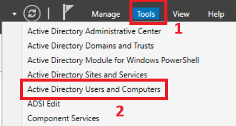

=======
!(01)[Ressources/Screenshots-Installation/01_creation_ou.png]
>>>>>>> bad1a5dd6502bfe7bca0af41a456b57d724ae905

- Dans le volet de gauche , clic droit sur **"billu.lan"**
- Sélectionner **"New"** ==> **"Organizational Unit"**

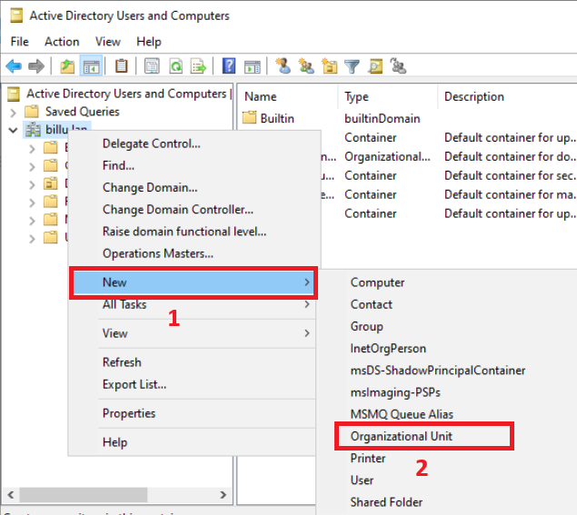

Dans la fênetre qui s'ouvre :
- Case **"Name"** : **"BilluComputers"**
- Cocher **"Protect container from accidental deletion"**
- Cliquer sur **"OK"**

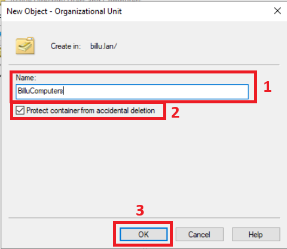

**"OU"** BilluComputers à été créé.

Même procédure pour les autres **"OU"**
- Case **"Name"** : **"BilluUsers"**
- Case **"Name"** : **"BilluSecurity"**

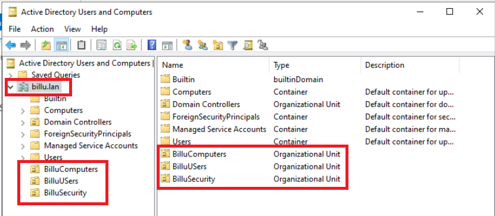

Voila nos **"OU"** de créés dans la forêt de **"billu.lan"**.

#### 1.3 Création des sous-OU
#### 1.3.1 Création des sous-OU de BilluComputers

- Dans le volet de gauche , clic droit sur **"billuComputers"**
- Sélectionner **"New"** ==> **"Organizational Unit"**

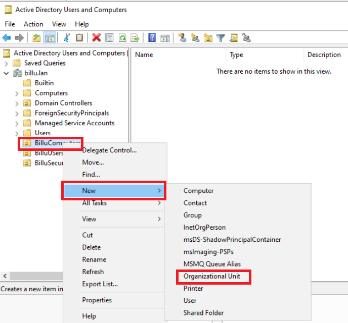

Dans la fênetre qui s'ouvre :
- Case **"Name"** : **"DEV"**
- Cocher **"Protect container from accidental deletion"**
- Cliquer sur **"OK"**

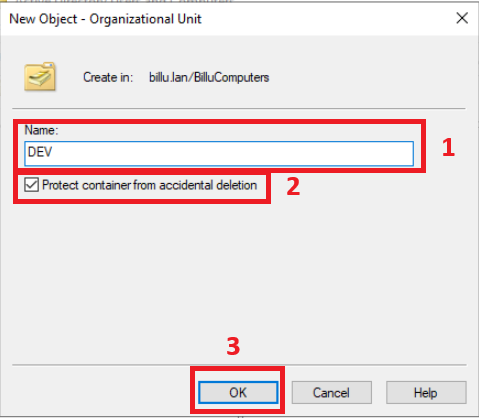

La **"SOUS-OU"** **"DEV"** a été créé dans **"OU"** BilluComputers.

Même procédure pour les autres **"SOUS-OU"**
- Case **"Name"** : **"COMMERCIAL"**
- Case **"Name"** : **"COMMUNICATION"**
- Case **"Name"** : **"JURIDIQUE"**
-  Case **"Name"** : **"DIRECTION"**
-  Case **"Name"** : **"COMPTABILITE"**
-  Case **"Name"** : **"QHSE"**
-  Case **"Name"** : **"RH"**
-  Case **"Name"** : **"DSI"**

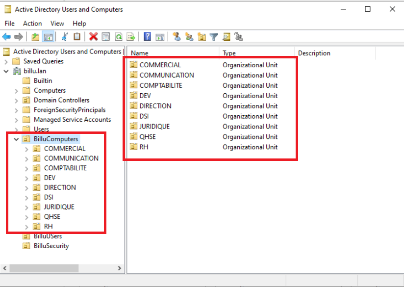
Voilà nos **"SOUS-OU"** de créés dans **"OU"** **"BilluComputers"**.

#### 1.3.2 Création des sous-OU de BilluUsers

- Dans le volet de gauche , clic droit sur **"billuUsers"**
- Sélectionner **"New"** ==> **"Organizational Unit"**

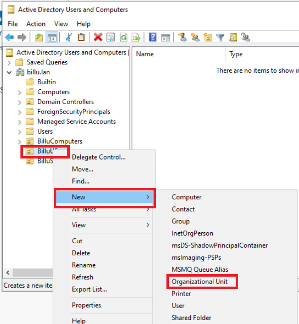

Dans la fênetre qui s'ouvre :
- Case **"Name"** : **"COMMERCIAL"**
- Cocher **"Protect container from accidental deletion"**
- Cliquer sur **"OK"**

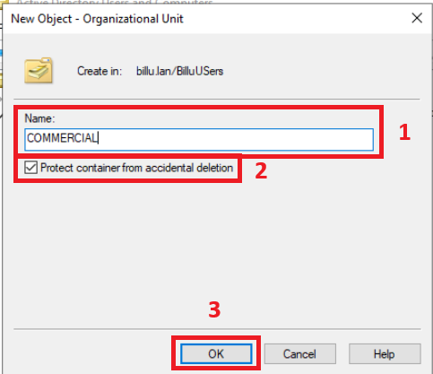

La **"SOUS-OU"** **"COMMERCIAL"** a été créé dans **"OU"** BilluUsers.

Même procédure pour les autres **"SOUS-OU"**
-  Case **"Name"** : **"COMMUNICATION"**
-  Case **"Name"** : **"COMPTABILITE"**
-  Case **"Name"** : **"DEV"**
-  Case **"Name"** : **"DIRECTION"**
-  Case **"Name"** : **"DSI"**
-  Case **"Name"** : **"JURIDIQUE"**
-  Case **"Name"** : **"QHSE"**
-  Case **"Name"** : **"RH"**

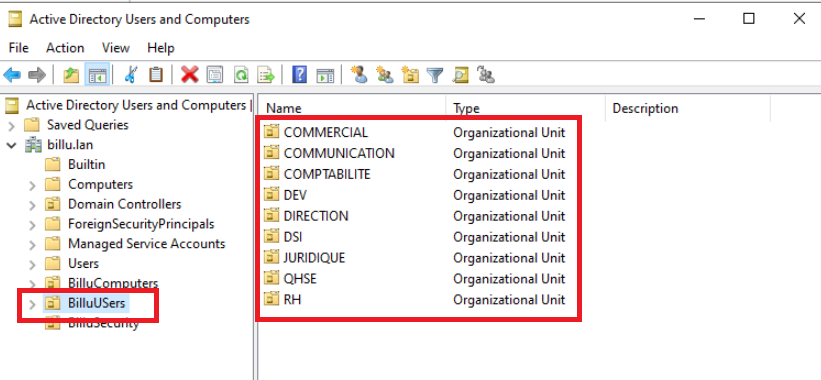

Voilà nos **"SOUS-OU"** de créés dans **"OU"** **"BilluUsers"**.

---
## 2. Création des utilisateurs

#### 2.1 Utilisateurs administrateurs

#### 2.2 Utilisateurs par service

---
## 3. Création des groupes

#### 3.1 Groupes de sécurité

#### 3.2 Groupes de distributions

---

## 4. Stratégies de groupe (GPO)

### 4.1 Création de GPO

- Dans `Server Manager` cliquer sur `Tools` et `Group Policy Management`

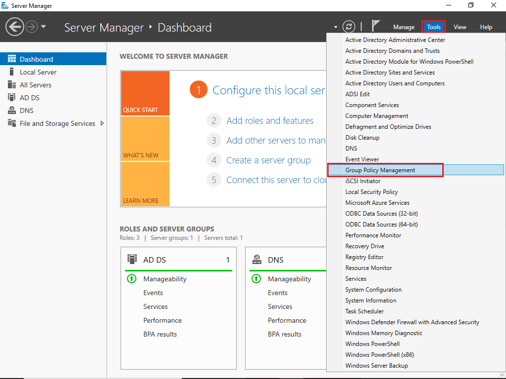

1) Faire `Clic droit` sur `Domain Controllers`
2) Sélectionner `Create a GPO in this domain, and Link it here...`

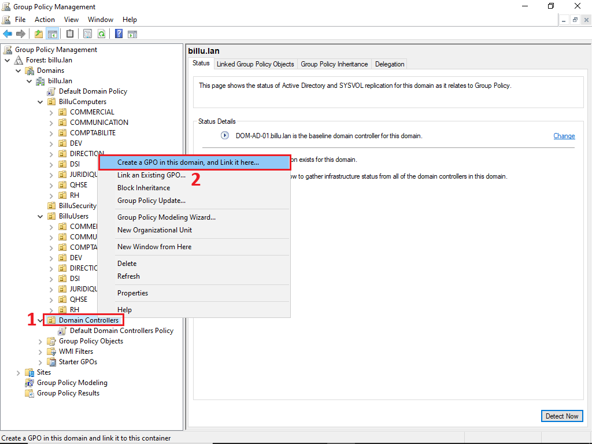

- Entrer le nom de la GPO en suivant la convention de nommage

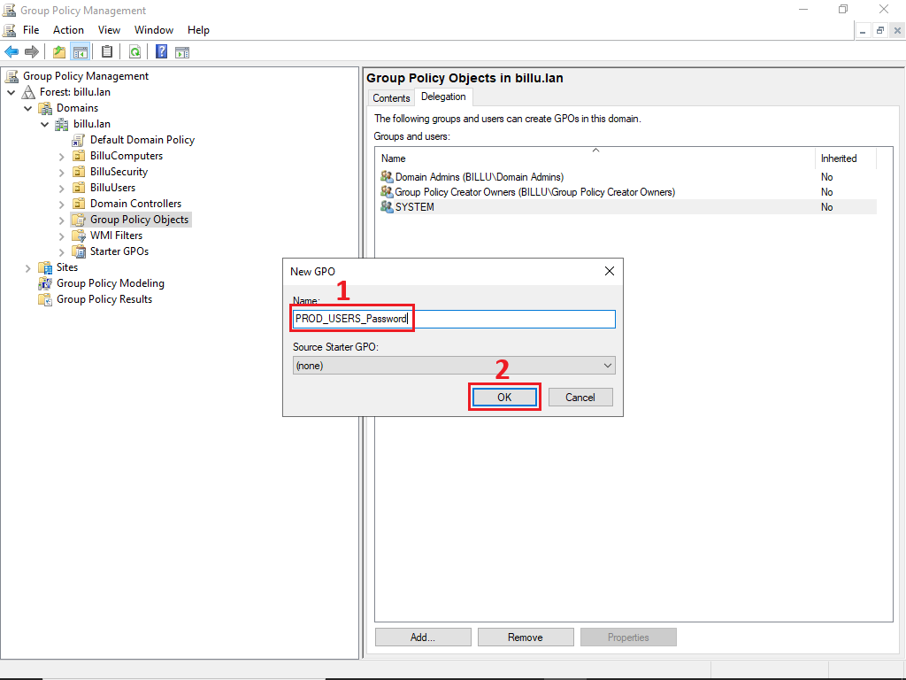

1) Faire `Clic droit` sur la GPO créée
2) Sélectionner `Edit...` pour faire apparaitre la console `Group Policy Management Editor`

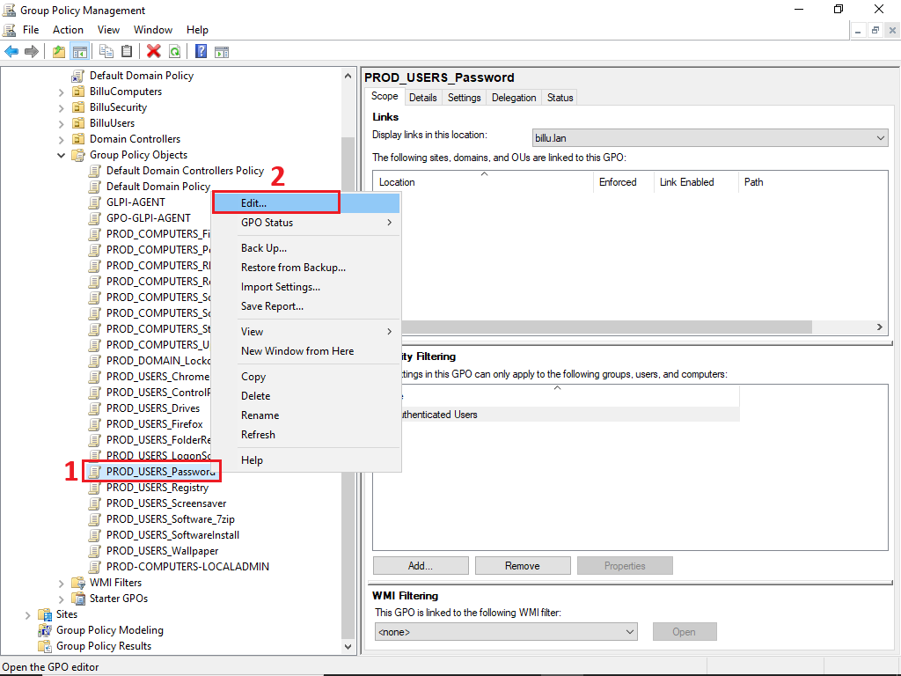

### 4.2 GPO de sécurité

#### 4.2.1 Politique de mot de passe

##### GPO : `PROD_DOMAIN_Password`

**Portée :**
- **Cible :** Computers
- **Liaison :** `BillU`
- **Filtrage :** Authenticated Users
- **GPO Status :** User configuration settings disabled

#### Paramètres

> **Computer Configuration** > **Policies** > **Windows Settings** > **Security Settings** > **Account Policies** > **Password Policy**

| Paramètre | Valeur | Note |
|-----------|--------|------|
| Enforce password history | `24 passwords` | Empêche la réutilisation des 24 derniers mots de passe |
| Maximum password age | `90 days` | Renouvellement obligatoire tous les 90 jours |
| Minimum password age | `1 day` | Empêche le changement immédiat du mot de passe |
| Minimum password length | `12 characters` | Longueur minimale requise |
| Minimum password lenght audit | `12 characters` | Audit de longueur minimale des mots de passe | 
| Password must meet complexity requirements | `Enabled` | Doit contenir : majuscules, minuscules, chiffres et caractères spéciaux |
| Store passwords using reversible encryption | `Disabled` | Stockage sécurisé des mots de passe |

---

#### 4.2.2 Verrouillage de compte

##### GPO : `PROD_DOMAIN_LockoutAccount`

**Portée :**
- **Cible :** Computers
- **Liaison :** `BillU`
- **Filtrage :** Authenticated Users
- **GPO Status :** User configuration settings disabled

#### Paramètres

> **Computer Configuration** > **Policies** > **Windows Settings** > **Security Settings** > **Account Policies** > **Account Lockout Policy**

| Paramètre | Valeur | Note |
|-----------|--------|------|
| Account lockout duration | `15 minutes` | Durée de verrouillage du compte |
| Account lockout threshold | `3 invalid attempts` | Nombre de tentatives avant verrouillage |
| Reset account lockout counter after | `15 minutes` | Réinitialisation du compteur d'échecs |

---

#### 4.2.3 Restriction d'installation de logiciels

##### GPO : `PROD_USERS_SoftwareInstall`

**Portée :**
- **Cible :** Computers
- **Liaison :** 
- **Filtrage :** Authenticated Users (sauf la DSI)
- **GPO Status :** User configuration settings disabled

#### Paramètres

> **Computer Configuration** > **Policies** > **Administrative Templates** > **Windows Components** > **Windows Installer**

| Paramètre | Valeur | Note |
|-----------|--------|------|
| Turn off Windows Installer | `Enabled` > `For non-managed applications only` | Autorise seulement les programmes approuvés | 
| Prohibit User Installs | `Enabled` > `Hide User Installs` | Empêche les installations per-user |  

---

#### 4.2.4 Gestion de Windows Update

##### GPO : `PROD_COMPUTERS_Updates`

**Portée :**
- **Cible :** Computers
- **Liaison :** `BillU > BilluComputers`
- **Filtrage :** 
- **GPO Status :** User configuration settings disabled

#### Paramètres

> **Computer Configuration** > **Policies** > **Administrative Templates** > **Windows Components** > **Windows Update** 

| Paramètre | Valeur | Note |
|-----------|--------|------|
| Turn off auto-restart for updates during active hours | `Enabled` > `8 AM` et `6 PM` | Empêche les redémarrages automatique après une MAJ pendant les heures actives |

> **Computer Configuration** > **Policies** > **Administrative Templates** > **Windows Components** > **Windows Update** > (Paramètre) **Configure Automatic Updates**

| Paramètre | Valeur | Note |
|-----------|--------|------|
| Configure Automatic Updates | `Enabled` | Active la configuration centralisée |
| Configure automatic updating | `4 - Auto download and schedule the install` | Téléchargement auto et installation planifiée |
| Scheduled install day | `4 - Every Wednesday` | Jour d'installation |
| Scheduled install time | `06:00` | Heure d'installation planifiée |
| | `Second week on the month` | Deuxième semaine du mois | 

---

#### 4.2.5 Blocage de l'accès à la base de registre

##### GPO : `PROD_USERS_Registry`

**Portée :**
- **Cible :** Users
- **Liaison :** `BillU > BilluUsers`
- **Filtrage :** Authenticated Users (exclure `Domain Admins`)
- **GPO Status :** Computer configuration settings disabled

#### Paramètres

> **User Configuration** > **Policies** > **Administrative Templates** > **System** > 

| Paramètre | Valeur | Note |
|-----------|--------|------|
| Prevent access to registry editing tools | `Enabled` > `Yes` | Bloque l'accès à regedit.exe et reg.exe sans message d'avertissement |

---

#### 4.2.6 Blocage du panneau de configuration

##### GPO : `PROD_USERS_ControlPanel`

**Portée :**
- **Cible :** Users
- **Liaison :** `BillU > BilluUsers`
- **Filtrage :** Authenticated Users (exclure les Admins)
- **GPO Status :** Computer configuration settings disabled

#### Paramètres - Blocage complet

> **User Configuration** > **Policies** > **Administrative Templates** > **Control Panel**

| Paramètre | Valeur | Note |
|-----------|--------|------|
| Prohibit access to Control Panel and PC settings | `Enabled` | Bloque complètement l'accès au panneau de configuration |

---

#### 4.2.7 Restriction des périphériques amovibles

##### GPO : `PROD_COMPUTERS_RemoveDevices`

**Portée :**
- **Cible :** Computers
- **Liaison :** `BillU > BilluComputers`
- **Filtrage :** 
- **GPO Status :** User configuration settings disabled

#### Paramètres

> **Computer Configuration** > **Policies** > **Administrative Templates** > **System** > **Removable Storage Access**

| Paramètre | Valeur | Note |
|-----------|--------|------|
| All Removable Storage classes: Deny all access | `Enabled` | Bloque tous les périphériques amovibles |

---

#### 4.2.8 Gestion du pare-feu

##### GPO : `PROD-COMPUTERS-FIREWALL`

**Portée :**
- **Cible :** Computers
- **Liaison :** `BillU > BilluComputers`
- **Filtrage :** 
- **GPO Status :** User configuration settings disabled

#### Paramètres - Profils

> **Computer Configuration** > **Policies** > **Windows Settings** > **Security Settings** > **Windows Defender Firewall with Advanced Security** > **Windows Defender Firewall with Advanced Security**

Clic droit > **Properties**

**Domain Profile :**

| Paramètre | Valeur | Note |
|-----------|--------|------|
| Firewall state | `On` | Active le pare-feu |
| Inbound connections | `Block (default)` | Bloque par défaut |
| Outbound connections | `Allow (default)` | Autorise par défaut |

**Private Profile :**

| Paramètre | Valeur | Note |
|-----------|--------|------|
| Firewall state | `On` | Active le pare-feu |
| Inbound connections | `Block (default)` | Bloque par défaut |
| Outbound connections | `Allow (default)` | Autorise par défaut |

**Public Profile :**

| Paramètre | Valeur | Note |
|-----------|--------|------|
| Firewall state | `On` | Active le pare-feu |
| Inbound connections | `Block (default)` | Bloque par défaut |
| Outbound connections | `Allow (default)` | Autorise par défaut |

---

#### 4.2.9 Écran de veille avec mot de passe

##### GPO : `PROD_USERS_ScreenSaver`

**Portée :**
- **Cible :** Users
- **Liaison :** `BillU > BilluUsers`
- **Filtrage :** 
- **GPO Status :** Computer configuration settings disabled

#### Paramètres

> **User Configuration** > **Policies** > **Administrative Templates** > **Control Panel** > **Personalization**

| Paramètre | Valeur | Note |
|-----------|--------|------|
| Enable screen saver | `Enabled` | Active l'écran de veille |
| Password protect the screen saver | `Enabled` | Demande le mot de passe à la sortie |
| Screen saver timeout | `Enabled` > `900` | Définit le délai d'activation |
| Prevent changing screen saver | `Enabled` | Empêche la modification des paramètres |

---

#### 4.2.10 Bureau à distance sécurisé

##### GPO : `PROD_COMPUTERS_RDP`

**Portée :**
- **Cible :** Computers
- **Liaison :** `BillU > BilluComputers`
- **Filtrage :** Authenticated Users
- **GPO Status :** User configuration settings disabled

#### Paramètres

> **Computer Configuration** > **Policies** > **Administrative Templates** > **Windows Components** > **Remote Desktop Services** > **Remote Desktop Session Host** > **Connections**

| Paramètre | Valeur | Note |
|-----------|--------|------|
| Allow users to connect remotely by using Remote Desktop Services | `Enabled` | Active le bureau à distance |

---

#### 4.2.11 Scripts de démarrage

##### GPO : `PROD_COMPUTERS_StartupScripts`

**Portée :**
- **Cible :** Computers
- **Liaison :** `BillU > BilluComputers`
- **Filtrage :** 
- **GPO Status :** User configuration settings disabled

#### Paramètres - Scripts ordinateur

> **Computer Configuration** > **Policies** > **Windows Settings** > **Scripts (Startup/Shutdown)** > **Startup**

Clic droit > **Properties** > **Add**

| Paramètre | Valeur | Note |
|-----------|--------|------|
| Script Name | `\\DOM-AD-01\share\scripts\startup.bat` | Chemin du script |

---  

### 4.3 GPO standard

#### 4.3.1 Fond d'écran

#### `PROD_USERS_Wallpaper`

**Portée :**
- **Cible :** Users
- **Liaison :** `BillU > BilluUsers > `
- **Filtrage :** 
- **GPO Status :** Computer configuration settings disabled

#### Paramètres

> **User Configuration** > **Policies** > **Administrative Templates** > **Desktop** > **Desktop**

| Paramètre | Valeur | Note |
|-----------|--------|------|
| Desktop Wallpaper | `\\DOM-AD-01\share\wallpaper.jpg` | Chemin du fichier image |
| Wallpaper Style | `Fill` |  |

---

#### 4.3.2 Mappage de lecteurs réseau

#### `PROD_USERS_Drives`

**Portée :**
- **Cible :** Users
- **Liaison :** `BillU > BilluUsers > `
- **Filtrage :** 
- **GPO Status :** Computer configuration settings disabled

#### Paramètres

> **User Configuration** > **Preferences** > **Windows Settings** > **Drive Maps**

Clic droit > **New** > **Mapped Drive**

| Paramètre | Valeur | Note |
|-----------|--------|------|
| Action | `Create` |  |
| Location | `\\DOM-AD-01\share` | Chemin du partage réseau |
| Reconnect | `Enabled` | Reconnecte le lecteur à chaque ouverture de session |
| Label as | `Documents` | Nom d'affichage du lecteur |
| Drive Letter | `H:` | Lettre de lecteur à utiliser |
| Hide/Show this drive | `No change` | Visibilité du lecteur |
| Hide/Show all drives | `No change` | Visibilité de tous les lecteurs |

---

#### 4.3.3 Gestion de l'alimentation

#### `PROD_COMPUTERS_PowerSaving`

**Portée :**
- **Cible :** Computers
- **Liaison :** `BillU > BilluComputers > `
- **Filtrage :** 
- **GPO Status :** User configuration settings disabled

#### Paramètres

> **Computer Configuration** > **Policies** > **Administrative Templates** > **System** > **Power Management** > **Video and Display Settings**

| Paramètre | Valeur | Note |
|-----------|--------|------|
| Turn off the display (on battery) | `Enabled` > `300` | Active le paramètre sur secteur et éteint l'écran après 5 minutes |

> **Computer Configuration** > **Policies** > **Administrative Templates** > **System** > **Power Management** > **Sleep Settings**

| Paramètre | Valeur | Note |
|-----------|--------|------|
| Specify the system sleep timeout (plugged in) | `Enabled` > `900` | Active la mise en veille sur secteur |
| Require a password when a computer wakes (plugged in) | `Enabled` | Demande le mot de passe au réveil |
| Specify the system sleep timeout (on battery) | `Enabled` > `900` | Active la mise en veille sur secteur |
| Require a password when a computer wakes (on battery) | `Enabled` | Demande le mot de passe au réveil |

---

#### 4.3.4 Déploiement de logiciels

#### `PROD_USERS_Software_7zip`

**Portée :**
- **Cible :** Users
- **Liaison :** `BillU > BilluUsers > `
- **Filtrage :** 
- **GPO Status :** Computer configuration settings disabled

#### Paramètres

> **Users Configuration** > **Policies** > **Software Settings** > **Software installation**

Clic droit > **New** > **Package**

| Paramètre | Valeur | Note |
|-----------|--------|------|
| Package path | `\\DOM-AD-01\share\software\7z2501-x64.msi` | Chemin de fichier MSI 7zip |
| Deployment method | `Published` |  |
| Installation user interface options | `Basic` | |

---

#### 4.3.5 Redirection de dossiers

#### `PROD_USERS_FolderRedirection`

**Portée :**
- **Cible :** Users
- **Liaison :** `BillU > BilluUsers > `
- **Filtrage :** 
- **GPO Status :** Computer configuration settings disabled

#### Paramètres - Documents

> **User Configuration** > **Policies** > **Windows Settings** > **Folder Redirection** > **Documents**

Clic droit > **Properties**

| Paramètre | Valeur | Note |
|-----------|--------|------|
| Setting | `Basic - Redirect everyone's folder to the same location` | Type de redirection |
| Target folder location | `Create a folder for each user under the root path` | Organisation des dossiers |
| Root Path | `\\DOM-AD-01\share\users$\` | Chemin de redirection |
| Grant the user exclusive rights to Documents | `Enabled` | Droits NTFS exclusifs |
| Move the contents of Documents to the new location | `Enabled` | Déplace les fichiers existants |

#### 4.3.6 Paramètres - Desktop

> **User Configuration** > **Policies** > **Windows Settings** > **Folder Redirection** > **Desktop**

| Paramètre | Valeur | Note |
|-----------|--------|------|
| Setting | `Basic - Redirect everyone's folder to the same location` | Type de redirection |
| Root Path | `\\DOM-AD-01\share\users$\` | Chemin de redirection |
| Grant the user exclusive rights to Desktop | `Enabled` | Droits NTFS exclusifs |
| Move the contents of Desktop to the new location | `Enabled` | Déplace les fichiers existants |

---

#### 4.3.7 Configuration du navigateur

### Fichier requis pour la configuration de la GPO

1) Aller sur le lien github : https://github.com/mozilla/policy-templates/releases
2) Télécharger la dernière version des policy_templates.
3) Copier les fichiers `firefox.admx` et `mozilla.admx` dans le dossier `C:\Windows\PolicyDefinitions`
4) Copier le contenu du dossier `en-US` (`firefox.adml` et `mozilla.adml`) dans le dossier `C:\Windows\PolicyDefinitions\en-US`

### `PROD-USERS-Firefox`

**Portée :**
- **Cible :** Users
- **Liaison :** `BillU > BilluUsers`
- **Filtrage :** 
- **GPO Status :** Computer configuration settings disabled

#### Paramètres

> **User Configuration** > **Policies** > **Administrative Templates** > **Mozilla** > **Firefox** > **Homepage**

| Paramètre | Valeur | Note |
|-----------|--------|------|
| Homepage | `Enabled` | Configure la page d'accueil |
| Homepage URL | `https://youtube.com` | URL de la page d'accueil |
| Homepage URL | `Lock Homepage` > `Enabled` | Empêche la modification de la page d'accueil |

> **User Configuration** > **Policies** > **Administrative Templates** > **Mozilla** > **Firefox** (Cliquer seulement sur le dossier Firefox et naviguer dans le menu à droite)
| Paramètre | Valeur | Note |
|-----------|--------|------|
| Disable Private Browsing | `Enabled` > `Disable Private Browsing Mode` | Désactive la navigation privée |
| Password Manager | `Disabled` | Désactive le gestionnaire de mots de passe |

---
## 5. Délégation d'administration

---
## 6. Test et validation

---
