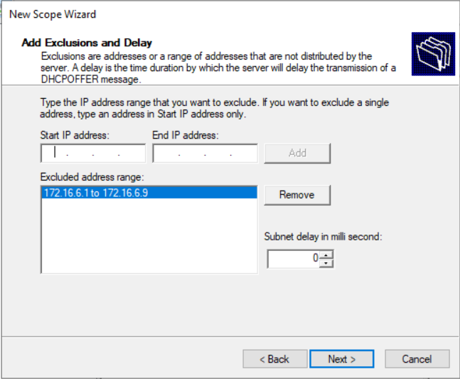
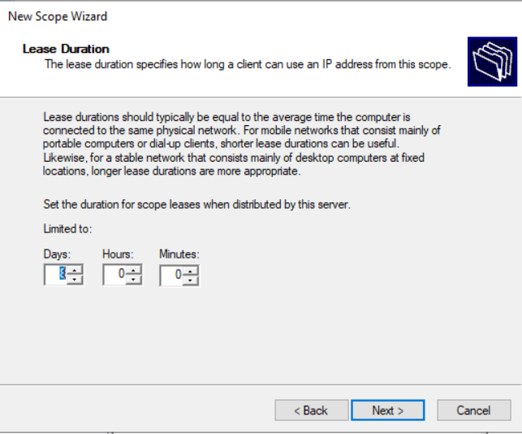
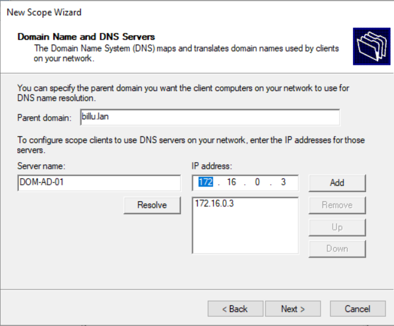

## Sommaire

- [1. Création des scopes DHCP](#1-création-des-scopes-dhcp)
  - [1.1 Nom du scope](#11-nom-du-scope)
  - [1..2 Configuration de la plage d’adresses (Address Pool)](#2-configuration-de-la-plage-dadresses-address-pool)
  - [1.3. Exclusions d’adresses IP](#3-exclusions-dadresses-ip)
  - [1.4. Durée du bail DHCP (Lease Duration)](#4-durée-du-bail-dhcp-lease-duration)
  - [1.5. Configuration de la passerelle par défaut (Router)](#5-configuration-de-la-passerelle-par-défaut-router)
  - [1.6. Configuration du DNS](#6-configuration-du-dns)
  - [1.7. Activation du scope](#7-activation-du-scope)
- [2. Détail des scopes par VLAN](#8-détail-des-scopes-par-vlan)
  - [VLAN10 – DEV](#vlan10--dev)
  - [VLAN20 – COMMERCIAL](#vlan20--commercial)
  - [VLAN30 – COMMUNICATION](#vlan30--communication)
  - [VLAN40 – VOIP](#vlan40--voip)
  - [VLAN50 – JURIDIQUE](#vlan50--juridique)
  - [VLAN60 – DSI](#vlan60--dsi)
  - [VLAN70 – COMPTABILITÉ](#vlan70--comptabilité)
  - [VLAN80 – DIRECTION](#vlan80--direction)
  - [VLAN100 – QHSE](#vlan100--qhse)
  - [VLAN110 – RH](#vlan110--rh)

Partons du principe que le rôle DHCP est correctement installé sur le serveur dédié `dom-dhcp-01.billu.lan`.

Le serveur DHCP est autorisé dans Active Directory et communique avec les VLAN via le routage inter-VLAN.

Nous pouvons donc passer directement à la configuration des scopes DHCP.

---

## 1. Création des scopes DHCP

Chaque VLAN dispose de son scope DHCP dédié, afin d’assurer :

- une segmentation réseau claire
- une attribution d’adresses contrôlée
- une configuration réseau homogène par service

La création des scopes s’effectue depuis la console DHCP.

Chemin :

```
DHCP  
	└ dom-dhcp-01.billu.lan    
		└ IPv4      
			└ New Scope
```


---

### 1.1 Nom du scope

Chaque scope est nommé selon la convention suivante :

`VLAN<ID>-<SERVICE>`

Exemple :

- `VLAN10-DEV`
- `VLAN60-DSI`
- `VLAN110-RH`

Cette convention permet :

- une identification rapide
- une cohérence avec la documentation réseau
- une lisibilité immédiate dans la console DHCP


---

### 1.2. Configuration de la plage d’adresses (Address Pool)

Lors de la création du scope, une **plage d’adresses IP** est définie pour chaque VLAN.

Cette plage correspond aux adresses distribuées dynamiquement aux postes clients.

Exemple (VLAN60 – DSI) :

- Réseau : `172.16.6.0/27`
- Plage DHCP : `172.16.6.1` → `172.16.6.28`

Le masque de sous-réseau est automatiquement calculé en fonction du CIDR fourni.


---

### 1.3. Exclusions d’adresses IP

Les adresses basses de chaque réseau sont **exclues de la distribution DHCP**.

Ces exclusions sont réservées pour :
- équipements réseau
- interfaces VLAN (SVI)
- serveurs
- futures adresses statiques

Exemple (VLAN60 – DSI) :

- Exclusion : `172.16.6.1` → `172.16.6.9`

Configuration effectuée dans l’assistant :



---

### 1.4. Durée du bail DHCP (Lease Duration)

La durée du bail est laissée à la valeur par défaut recommandée par Microsoft.

Configuration retenue :
- 8 jours



---

### 1.5. Configuration de la passerelle par défaut (Router)

Chaque scope distribue la passerelle correspondant à l’interface VLAN.

La passerelle est systématiquement positionnée sur la dernière adresse utilisable du réseau.

Exemple :

- VLAN60 – DSI
- Passerelle : `172.16.6.30`

Configuration via l’option DHCP 003 – Router :


---

### 1.6. Configuration du DNS

Les postes clients utilisent le DNS interne Active Directory.

Paramètres distribués par DHCP :

- Nom de domaine : `billu.lan`
- Serveur DNS : `172.16.12.1` (DOM-AD-01)


Configuration via l’option DHCP 006 – DNS Servers :



---

### 1. 7. Activation du scope

À la fin de l’assistant, le scope est :

- **activé**
- immédiatement opérationnel
- prêt à distribuer des adresses IP

Chaque scope apparaît avec le statut Active dans la console DHCP.


---

## 2. Détail des scopes par VLAN

L’ensemble des scopes DHCP est configuré et actif :
### VLAN10 – DEV

|Élément|Valeur|
|---|---|
|Réseau|`172.16.1.0/24`|
|Scope DHCP|`172.16.1.1` → `172.16.1.250`|
|Exclusions|`172.16.1.1` → `172.16.1.9`|
|Passerelle|`172.16.1.254`|
|DNS|`172.16.12.1`|

---

### VLAN20 – COMMERCIAL

|Élément|Valeur|
|---|---|
|Réseau|`172.16.2.0/26`|
|Scope DHCP|`172.16.2.1` → `172.16.2.60`|
|Exclusions|`172.16.2.1` → `172.16.2.9`|
|Passerelle|`172.16.2.62`|
|DNS|`172.16.12.1`|

---

### VLAN30 – COMMUNICATION

|Élément|Valeur|
|---|---|
|Réseau|`172.16.3.0/26`|
|Scope DHCP|`172.16.3.1` → `172.16.3.60`|
|Exclusions|`172.16.3.1` → `172.16.3.9`|
|Passerelle|`172.16.3.62`|
|DNS|`172.16.12.1`|

---

### VLAN40 – VOIP

|Élément|Valeur|
|---|---|
|Réseau|`172.16.4.0/24`|
|Scope DHCP|`172.16.4.1` → `172.16.4.250`|
|Exclusions|`172.16.4.1` → `172.16.4.9`|
|Passerelle|`172.16.4.254`|
|DNS|`172.16.12.1`|

---
### VLAN50 – JURIDIQUE

| Élément    | Valeur                       |
| ---------- | ---------------------------- |
| Réseau     | `172.16.5.0/27`              |
| Scope DHCP | `172.16.5.1` → `172.16.5.28` |
| Exclusions | `172.16.5.1` → `172.16.5.9`  |
| Passerelle | `172.16.5.30`                |
| DNS        | `172.16.12.1`                |

---
### VLAN60 – DSI

| Élément    | Valeur                       |
| ---------- | ---------------------------- |
| Réseau     | `172.16.6.0/27`              |
| Scope DHCP | `172.16.6.1` → `172.16.6.28` |
| Exclusions | `172.16.6.1` → `172.16.6.9`  |
| Passerelle | `172.16.6.30`                |
| DNS        | `172.16.12.1`                |

---
### VLAN70 – COMPTABILITÉ

|Élément|Valeur|
|---|---|
|Réseau|`172.16.7.0/27`|
|Scope DHCP|`172.16.7.1` → `172.16.7.28`|
|Exclusions|`172.16.7.1` → `172.16.7.9`|
|Passerelle|`172.16.7.30`|
|DNS|`172.16.12.1`|

---

### VLAN80 – DIRECTION

|Élément|Valeur|
|---|---|
|Réseau|`172.16.8.0/28`|
|Scope DHCP|`172.16.8.1` → `172.16.8.12`|
|Exclusions|`172.16.8.1` → `172.16.8.4`|
|Passerelle|`172.16.8.14`|
|DNS|`172.16.12.1`|

---

### VLAN100 – QHSE

|Élément|Valeur|
|---|---|
|Réseau|`172.16.10.0/28`|
|Scope DHCP|`172.16.10.1` → `172.16.10.12`|
|Exclusions|`172.16.10.1` → `172.16.10.4`|
|Passerelle|`172.16.10.14`|
|DNS|`172.16.12.1`|

---

### VLAN110 – RH

|Élément|Valeur|
|---|---|
|Réseau|`172.16.11.0/29`|
|Scope DHCP|`172.16.11.1` → `172.16.11.4`|
|Exclusion|`172.16.11.1`|
|Passerelle|`172.16.11.6`|
|DNS|`172.16.12.1`|
