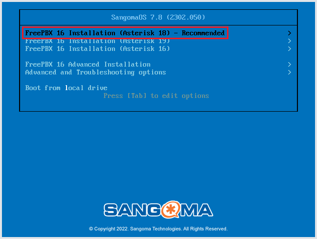
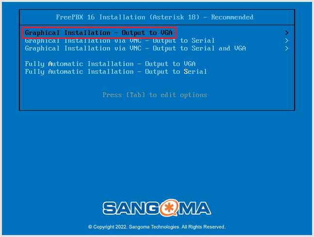
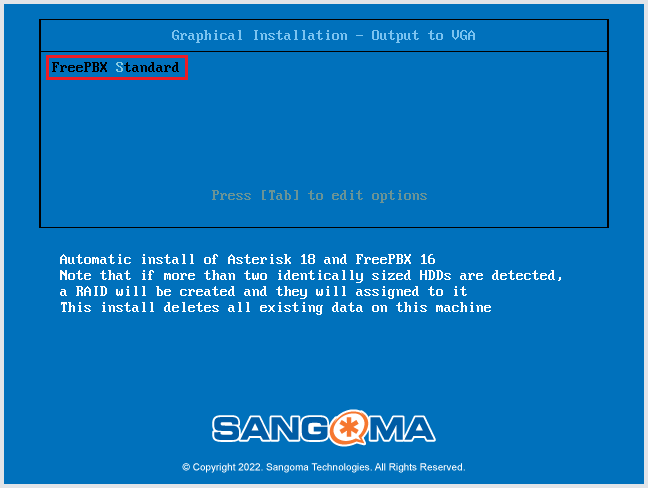
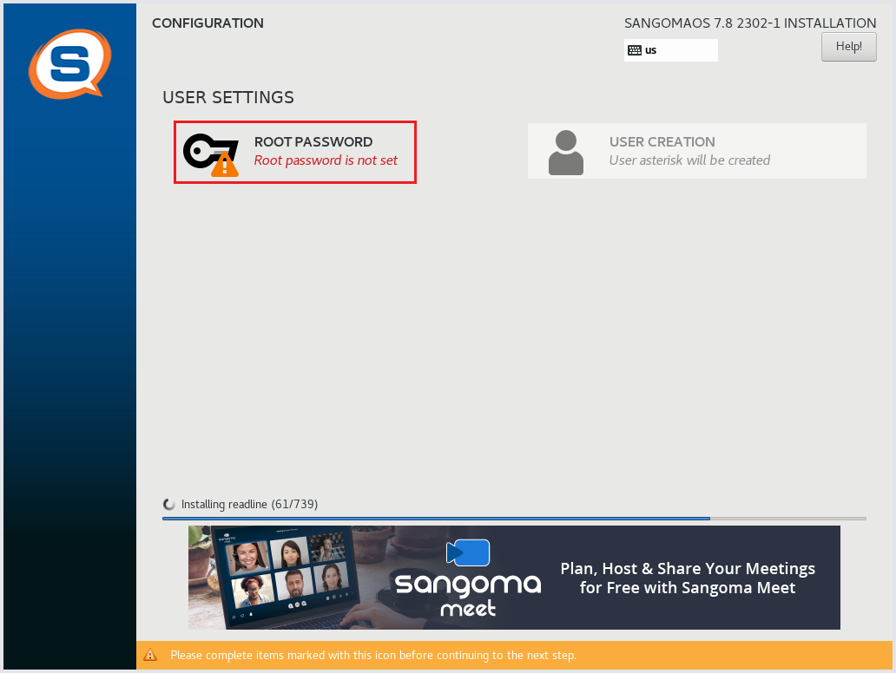
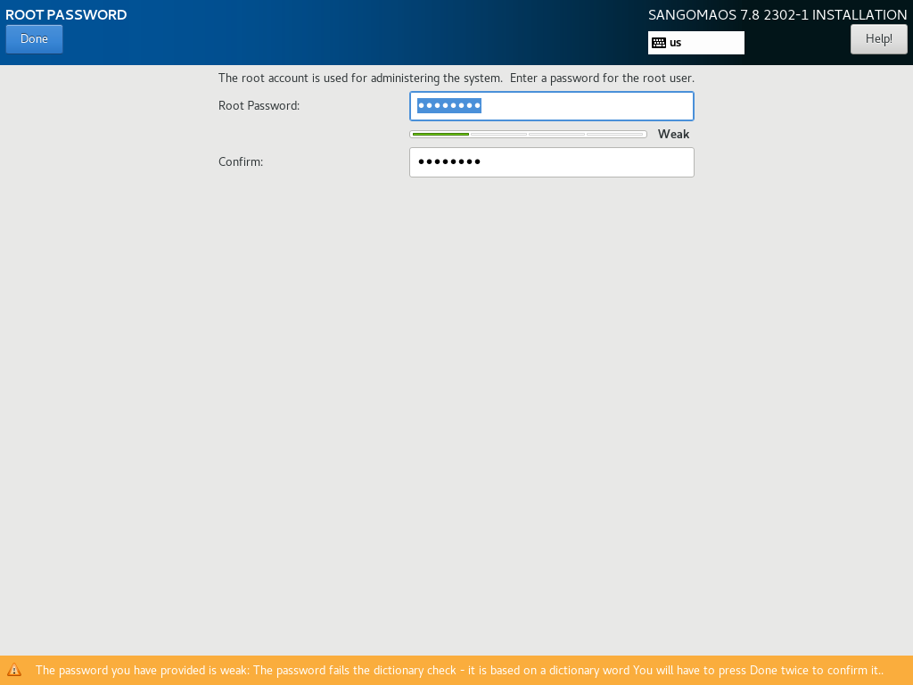
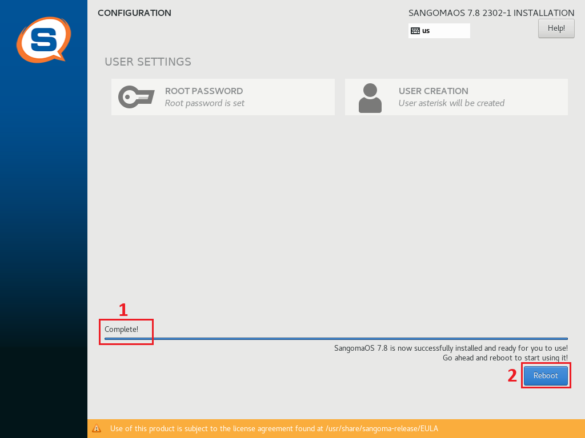
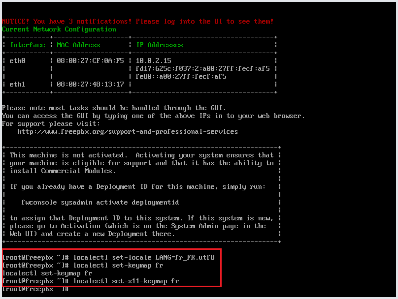
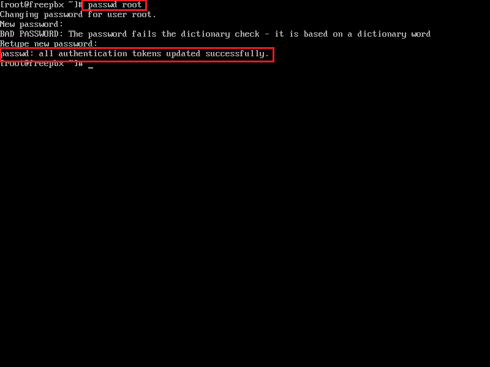
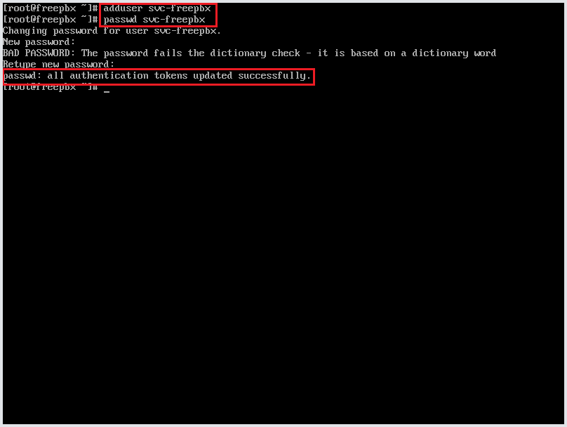
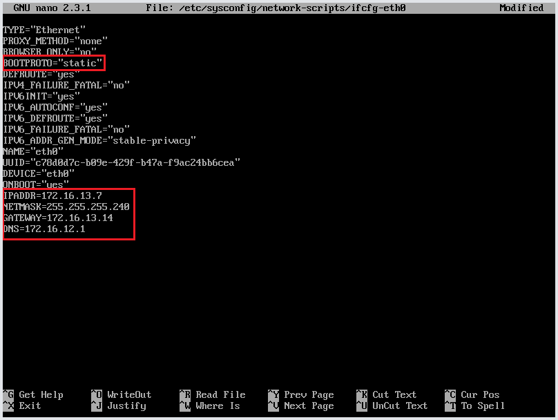

# Installation FreePBX

# Sommaire

1. [Téléchargement de FreePBX](#1-téléchargement-de-freepbx)
2. [Installation FreePBX](#2-installation-freepbx)
3. [Modifier le layout du clavier en Azerty](#3-modifier-le-layout-du-clavier-en-azerty)
4. [Modifier le mot de passe Root avec le layout Azerty](#4-modifier-le-mot-de-passe-root-avec-le-layout-azerty)
5. [Créer un utilisateur pour la connexion SSH](#5-créer-un-utilisateur-pour-la-connexion-ssh)
6. [Modifier le fichier de configuration du serveur SSH](#6-modifier-le-fichier-de-configuration-du-serveur-ssh)
7. [Configuration de l'adresse IP statique](#7-configuration-de-ladresse-ip-statique)
8. [Connexion à FreePBX](#8-connexion-à-freepbx)

---

### 1. Téléchargement de FreePBX

https://downloads.freepbxdistro.org/ISO/SNG7-PBX16-64bit-2302-1.iso

### 2. Installation FreePBX

1) Sélectionner `FreePBX 16 Installation (Asterisk 18) - Recommended`



2) Sélectionner `Graphical Installation - Output to VGA`



3) Appuyer sur `Entrer` pour commancer l'installation



4) Pendant l'installation cliquer sur `ROOT PASSWORD`



5) Modifier le mot de passe 
**- Attention le clavier est en QWERTY mais nous changerons ça plus tard dans la procédure**



6) Attendre l'installation `Complete!` et cliquer sur `Reboot`



### 3. Modifier le layout du clavier en Azerty

- Entrer les commandes :
```
localectl set-locale LANG=fr_FR.utf8
localectl set-keymap fr
localectl set-x11-keymap fr
```

- Vérifier les paramètres modifié avec la commande :
```
localectl
```


### 4. Modifier le mot de passe Root avec le layout Azerty
1) Entrer la commande : 
```
passwd root
```

2) Entrer le mot de passe `Azerty1*` avec le clavier en Azerty
- Un message de confirmation doit apparaitre



### 5. Créer un utilisateur pour la connexion SSH
1) Entrer la commande :
```
adduser svc-freepbx
```
2) Modifier le mot de passe 
```
passwd svc-freepbx
```


### 6. Modifier le fichier de configuration du serveur SSH
1) Ouvrir le fichier `sshd_config`
```
nano /etc/ssh/sshd_config
```
2) Modifier les valeurs :

```
PermitRootLogin no
PasswordAuthentication yes
``` 


3) Ajouter cette ligne au fichier :

``` 
AllowUsers svc-freepbx
```


### 7. Configuration de l'adresse IP statique
1) Modifier le fichier `ifcfg-eth0`
- PS : Utiliser le fichier de configuration de l'interface que vous souhaitez utiliser pour le réseau interne.
```
nano /etc/sysconfig/network-scripts/ifcfg-eth0
```

2) Modifier la valeur de `BOOTPROTO="dhcp"` par :
```
BOOTPROTO="static"
```
3) Ajouter à la fin du fichier : 
```
IPADDR=172.16.13.7
NETMASK=255.255.255.0
GATEWAY=172.16.13.14
DNS=172.16.12.1
```


### 8. Connexion à FreePBX
1) Pour la connexion par SSH utiliser le compte svc-freepbx et le mot de passe configuré

2) Pour la connexion sur l'interface WEB, utiliser l'adresse IP du serveur
