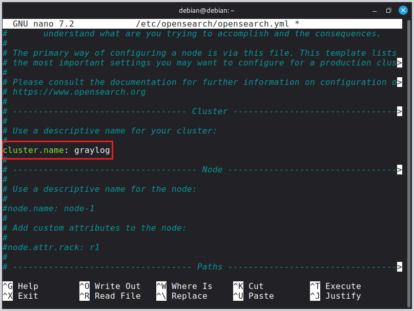
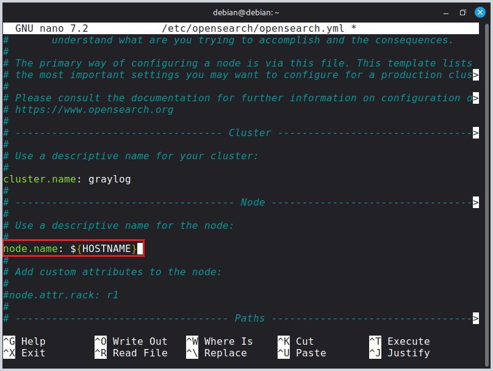
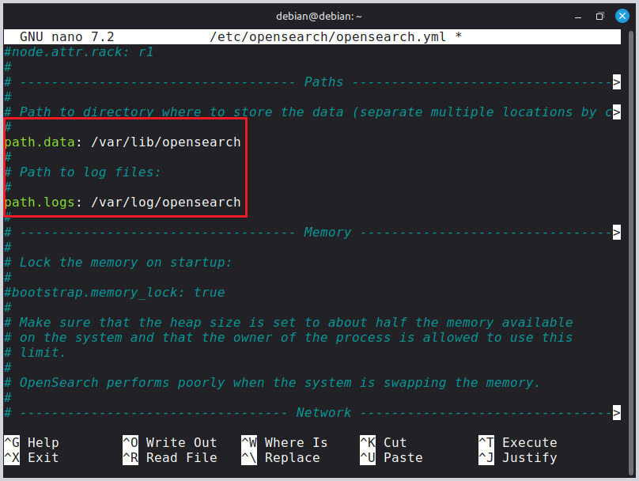
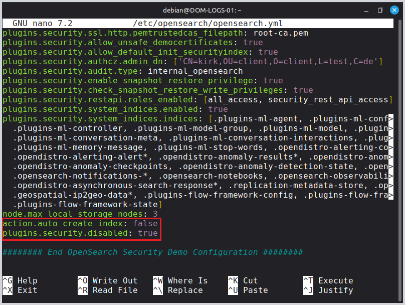
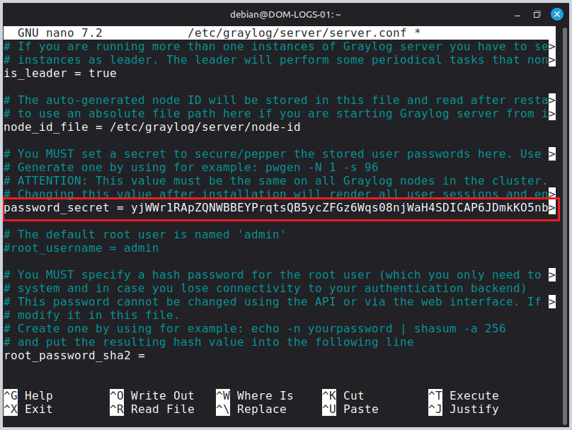
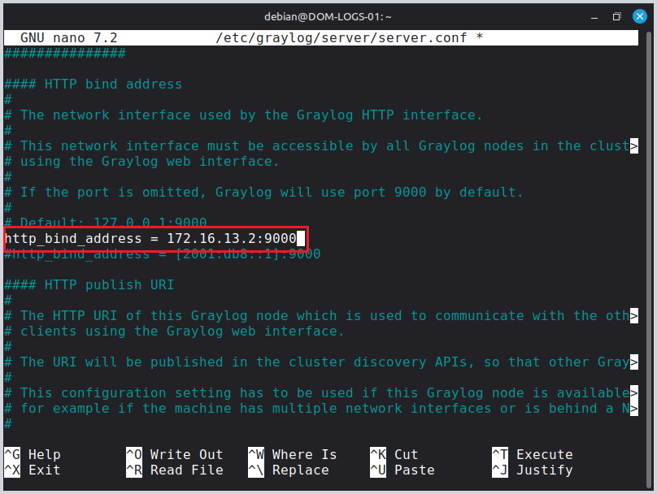
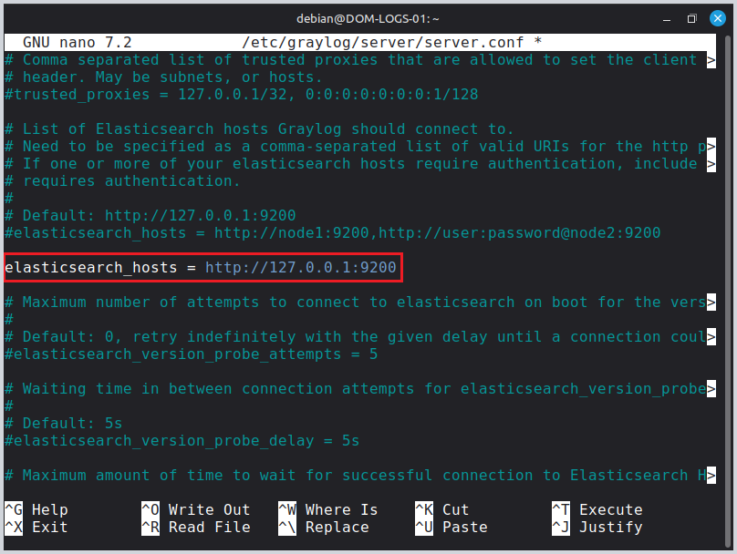
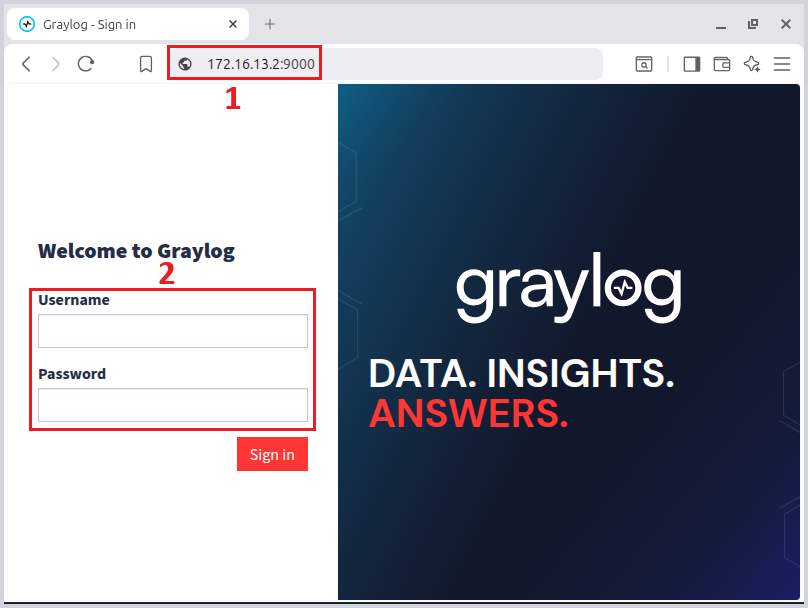

# Sommaire - Guide d'installation Graylog sur Debian 12

1. [Préparation du système](#1-préparation-du-système)
   - 1.1 [Connexion en root](#11-connexion-en-root)
   - 1.2 [Mise à jour du système](#12-mise-à-jour-du-système)
   - 1.3 [Installation des outils de base](#13-installation-des-outils-de-base)
   - 1.4 [Configuration du nom d'hôte](#14-configuration-du-nom-dhôte)

2. [Installation de MongoDB](#2-installation-de-mongodb)
   - 2.1 [Ajout du dépôt MongoDB](#21-ajout-du-dépôt-mongodb)
   - 2.2 [Installation de MongoDB](#22-installation-de-mongodb)
   - 2.3 [Activation et démarrage de MongoDB](#23-activation-et-démarrage-de-mongodb)

3. [Installation d'OpenSearch](#3-installation-dopensearch)
   - 3.1 [Ajout du dépôt OpenSearch](#31-ajout-du-dépôt-opensearch)
   - 3.2 [Installation d'OpenSearch](#32-installation-dopensearch)
   - 3.3 [Configuration OpenSearch](#33-configuration-opensearch)
   - 3.4 [Configuration Java (JVM)](#34-configuration-java-jvm)
   - 3.5 [Redémmarrage du service](#35-redémmarrage-du-service)
   - 3.6 [Vérification avec btop](#36-vérification-avec-btop)

4. [Installation de Graylog](#4-installation-de-graylog)
   - 4.1 [Téléchargement de Graylog](#41-téléchargement-de-graylog)
   - 4.2 [Installation de Graylog-server](#42-installation-de-graylog-server)
   - 4.3 [Configuration de Graylog](#43-configuration-de-graylog)
     - 4.3.1 [Génération du secret password](#431-génération-du-secret-password)
     - 4.3.2 [Definir le mot de passe Admin](#432-definir-le-mot-de-passe-admin)
     - 4.3.3 [Configuration des adresse IP d'accès WEB au serveur](#433-configuration-des-adresse-ip-daccès-web-au-serveur)
     - 4.3.4 [Démarrer le serveur Graylog](#434-démarrer-le-serveur-graylog)

5. [Première connexion](#5-première-connexion)

---  

### 1. Préparation du système

**La procédure d'installation se déroule sur la version 12 de Debian.**

#### 1.1 Connexion en root
```bash
su -
```
*Ou utilisez `sudo` si votre utilisateur est dans le groupe sudoers*

#### 1.2 Mise à jour du système
```bash
apt update && apt upgrade -y
```

#### 1.3 Installation des outils de base
```bash
apt install curl wget gnupg2 apt-transport-https pwgen -y 
```

#### 1.4 Configuration du nom d'hôte
```bash
hostnamectl set-hostname DOM-LOGS-01
```

- Modifier le nom de la machine  dans le fichier `/etc/hosts`
```bash
nano /etc/hosts

# Ne pas toucher à "127.0.0.1  localhost"
# Modifier la deuxième ligne par le nouveau nom de la machine 

127.0.0.1   DOM-LOGS-01
```

---  

### 2. Installation de MongoDB

#### 2.1 Ajout du dépôt MongoDB

- Importer la clé GPG MongoDB 8.0

```bash
curl -fsSL https://pgp.mongodb.com/server-8.0.asc | gpg --dearmor -o /usr/share/keyrings/mongodb-server-8.0.gpg
```

- Ajouter le dépôt MongoDB 8.0

```bash
echo "deb [ signed-by=/usr/share/keyrings/mongodb-server-8.0.gpg ] \
https://repo.mongodb.org/apt/debian bookworm/mongodb-org/8.0 main" | \
tee /etc/apt/sources.list.d/mongodb-org-8.0.list
```
- Mettre à jour le gestionnaire apt 

```bash
apt update
```

#### 2.2 Installation de MongoDB

- Installer MongoDb

```bash
apt install mongodb-org -y
```

#### 2.3 Activation et démarrage de MongoDB

- Activer MongoDB au démarrage 

```bash
systemctl enable mongod
systemctl start mongod
```

- Vérifier le service mongod

```bash
systemctl status mongod
```

---  

### 3. Installation d'OpenSearch

#### 3.1 Ajout du dépôt OpenSearch

- Importer la clé GPG OpenSearch

```bash
curl -o- https://artifacts.opensearch.org/publickeys/opensearch.pgp | \
gpg --dearmor -o /usr/share/keyrings/opensearch-keyring.gpg
```

- Ajouter le dépôt OpenSearch

```bash
echo "deb [signed-by=/usr/share/keyrings/opensearch-keyring.gpg] \
https://artifacts.opensearch.org/releases/bundle/opensearch/2.x/apt stable main" | \
tee /etc/apt/sources.list.d/opensearch-2.x.list
```

- Mettre à jour le gestionnaire apt 

```bash
apt update
```

#### 3.2 Installation d'OpenSearch

- Definir le mot de passe **Admin** pour OpenSearch

```bash
export OPENSEARCH_INITIAL_ADMIN_PASSWORD="LeMotDePasseAzerty1*"
```

- Installer OpenSearch

```bash
apt install opensearch -y
```

#### 3.3 Configuration OpenSearch

- Ouvrir le fichier **opensearch.yml**

```bash
nano /etc/opensearch/opensearch.yml
```

- Pour chaque paramètre, rechercher dans nano avec `CTRL + W`

```bash
cluster.name: graylog
```


```bash
node.name: ${HOSTNAME}
```


```bash
path.data: /var/lib/opensearch
path.logs: /var/log/opensearch
```


```bash
network.host: 127.0.0.1
```


- Ajouter à la fin du fichier : 

```bash
action.auto_create_index: false
plugins.security.disabled: true
```


#### 3.4 Configuration Java (JVM)

- Entrer la commande 

```bash
nano /etc/opensearch/jvm.options
```

- Modifier la mémoire alloué par 4 (ou une quantité adéquate par rapport à la machine)

```bash
-Xms4g
-Xmx4g
```


- Vérifier la valeur de la mémoire configuré

```bash
cat /proc/sys/vm/max_map_count
```
- Si cette valeur est de **262144**, la valeur est bonne, dans le cas contraire, exécuter cette commande 

```bash
sysctl -w vm.max_map_count=262144
```

#### 3.5 Redémmarrage du service

- Entrer les commandes 

```bash
systemctl daemon-reload
systemctl enable opensearch
systemctl restart opensearch
```

#### 3.6 Vérification avec btop

- Vérifier l'allocation de la valeur modifié dans le fichier jvm.options (4go)

**Si `Btop` n'est pas installé, utiliser la commande `apt install btop` et lancer ensuite avec la commande `btop`**


---  

### 4. Installation de Graylog

#### 4.1 Téléchargement de Graylog

- Ajouter le dépôt Graylog

```bash
wget https://packages.graylog2.org/repo/packages/graylog-7.0-repository_latest.deb
dpkg -i graylog-7.0-repository_latest.deb
```

- Mettre à jour les paquets

```bash
apt update
```

#### 4.2 Installation de Graylog-server
- Installer Graylog-server

```bash
apt install graylog-server -y
```

#### 4.3 Configuration de Graylog

##### 4.3.1 Génération du secret password
- Générer une clé pour le paramètre **password_secret** avec `pwgen -N 1 -s 96`

```bash
# Exemple de résultat attendu 
yjWWr1RApZQNWBBEYPrqtsQB5ycZFGz6Wqs08njWaH4SDICAP6JDmkKO5nbp6GRvCHYkOIn5DFpKFCW6IL79XkfBX9WarZJc
```
- Copier la clé généré dans le fichier server.conf

1) Ouvrir le fichier `nano /etc/graylog/server/server.conf`
2) Faire `CTRL + W` et rechercher `password_secret`
3) Copier la clé dans le fichier
4) Sauvegarder et fermer le fichier



##### 4.3.2 Definir le mot de passe Admin
- Définir le mot de passe du compte **Admin** et générer son hashage avec la commande `echo -n "Azerty1*" | shasum -a 256`

```bash
# Résultat attendu 
341124fa0200aa936f241fd515fffa792718ec8a8deba082ff5ace14f30164b6

- Attention ne pas copier les espaces et le tiret à la fin
```
- Copier la clé généré dans le fichier server.conf

1) Ouvrir le fichier `nano /etc/graylog/server/server.conf`
2) Faire `CTRL + W` et rechercher `root_password_sha2`
3) Copier la clé dans le fichier
4) 4) Sauvegarder et fermer le fichier


##### 4.3.3 Configuration des adresse IP d'accès WEB au serveur

1) Ouvrir le fichier `nano /etc/graylog/server/server.conf`
2) Faire `CTRL + W` et rechercher `http_bind_address`
3) Décommenter la ligne et entrer l'adresse du serveur `172.16.13.2:9000`



4) Faire `CTRL + W` et rechercher `elasticsearch_hosts`
5) Descendre à la ligne et ajouter :

```bash
elasticsearch_hosts = http://127.0.0.1:9200
```


6) Sauvegarder et fermer le fichier

##### 4.3.4 Démarrer le serveur Graylog

- Entrer la commande 

```bash
systemctl enable --now graylog-server
```

### 5. Première connexion

1) Ouvrir un navigateur Web
2) Entrer l'adresse du serveur `172.16.13.1`
3) Entrer l'utilisateur **Admin** et le mot de passe définit pendant l'installation (`Azerty1*`)


