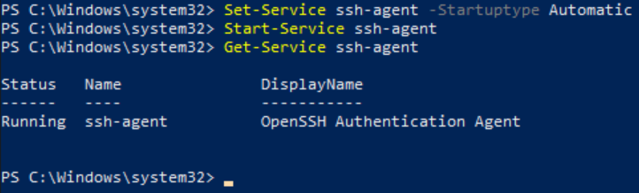
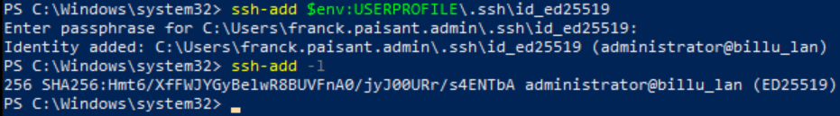
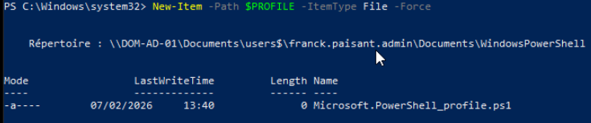
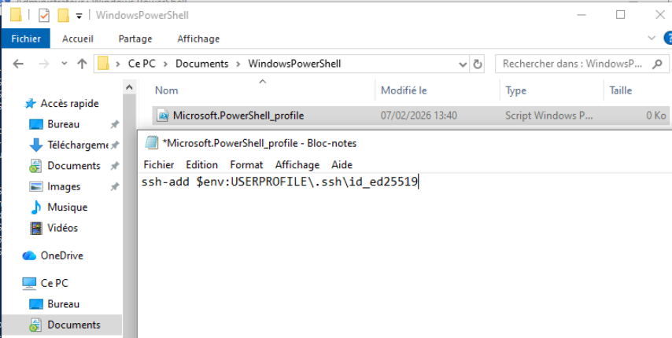

1. [Création d'une paire de clés Windows-Client (PC-ADMIN)](#1-création-dune-paire-de-clés-windows-client-pc-admin) 
	- [Installation et activation de AGENT-SSH](#11-installation-et-activation-de-agent-ssh) 
2. [Copie de la clé Publique sur DOM-AD-01](#2-copie-de-la-clé-publique-sur-dom-ad-01) 
	- [Modification du fichier de configuration SSH](#21-modification-du-fichier-de-configuration-ssh) 
3. [Copie de la clé Publique sur DOM-LOGS-01 et DOM-GLPI-01](#3-copie-de-la-clé-publique-sur-dom-logs-01-et-dom-glpi-01) 
4. [Copie de la clé Publique sur DOM-DHCP-01](#4-copie-de-la-clé-publique-sur-dom-dhcp-01)

---
### 1. Création d'une paire de clés Windows-Client (PC-ADMIN)

Ouvrir "PowerShell" en mode administrateur.

Pour générer la paire de clés voici la commande :

```powershell
ssh-keygen -t ed25519 -C "administrator@billu.lan"
```

- Entrer le chemin pour sauvegarder la clé : `C:\Users\.ssh`
- Entrer la Passphrase : `Azerty1*`

![image_01][Ressources/01_config_admin.png]

### 1.1 Installation et activation de AGENT-SSH

Pour éviter de saisir la passphrase à chaque connexion SSH , il faut activer et configurer le ce service . - Ouvrir **PowerShell** en mode **Administrateur** et taper ses commandes :

```powershell
Set-Service ssh-agent -StartupType Automatic
Start-Service ssh-agent
```

Nous allons vérifier que le service est démarré avec cette commande :

```powershell
Get-Service ssh-agent
```

Voici le résultat attendu :



Maintenant il faut ajouter la Clé Privé à l'agent : 
- Taper cette commande :

```powershell
ssh-add $env:USERPROFILE\.ssh\id_ed25519
```

La Passphrase sera demander une seule fois,puis sera mémorisée.

Dernière étape on va vérifier que la clé est bien chargée avec cette commande :

```shell
ssh-add -l
```



- Configuration automatique au démarrage de PowerShell

Cette étape va servir à chargé automatiquement la clé Privé dans le SSH-Agent à chaque ouverture de PowerShell.

On va créé le fichier Profile avec cette commande :

```shell
New-Item -Path $PROFILE -ItemType File -Force
```



Nous allons maintenant ouvrir ce fichier avec le Bloc note et ajouter cette ligne dans ce fichier :

`ssh-add $env:USERPROFILE\.ssh\id_ed25519`



Maintenant à chaque redémarrage du `PC-ADMIN` et à la 1ère ouverture de Powershell il va nous demander d'entrer notre Passphrase :

Une fois la Passphrase validé elle ne vous seras plus demandé jusqu'au prochain démarrage du `PC-ADMIN`.


---
### 2 .Copie de la clé Publique sur DOM-AD-01

Depuis le PC `ADMIN` :
Copié la clé Publique sur `DOM-AD-01`  avec cette commande :

```powershell
ssh administrator@DOM-AD-01 "echo $(Get-Content $env:USERPROFILE\.ssh\id_ed25519.pub) >> .ssh/authorized_keys"
```

- 2.1 Modification du fichier de configuration _SSH_

Depuis le Serveur `DOM-AD-01`

Commencer par ouvrir **PowerShell** en tant qu'administrateur.

Ensuite ce rendre dans le dossier suivant :

```shell
notepad C:\ProgramData\ssh\sshd_config
```

Il faut dé-commenter cette ligne = Enlever le **#** devant pour l'activer

```
PubkeyAuthentication yes
```

Il faut Commenter cette ligne = Ajouter un **#** devant pour la désactiver

```
PasswordAuthentication yes
```

Faire un **CTRL+S** pour sauvegarder le fichier après les modifications

Nous allons copier notre clé publique vers le fichiers des administrateur avec cette commande :

```powershell
Copy-Item C:.ssh\authorized_keys C:\ProgramData\ssh\administrators_autorized_keys
```


Dernière étape mais très importante nous devons redémarrer le service **sshd** avec cette commande :

```shell
 Restart-Service sshd
```

Depuis le `PC-ADMIN`  pour se connecter en SSH:

```powershell
ssh administrator@DOM-AD-01
```

---
### 3 .Copie de la clé Publique sur DOM-LOGS-01 et DOM-GLPI-01

Depuis le `PC-ADMIN` :

Afficher la clé publique :

```powershell
type $env:USERPROFILE\.ssh\id_ed25519.pub
```

Copie tout le contenu affiché.

Depuis le serveur `LOGS` connecter en SSH :

Créé le dossier `.ssh` :

```powershell
mkdir -p ~/.ssh
chmod 700 ~/.ssh
```

Créé le fichier `authorized_keys`:

```powershell
touch ~/.ssh/authorized_keys 
chmod 600 ~/.ssh/authorized_keys
```

Editer le fichier `authorized_keys` :

```powershell
sudo nano ~/.ssh/authorized_keys
```

Coller la clé publique dans le fichier puis sauvegarder et fermer.

- Modification du fichier configuration sshd :

```powershell
sudo nano /etc/ssh/sshd_config
```

Dans ce fichier effectuer les modifications suivantes :

- Garder l'authentification par clé activée :

`PubkeyAuthentication yes`

- Désactiver l'authentification par mot de passe :

`PasswordAuthentication no`

- Désactiver les mots de passe vides:

`PermitEmptyPasswords no`

- Désactiver root login par mot de passe :

`PermitRootLogin prohibit-password`

Sauvegarder et quitter .

- Redémarrer le service ssh :

```
sudo systemctl restart ssh
sudo systemctl restart sshd
```

**"IMPORTANT"** Test avant de se déconnecter :

Garde la session powershell ouverte et ouvre une autre console powershell.

depuis cette console effectue la connexion :

```powershell
ssh wilder@172.16.13.2
```

Logiquement tu doit te connecter sans Mot de Passe.

Même procédure pour le serveur `GLPI`

---
### 4 .Copie de la clé Publique sur DOM-DHCP-01

On se connecte sur `DOM-DHCP-01`

 - Créer le dossier SSH :
```Powershell
New-Item -ItemType Directory -Force -Path C:\ProgramData\ssh
```

- Créer le fichier authorized_keys 
```powershell
New-Item -ItemType File -Force -Path C:\ProgramData\ssh\administrators_authorized_keys
```

Depuis le `PC-ADMIN`:

- Copier la clé publique vers le serveur Windows:
```powershell
ssh administrator@172.16.12.2 "echo $(Get-Content $env:USERPROFILE\.ssh\id_ed25519.pub) >> C:\ProgramData\ssh\administrators_authorized_keys"
```

 - Configuration du fichier `sshd_config` :
```powershell
 Add-Content -Path C:\ProgramData\ssh\sshd_config -Value ""
```

```powershell
Add-Content -Path C:\ProgramData\ssh\sshd_config -Value "PubkeyAuthentication yes"
```

```powershell
Add-Content -Path C:\ProgramData\ssh\sshd_config -Value "PasswordAuthentication no"
```

```powershell
Add-Content -Path C:\ProgramData\ssh\sshd_config -Value "Match Group administrators"
 Add-Content -Path C:\ProgramData\ssh\sshd_config -Value " AuthorizedKeysFile __PROGRAMDATA__/ssh/administrators_authorized_keys"
```

Démarrage du service :

```powershell
Start-Service sshd
```

---
