# Installation de pfSense

## Sommaire

[1. Installation de pfSense](#1-installation-de-pfsense)  
[2. Première configuration CLI de pfSense](#2-première-configuration-cli-de-pfsense)  

### 1. Installation de pfSense

Dans ce premier chapitre nous allons effectuer l'installation complète de pfSense. 

- Cliquer sur `Accept`

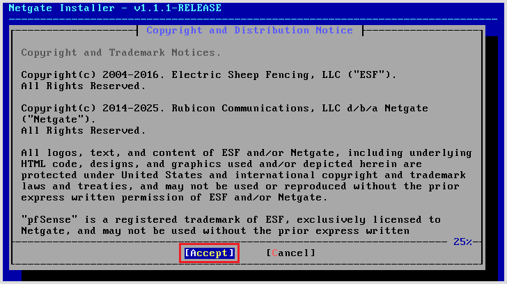

1) Cliquer sur `Install` 
2) Cliquer sur `OK`

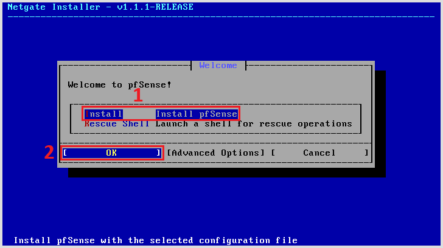

- Cliquer sur `OK`

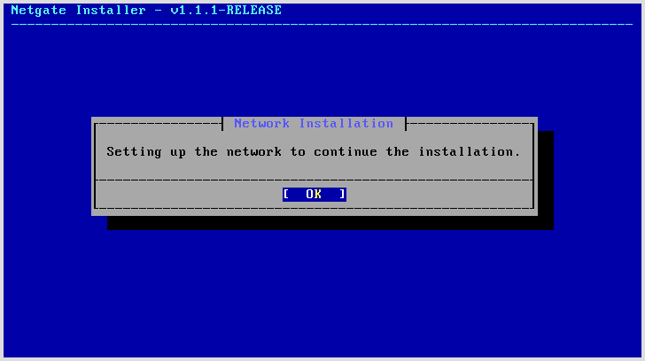

1) Sélectionner l'interface réseau `WAN`
2) Cliquer sur `OK`

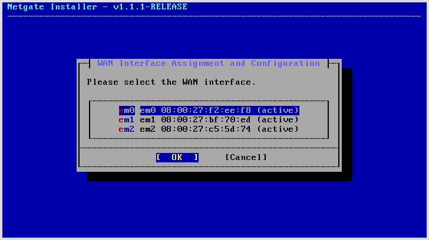

1) Sélectionner `Continue`
2) Cliquer sur `OK`

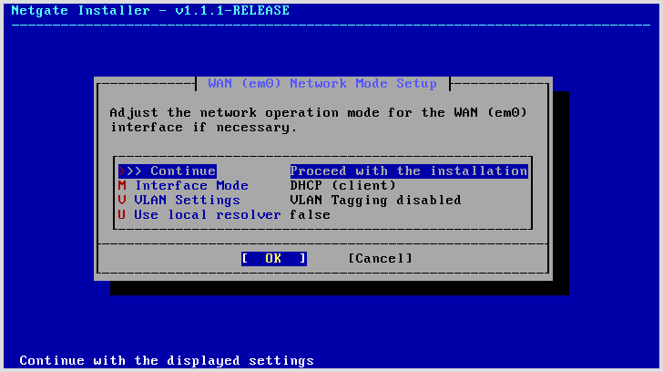

1) Sélectionner l'interface réseau `LAN`
2) Cliquer sur `OK`

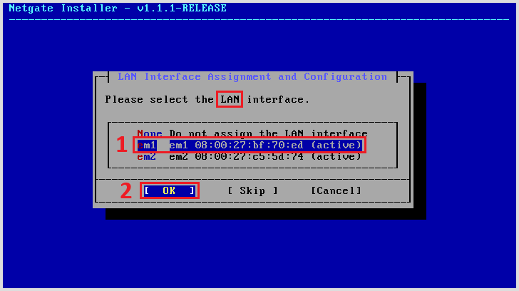

1) Sélectionner `Continue`
2) Cliquer sur `OK`

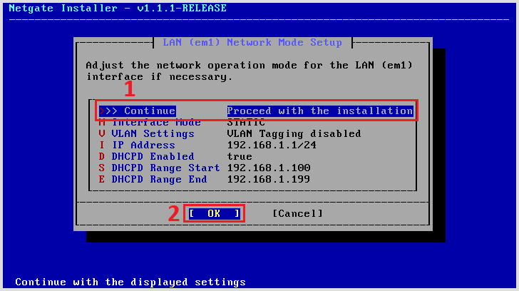

1) Sélectionner l'interface `WAN`
2) Cliquer sur `Continuer`

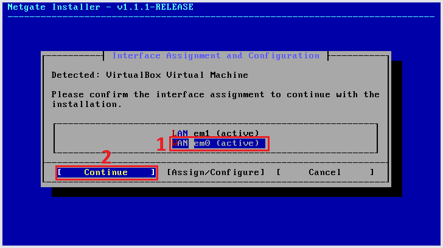

- Vérification de la connection internet

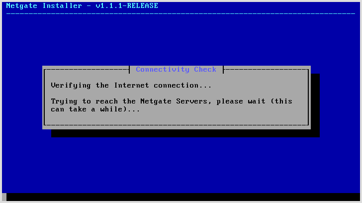

- Cliquer sur `Install CE`

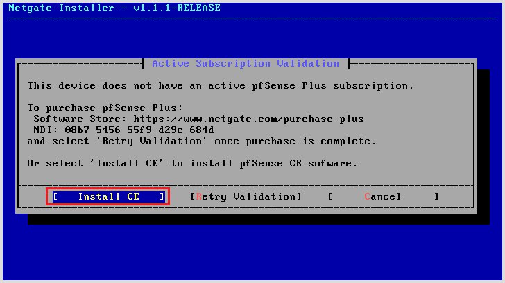

1) Sélectioner sur `Continue`
2) Cliquer `OK`

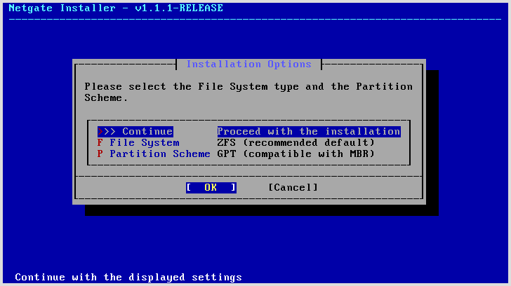

- Cliquer sur `OK`

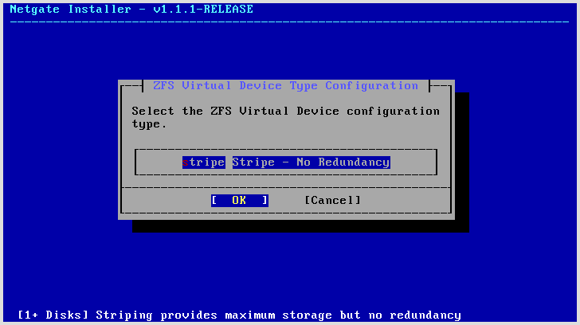

1) Sélectionner le disque pour l'installation
2) Cliquer sur `OK`

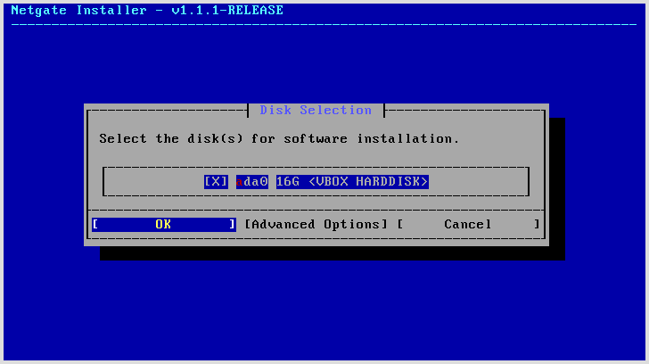

- Confirmer l'installation sur le disque sélectionné

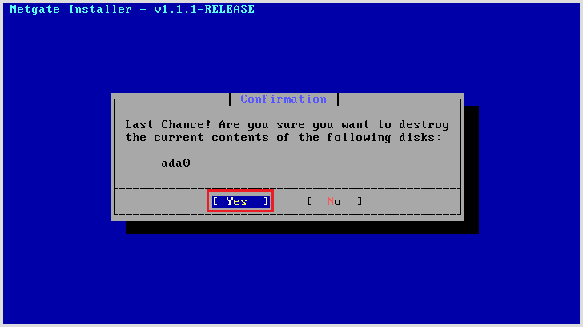

1) Sélectionner la version a installer (`Current Stable` de préférence)
2) Cliquer sur `OK`

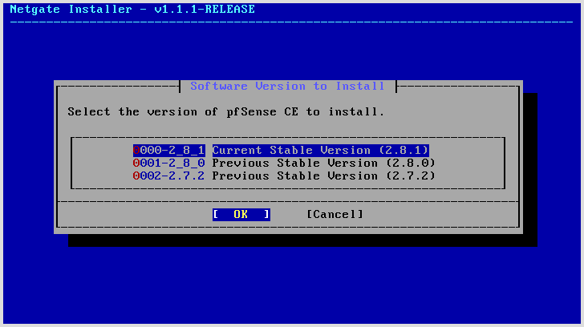

- Fenêtre d'installation en cours

- Fenêtre de confirmation d'installation

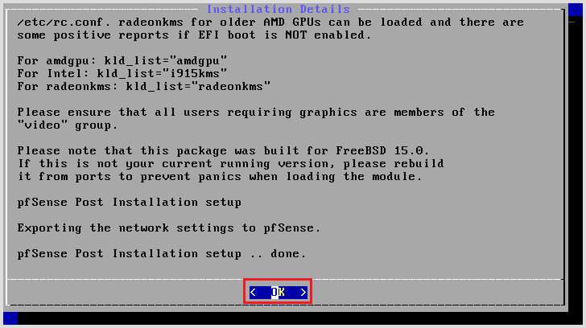

- Sélectionner `Reboot`

####### WARNING : Enlever l'iso ou le CD pour éviter que l'installation ne se relance #######

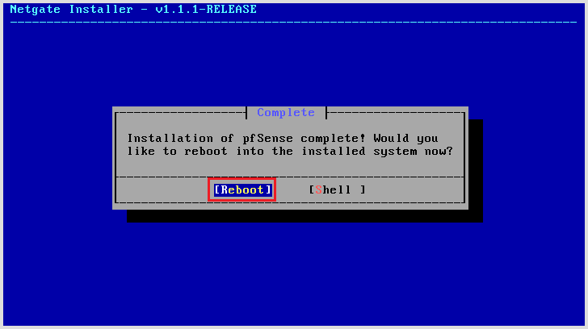

- **Installation terminée**, Menu CLI

## 2. Première configuration CLI de pfSense

Dans ce chapitre nous allons effectuer les premières configuration à partir de l'interface CLI de pfSense pour nous permettre un accès WEB.

- Entrer l'option 2

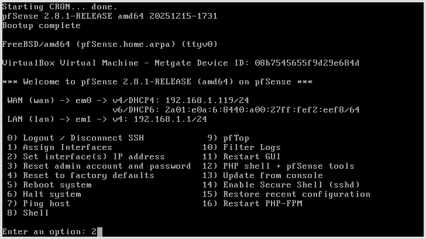

- Entrer l'option 2 pour sélectionner l'interface `LAN`

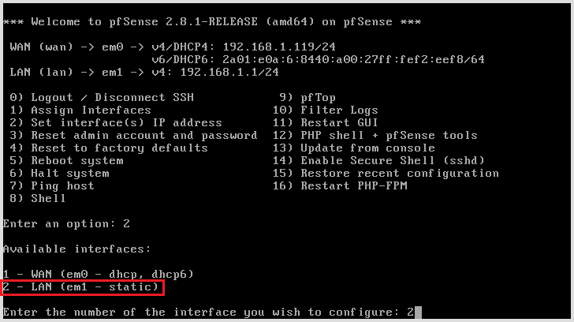

- Entrer `n` pour la configuration de DHCP

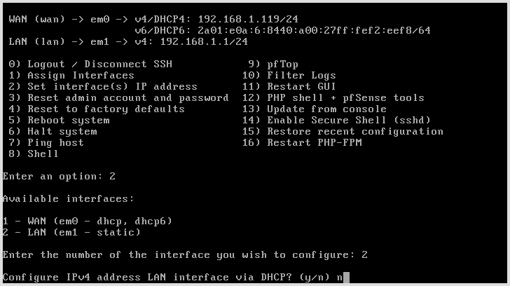

- Entrer l'adresse IP de l'interface LAN (10.10.10.1)

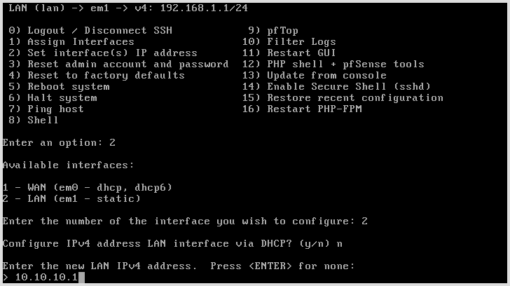

- Entrer le CIDR du réseau (30)

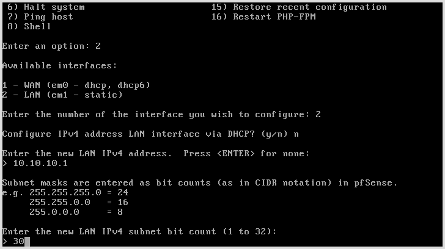

- Ne rien saisir et appuyer sur `Entrée`

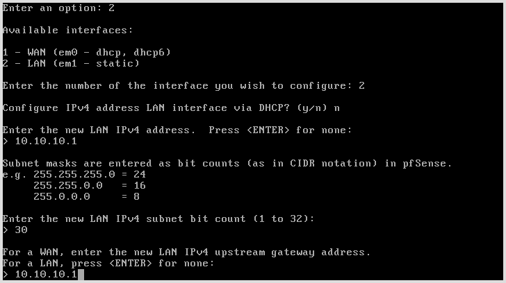

- Entrer `n` pour la configuration de DHCP6

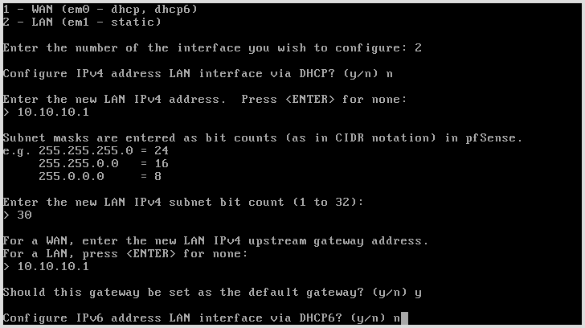

- Ne rien saisir et appuyer sur `Entrée`

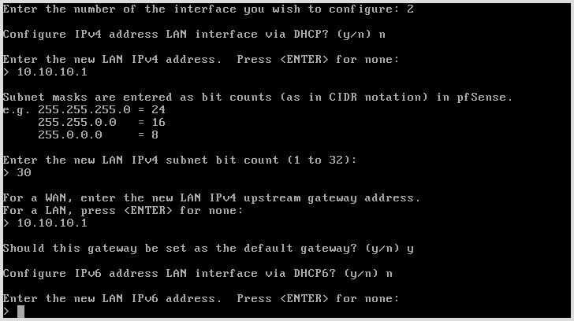

- Entrer `n` pour l'activation du DHCP server sur le LAN

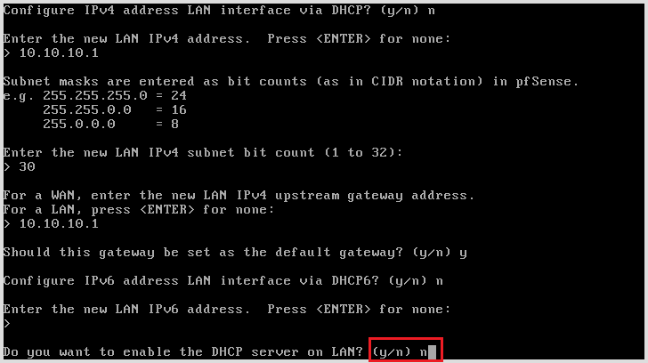

- Entrer `y` pour accéder à l'interface par le procotol HTTP, sinon entrer `n` pour accéder seulement pas HTTPS

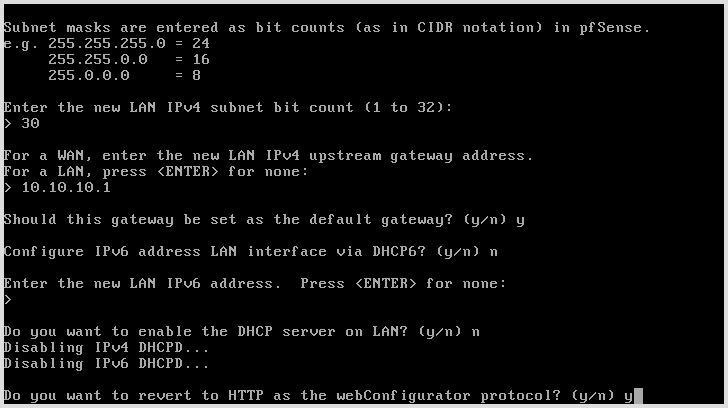

- Ecran de confirmation de configurer, appuyer sur `Entrée` pour continuer

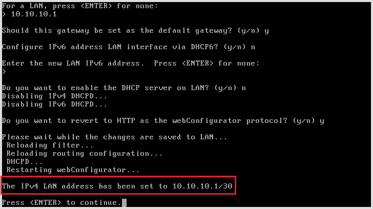

- Configuration de l'interface LAN terminé

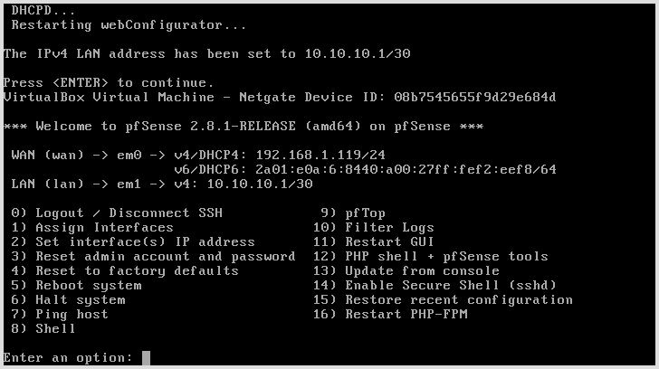

