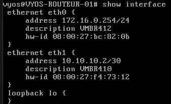
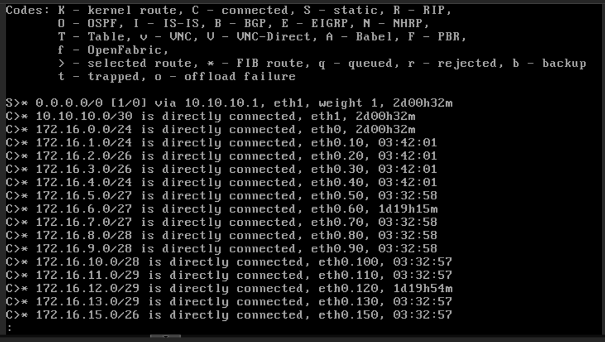
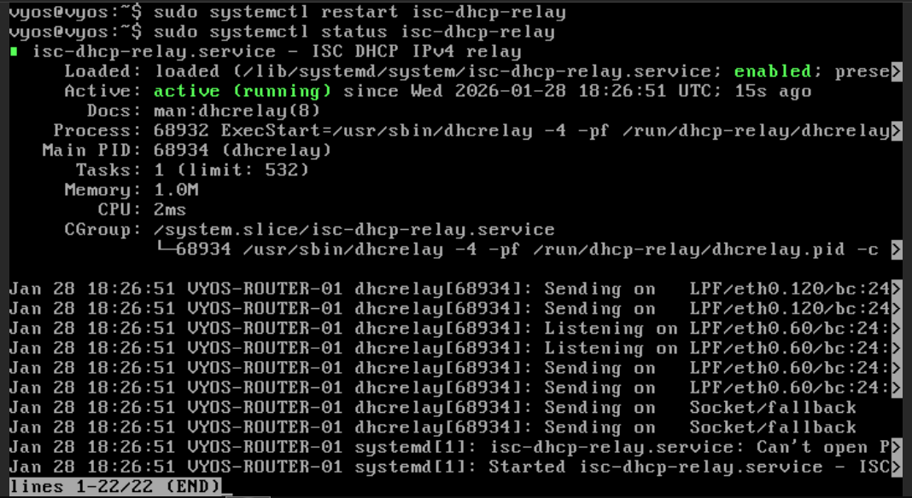

# Configuration du Routeur VyOS

## Sommaire

1. [Configuration des interfaces réseau](#1-configuration-des-interfaces-réseau)
   - [Identification des interfaces](#identification-des-interfaces)
   - [Configuration des adresses IP](#configuration-des-adresses-ip)
2. [Configuration des VLANs](#2-configuration-des-vlans)
   - [Vérification des VLANs](#verification-des-vlans)
3. [Configuration du routage inter-VLAN](#3-configuration-du-routage-inter-vlan)
   - [Activation et ajout du routage IP](#activation-et-ajout-du-routage-ip)
   - [Vérification des routes](#vérification-des-routes)
4. [Configuration du DHCP Relay](#4-configuration-du-dhcp-relay)
   - [Principe du DHCP relay](#principe-du-dhcp-relay)
   - [Configuration par VLAN](#configuration-par-vlan)
   - [Vérification et statut du relay](#vérification-et-statut-du-relay)

---

## 1. Configuration des interfaces réseau

### Identification des interfaces

Avant de configurer, identifier les interfaces disponibles :

Afficher toutes les interfaces :

```bash
show interface
```

### Configuration des adresses IP

#### Configuration de base des interfaces

Interface **"eth0"** :

```bash
configure
set interfaces ethernet eth0 address 172.16.0.254/24
set interfaces ethernet eth0 description VMBR412
```

Interface **"eth1"**:

```bash
set interfaces ethernet eth0 address 10.10.10.2/30
set interfaces ethernet eth0 description VMBR410
```

Pour valider et sauvegarder :

```bash
commit
save
exit
```

#### Vérification des interfaces

Verifier la configuration des interfaces "eth0" et "eth1"

```bash
show interfaces
```



---

## 2. Configuration des VLANs

Pour configurer les VLAN sur interface physique :

Exemple VLAN 10 - DEV

```bash
configure
set interfaces ethernet eth0 vif 10 address 172.16.1.254/24
set interfaces ethernet eth0 vif 10 description "VLAN 10 - DEV"
```

Effectuer la même procédure pour tous les VLANs suivant le plan d'adressage :

VLAN 20 - COMMER

VLAN 30 - COMMU

VLAN 40 - VOIP

VLAN 50 - JURI

VLAN 60 - DSI

VLAN 70 - COMPTA

VLAN 80 - DIREC

VLAN 100 - QHSE

VLAN 110 - RH

VLAN 120 - AD/DHCP/DNS

VLAN 130 - SERVEUR

VLAN 150 - ADMIN

Pour valider et sauvegarder :

```bash
commit
save
```

#### Vérification des VLANs

Afficher les VLANs configurés :

```bash
show interfaces ethernet
```


---

## 3. Configuration du routage inter-VLAN

### Activation et ajout du routage IP

Par défaut, VyOS active le routage IP entre les interfaces.
Vérification :

```bash
show ip forwarding
```


Si pas activer il faut exécuter ses commandes :

```bash
configure
set system ip forwarding
commit
save
```

Création d'une route pour accéder à internet :

```bash
set protocols static route 0.0.0.0/0 next-hop 10.10.10.1
commit
save
exit
```
### Vérification des routes

Pour afficher la table de routage :

```bash
show ip route
```



---
## 4. Configuration du DHCP Relay

### Principe du DHCP relay

Le **DHCP relay** (relais DHCP) est un service qui transfère les requêtes DHCP entre les clients et un serveur DHCP situé sur un réseau différent.

**Architecture VLAN 10** :
```
Client VLAN 10 → VyOS (relay) → Serveur DHCP VLAN 120 → VyOS → Client VLAN 10
```

### Configuration par VLAN

#### Configuration du serveur DHCP cible

Définir l'adresse IP du serveur DHCP :

```bash
configure
set service dhcp-relay server 172.16.12.2
```

Définir les interfaces d'écoute (VLANs clients) :

```bash
set service dhcp-relay listen-interface eth0.10
set service dhcp-relay listen-interface eth0.20
set service dhcp-relay listen-interface eth0.30
set service dhcp-relay listen-interface eth0.40
set service dhcp-relay listen-interface eth0.50
set service dhcp-relay listen-interface eth0.60
set service dhcp-relay listen-interface eth0.70
set service dhcp-relay listen-interface eth0.80
set service dhcp-relay listen-interface eth0.100
set service dhcp-relay listen-interface eth0.110
set service dhcp-relay listen-interface eth0.120
set service dhcp-relay listen-interface eth0.130
```

Spécifier l'interface de sortie (vers le serveur DHCP) :

```bash
set service dhcp-relay upstream-interface eth0.120
```

Pour valider et sauvegarder :

``` bash
commit
save
exit
```

### Vérification et status du relay

Vérifier la configuration du **"DHCP-relay"** :

```bash
configure
show service dhcp-relay
```


Redémarrage et statut du **"DHCP relay"** :

```bash
sudo systemctl restart isc-dhcp-relay
sudo systemctl enable isc-dhcp-relay
sudo systemctl status isc-dhcp-relay
```



Nous voyons que le service est **"enabled"** et **"active"**.

---

**Date de création** : 28/01/2026  
**Auteur** : G1 - Projet 3 BillU  
**Version** : 1.0
