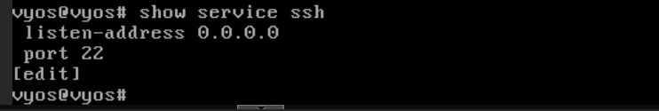

# Installation du Routeur VyOS

## Sommaire

1. [Prérequis](#2-prérequis)
   - [Ressources matérielles](#ressources-matérielles)
2. [Premier démarrage et accès](#3-premier-démarrage-et-accès)
   - [Connexion initiale](#connexion-initiale)
   - [Changement du mot de passe](#changement-du-mot-de-passe)
3. [Configuration de base](#4-configuration-de-base)
   - [Accès au mode configuration](#accès-au-mode-configuration)
   - [Configuration du hostname](#configuration-du-hostname)
   - [Activation du serveur SSH](#activation-du-serveur-ssh)
   - [Sauvegarde de la configuration](#sauvegarde-de-la-configuration)
4. [Vérifications post-installation](#5-vérifications-post-installation)
   - [Vérification des services](#vérification-des-services)

## 1. Prérequis

### Ressources matérielles

Configuration recommandée pour la VM VyOS :

| Ressource         | Valeur recommandée             |
| ----------------- | ------------------------------ |
| CPU               | 1 CPU                          |
| RAM               | 512 Mo                         |
| Disque            | 2 Go                           |
| Interfaces réseau | Minimum 2 (selon architecture) |

---

## 2. Premier démarrage et accès

### Connexion initiale

1. Démarrer la VM VyOS depuis l'interface Proxmox
2. Accéder à la console via le bouton **"Console"**
3. Attendre le démarrage complet du système

### Connexion par défaut

```
VyOS login: vyos
Password: vyos
```

> **Sécurité** : Le mot de passe par défaut **doit être changé immédiatement** après la première connexion.

### Changement de la disposition du clavier

Par défaut, le clavier est configuré en **"QWERTY"**.
Pour passer en **'AZERTY"** :

Pour entrer dans le mode configuration nous devons exécuter cette commande :

```bash
configure
```
Pour changer la configuration clavier :

```bash
set system option keyboard-layout fr
```

Pour valider et sauvegarder :

```bash
commit
save
exit
```

### Changement du mot de passe

Pour entrer dans le mode configuration nous devons exécuter cette commande :

```bash
configure
```

Pour changer le mot de passe utilisateur  :
```bash
set system login user vyos authentication plaintext-password Azerty1*
```

Ensuite on exécutes ces commandes pour valider et sauvegarder  :

```bash
commit
save
exit
```

---

## 3. Configuration de base

### Accès au mode configuration

VyOS fonctionne avec deux modes :
- **Mode opérationnel** : Consultation et diagnostic 
	- (prompt `vyos@vyos:~$`)
- **Mode configuration** : Modification de la configuration 
	- (prompt `vyos@vyos#`)

Pour entrer dans le mode configuration :
```bash
configure
```

Pour sortir du mode configuration :
```bash
exit
```

### Configuration du hostname

Pour définir le nom d'hôte :

```bash
configure
set system host-name 'VYOS-ROUTER-01'
```

Pour définir le nom de domaine :

```bash
set system domain-name 'billu.lan'
```

Pour valider :

```bash
commit
save
```

### Activation du serveur SSH

Pour permettre l'administration à distance :

Activer le service SSH :

```bash
configure
set service ssh port 22
set service ssh listen-address 0.0.0.0
```

Valider :

```bash
commit
save
```


> **Sécurité** : Il est recommandé de restreindre l'accès SSH uniquement au VLAN Administration (150) après configuration complète.

### Sauvegarde de la configuration

Pour sauvegarder la configuration actuelle :
```bash
save
```

---
## 4. Vérifications post-installation

### Vérification des services

Vérifier le statut du service SSH

```bash
show service ssh
```



### Test de connexion SSH

Avant de tester la connxeion SSH, n'oubliez pas de configurer les interfaces de la carte réseau.
Vous pouvez vous référez a la documentation documentation.md au chapitre :

**[1. Configuration des interfaces réseau](https://github.com/WildCodeSchool/TSSR-1025-P3-G1/blob/main/components/Vyos_Routeur/configuration.md#1-configuration-des-interfaces-r%C3%A9seau)**

Une fois cela fais, vous pouvez donc, depuis un poste d'administration :

Connexion SSH au routeur Vyos :

```bash
ssh vyos@172.16.0.254
```

---

**Date de création** : 28/01/2026  
**Auteur** : G1 - Projet 3 BillU  
**Version** : 1.0

