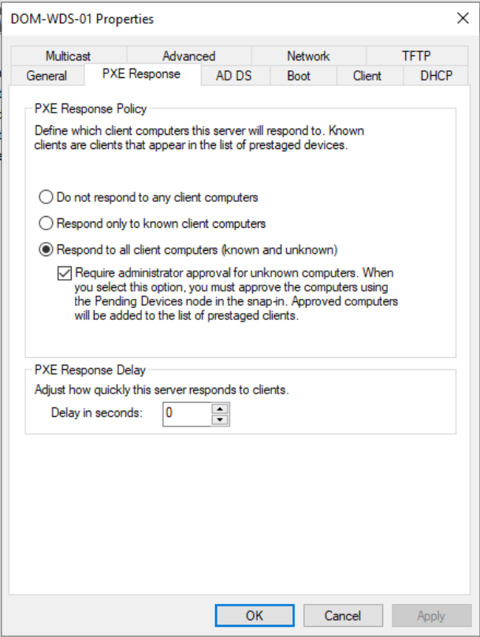
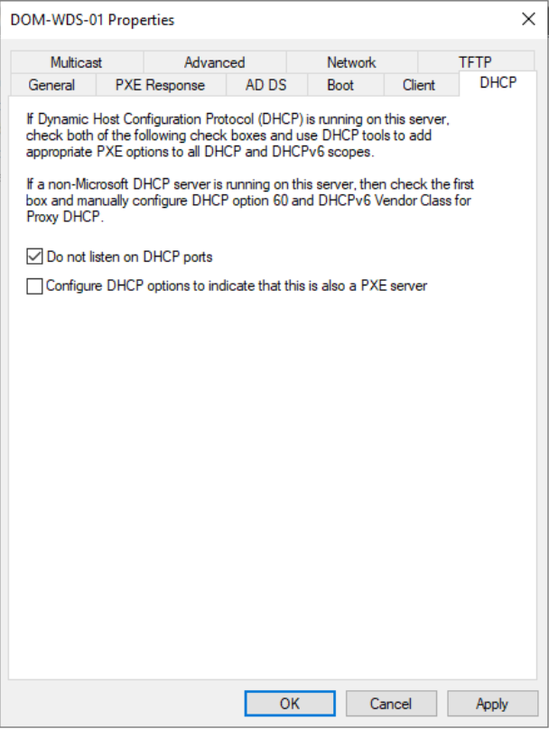
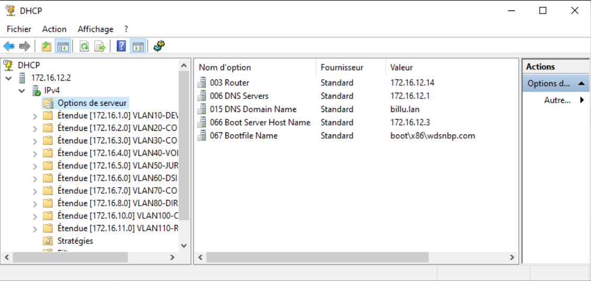
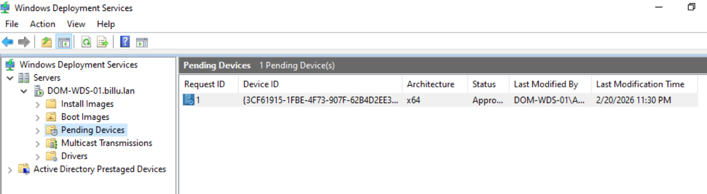

## Sommaire

## Sommaire

1. [Configuration du serveur WDS](#1-configuration-du-serveur-wds)
   - [1.1 Paramètres PXE](#11-paramètres-pxe)
   - [1.2 Paramètres DHCP](#12-paramètres-dhcp)
   - [1.3 Paramètres Boot](#13-paramètres-boot)
   - [1.4 Paramètres AD DS](#14-paramètres-ad-ds)
2. [Configuration des options DHCP pour le PXE](#2-configuration-des-options-dhcp-pour-le-pxe)
3. [Configuration du DHCP Relay sur VyOS](#3-configuration-du-dhcp-relay-sur-vyos)
4. [Import des images WDS](#4-import-des-images-wds)
   - [4.1 Préparer l'ISO Windows](#41-préparer-liso-windows)
   - [4.2 Ajout d'une Boot Image](#42-ajout-dune-boot-image)
   - [4.3 Ajout d'une Install Image](#43-ajout-dune-install-image)
5. [Paramètres de sécurité et gestion des clients](#5-paramètres-de-sécurité-et-gestion-des-clients)
6. [Validation du fonctionnement PXE](#6-validation-du-fonctionnement-pxe)

---

## 1. Configuration du serveur WDS

Ouvrir la console WDS depuis Server Manager :

```
Server Manager > Tools > Windows Deployment Services
```

Dans l'arborescence à gauche, développer :

```
Servers
  └── DOM-WDS-01   < clic droit > Properties
```

---

### 1.1 Paramètres PXE

Onglet **PXE Response** dans les propriétés du serveur.

| Option                                               | État        |
| ---------------------------------------------------- | ----------- |
| Respond to all client computers (known and unknown)  | Sélectionné |
| Require administrator approval for unknown computers | Coché       |
| Response delay                                       | `0` seconde |

**Pourquoi ces choix ?**

- `Respond to all` > permet d'accueillir les nouvelles machines qui ne sont pas encore connues du WDS
- `Require administrator approval` > sécurité : une machine ne peut pas démarrer sur le réseau sans validation manuelle d'un admin
- `Delay 0` > pas d'attente inutile avant la réponse PXE


---

### 1.2 Paramètres DHCP

Onglet **DHCP** dans les propriétés du serveur.

| Option                                                            | État    |
| ----------------------------------------------------------------- | ------- |
| Do not listen on DHCP ports                                       | Coché   |
| Configure DHCP options to indicate that this is also a PXE server | Décoché |

**Pourquoi ?**

Dans notre infrastructure, le DHCP est géré par un serveur séparé (`DOM-DHCP-01` - `172.16.12.2`). Le WDS ne doit pas interférer avec lui sur le port 67. Les options de boot (66/67) sont configurées directement sur les scopes DHCP - voir [section 2]



---

### 1.3 Paramètres Boot

Onglet **Boot** dans les propriétés du serveur.

|Paramètre|Valeur|
|---|---|
|Architecture x64 (BIOS)|`boot\x86\wdsnbp.com`|

Même si nos machines sont en x64, SeaBIOS (Proxmox) utilise le boot en mode Legacy BIOS > fichier `x86`. Pour des machines UEFI, utiliser `boot\x64\wdsnbp.com`.

---

### 1.4 Paramètres AD DS

Onglet AD DS dans les propriétés du serveur.

| Option                                                 | État  |
| ------------------------------------------------------ | ----- |
| Allow WDS to dynamically discover valid domain servers | Coché |

Les comptes ordinateurs des machines déployées seront automatiquement créés dans le domaine `billu.lan`. On peut définir l'OU de destination ici si nécessaire.

---

## 2. Configuration des options DHCP pour le PXE

Ces options indiquent aux clients PXE où se trouve le serveur WDS et quel fichier télécharger pour démarrer.

Elles sont à configurer sur chaque scope VLAN où le PXE doit fonctionner, depuis le serveur DHCP `DOM-DHCP-01`.

### Via la console DHCP (GUI)

Chemin pour chaque scope :

```
DHCP
  └── IPv4
        └── Server Option 
		        └── clic droit > Configure Options
```

Cocher et renseigner :

**Option 066 – Boot Server Host Name**

```
172.16.12.3
```

**Option 067 – Bootfile Name**

```
boot\x86\wdsnbp.com
```

---

## 3. Configuration du DHCP Relay sur VyOS

Le routeur VyOS relaie les requêtes DHCP/PXE des clients vers les serveurs, puisque ces derniers sont dans un VLAN différent.
### Configuration complète

```bash
configure

# Interfaces clients (une par VLAN utilisateur)
set service dhcp-relay listen-interface eth0.10
set service dhcp-relay listen-interface eth0.20
set service dhcp-relay listen-interface eth0.30
set service dhcp-relay listen-interface eth0.50
set service dhcp-relay listen-interface eth0.60
set service dhcp-relay listen-interface eth0.70
set service dhcp-relay listen-interface eth0.80
set service dhcp-relay listen-interface eth0.100
set service dhcp-relay listen-interface eth0.110
set service dhcp-relay listen-interface eth0.120
set service dhcp-relay listen-interface eth0.130
set service dhcp-relay listen-interface eth0.150

# Serveurs cibles
set service dhcp-relay server 172.16.12.2   # DHCP
set service dhcp-relay server 172.16.12.3   # WDS

# Interface vers les serveurs (VLAN 120)
set service dhcp-relay upstream-interface eth0.120

commit
save
```

### Vérification

```bash
show service dhcp-relay
```

---

## 4. Import des images WDS

### 4.1 Préparer l'ISO Windows

Avant d'importer quoi que ce soit dans WDS, il faut extraire les fichiers depuis l'ISO Windows.

**Étape 1 — Monter l'ISO**

Depuis le serveur `DOM-WDS-01` (ou n'importe quelle machine Windows) :

- Faire un clic droit sur le fichier `.iso` > `Mount`
- Windows va lui attribuer une lettre de lecteur
- Ouvrir l'Explorateur de fichiers pour vérifier le contenu du lecteur monté

Le contenu de l'ISO doit ressembler à ceci :

```
D:\
  ├── boot\
  ├── efi\
  ├── sources\
  │     ├── boot.wim       < image de démarrage (WinPE)
  │     └── install.wim    < image(s) d'installation Windows
  └── setup.exe
```

Les deux fichiers dont on a besoin sont `boot.wim` et `install.wim`, tous les deux dans le dossier `sources\`.

---

### 4.2 Ajout d'une Boot Image

La Boot Image est l'image WinPE qui se charge lors du boot PXE. Elle permet d'afficher le menu WDS et de lancer l'installation.

**Étape 1 — Ouvrir la console WDS**

```
Server Manager > Tools > Windows Deployment Services
```

**Étape 2 — Accéder aux Boot Images**

```
Servers
  └── DOM-WDS-01
        └── Boot Images
		       └── clic droit > Add Boot Image
```

**Étape 3 — Sélectionner le fichier**

Dans l'assistant qui s'ouvre :

- Cliquer sur `Browse`
- Naviguer jusqu'au lecteur de l'ISO monté > dossier `sources\`
- Sélectionner le fichier `boot.wim`
- Cliquer sur `Open` puis `Next`

**Étape 4 — Nommer l'image**

- `Image name` : donner un nom parlant, exemple : `WinPE x64 - Windows 11`
- `Image description` : optionnel, exemple : `Image de démarrage PXE`
- Cliquer sur `Next`

**Étape 5 — Confirmer et importer**

- Vérifier le récapitulatif
- Cliquer sur `Next` > l'import commence (quelques secondes)
- Cliquer sur `Finish`

La Boot Image apparaît maintenant sous `Boot Images` dans la console WDS.

---

### 4.3 Ajout d'une Install Image

Les Install Images contiennent les éditions Windows à déployer (Windows 10, 11, Server...). Un seul fichier `install.wim` peut contenir plusieurs éditions.

**Étape 1 — Créer un groupe d'images**

Les Install Images sont organisées en groupes dans WDS. Il est conseillé de créer un groupe par OS.

```
Servers
  └── DOM-WDS-01
        └── Install Images   < clic droit > Add Install Image Group
```

Nommer le groupe, par exemple :

- `Windows 10`
- `Windows 11`
- `Windows Server 2022`

**Étape 2 - Ajouter une image dans le groupe**

Clic droit sur le groupe créé > `Add Install Image`

**Étape 3 - Sélectionner le fichier**

Dans l'assistant :

- Cliquer sur `Browse`
- Naviguer jusqu'au lecteur de l'ISO monté > dossier `sources\`
- Sélectionner le fichier `install.wim`
- Cliquer sur `Open` puis `Next`

**Étape 4 — Choisir les éditions à importer**

Le fichier `install.wim` contient souvent plusieurs éditions (Pro, Entreprise, Home...). Une liste s'affiche avec des cases à cocher.

Sélectionner uniquement les éditions dont on a besoin, par exemple :

- `Windows 11 Pro`

Cliquer sur `Next`.

**Étape 5 — Confirmer et importer**

- Vérifier le récapitulatif
- Cliquer sur `Next` > l'import commence (peut prendre quelques minutes selon la taille)
- Cliquer sur `Finish`

Les images apparaissent maintenant dans le groupe sous `Install Images`.

**Répéter les étapes 4.1 à 4.3** pour chaque ISO (Windows 10, Windows 11, Windows Server), en montant un ISO à la fois et en créant un groupe distinct pour chacun.

---

## 5. Paramètres de sécurité et gestion des clients

### Approbation des machines inconnues

Avec l'option `Require administrator approval` activée, chaque nouvelle machine qui tente un boot PXE apparaît dans la file d'attente WDS.

**Via la console WDS :**

```
Servers
  └── DOM-WDS-01
        └── Pending Devices   < clic droit sur la machine > Approve
```


---

## 6. Validation du fonctionnement PXE

### Prérequis côté client

|Paramètre|Valeur|
|---|---|
|BIOS|SeaBIOS (Proxmox)|
|Carte réseau|Intel E1000|
|Boot order|Network en premier|
|VLAN|N'importe quel VLAN avec PXE activé|

### Séquence de boot attendue

```
1.  Client envoie un DHCP Discover en broadcast
2.  VyOS relay transmet la requête vers 172.16.12.2 et 172.16.12.3
3.  DHCP répond avec une IP + options 66/67
4.  Client affiche :
      Next server : 172.16.12.3
      Filename    : boot\x86\wdsnbp.com
5.  Téléchargement TFTP de wdsnbp.com > OK
6.  WDSNBP démarre et contacte WDS sur le port 4011
7.  Message affiché :
      "Please provide these details to your WDS Administrator
       so that this request can be approved."
      Pending Request ID : X
8.  Admin approuve la machine dans la console WDS
9.  WinPE se charge
10. Menu de sélection de l'image d'installation
11. Déploiement Windows
```
#### L'onglet Pending devices sur WDS, pour accepter les nouveaux PC.
