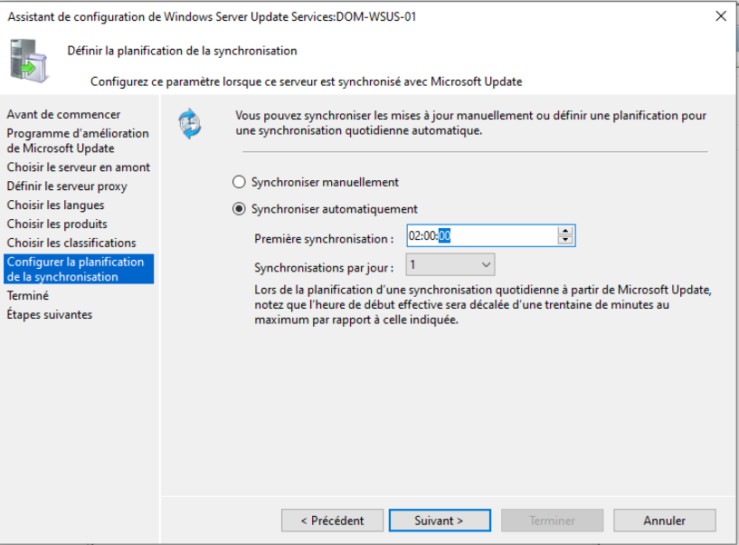
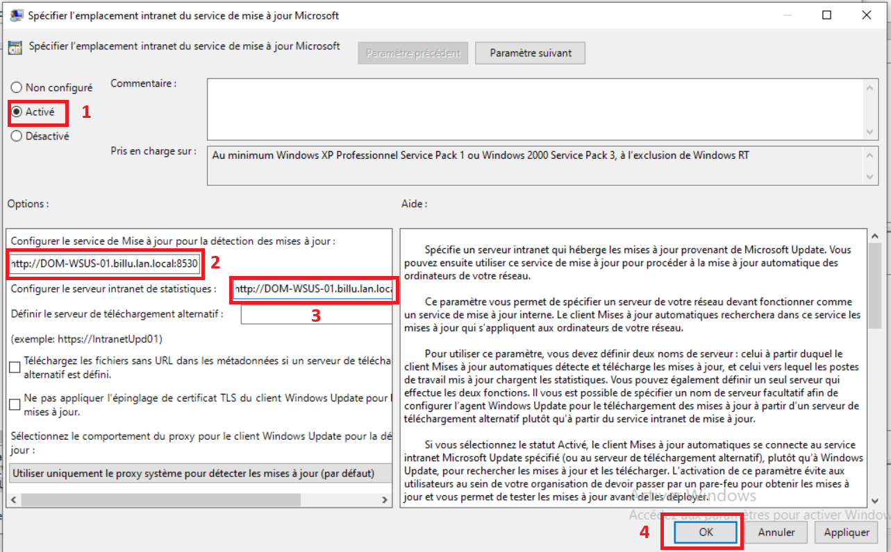
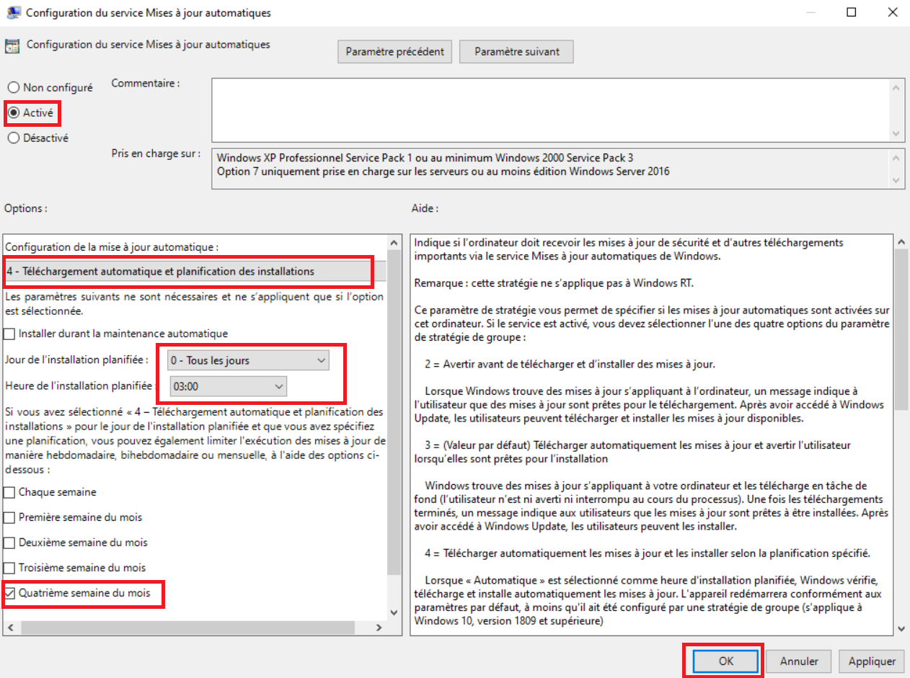

---
## 2. 1 ère configuration de WSUS

Depuis le `PC-ADMIN` ouvrir la console `WSUS` depuis le menu `Démarrer`

- Cliquer sur `NEXT`  x4
- Cliquer sur `Démarrer la connexion`
- Cliquer sur `NEXT`  x2
- Cocher : `AD` `Windows 10 version 1.903 and later` `windows server 2019` `Powershell`
- Cliquer sur `suivant`

- Cliquer sur `suivant`

- Cliquer sur `Synchroniser automatiquement` + `suivant` 
- Cliquer sur `Terminer`

---
## 2 . Création de groupes du WSUS Activation de GPO

Depuis la console `WSUS`  du `PC-ADMIN`:
- Cliquer sur `Ordinateurs`
- Clique droit sur `Tous les ordinateurs`
- Cliquer sur `Ajouter un groupe d'ordinateurs`
- Entrer le Nom du groupe à ajouter : `PC` `SERVERS` et `PC TEST`
- Cliquer sur `Ajouter`

Toujours depuis la console `WSUS`:
- Cliquer sur `Options`
- Cliquer sur `Ordinateurs`
- Cocher `Utiliser les paramètres de stratégie de groupe ou de Registre sur les ordinateurs`
- Cliquer sur `OK`

---

## 3. GPO WSUS 

**Nom :** `WSUS_COMPUTERS_Common_Parameter`

Depuis le PC `Admin` :

**Chemin de configuration :**
> Configuration ordinateur > Modèles d'administration > Composants Windows > Windows update

**Paramètres :**

| Paramètre                                                          | Valeur           | Note                                   |
| ------------------------------------------------------------------ | ---------------- | -------------------------------------- |
| Specifier Emplacement intranet du service de mise à jour Microsoft | `Activé` > `oui` | Spécifie l'emplacement du serveur WSUS |

Onglet : `Gérer les mises à jours proposées de windows Server Updates Services`

| Paramètre                                                      | Valeur           | Note                                        |
| -------------------------------------------------------------- | ---------------- | ------------------------------------------- |
| Ne pas se connecter à des emplacements Internet Windows Update | `Activé` > `oui` | Interdit de se connecter sur Windows update |

**Portée :**

| Propriété | Valeur                                           |
| --------- | ------------------------------------------------ |
| Liaison   | `BillU > BilluComputers > Tous les départements` |
| Filtrage  | Tous les groupes de départements                 |
| Cible     | Computers                                        |
| Statut    | configuration utilisateur désactivée             |

**Nom :** `WSUS_COMPUTERS_PC`

**Chemin de configuration :**
> Configuration ordinateur > Modèles d'administration > Composants Windows > Windows update

**Paramètres :**

| Paramètre                        | Valeur           | Note                                                                        |
| -------------------------------- | ---------------- | --------------------------------------------------------------------------- |
| Autoriser le ciblage côté client | `Activé` > `oui` | chaque Pc attribuer a ce groupe ira directement dans le bon groupe sur WSUS |
Indiquer le nom du groupe cible : `PC`

| Paramètre                                                                                  | Valeur           | Note                      |
| ------------------------------------------------------------------------------------------ | ---------------- | ------------------------- |
| Désactiver le redémarrage automatique pour les mises à jour pendants les heures d'activité | `Activé` > `oui` | Heure d'activité 08h -17h |
| Configuration du service Mises à jour automatiques                                         | `Activé` > `oui` |                           |

**Portée :**

| Propriété | Valeur                                           |
| --------- | ------------------------------------------------ |
| Liaison   | `BillU > BilluComputers > Tous les départements` |
| Filtrage  | Tous les groupes de départements                 |
| Cible     | Computers                                        |
| Statut    | configuration utilisateur désactivée             |

**Nom :** `WSUS_COMPUTERS_SERVER`

**Chemin de configuration :**
> Configuration ordinateur > Modèles d'administration > Composants Windows > Windows update

**Paramètres :**

| Paramètre                        | Valeur           | Note                                                                        |
| -------------------------------- | ---------------- | --------------------------------------------------------------------------- |
| Autoriser le ciblage côté client | `Activé` > `oui` | chaque Pc attribuer a ce groupe ira directement dans le bon groupe sur WSUS |
|                                  |                  |                                                                             |
Indiquer le nom du groupe cible : `SERVERS`

| Paramètre                                                                                  | Valeur           | Note                      |
| ------------------------------------------------------------------------------------------ | ---------------- | ------------------------- |
| Désactiver le redémarrage automatique pour les mises à jour pendants les heures d'activité | `Activé` > `oui` | Heure d'activité 07h -22h |
| Configuration du service Mises à jour automatiques                                         | `Activé` > `oui` |                           |

**Portée :**

| Propriété | Valeur                               |
| --------- | ------------------------------------ |
| Liaison   | `BillU > BilluServers > `            |
| Filtrage  | Tous les groupes de départements     |
| Cible     | Servers                              |
| Statut    | configuration utilisateur désactivée |

**Nom :** `WSUS_COMPUTERS_AD`

**Chemin de configuration :**
> Configuration ordinateur > Modèles d'administration > Composants Windows > Windows update

**Paramètres :**

| Paramètre                        | Valeur           | Note                                                                        |
| -------------------------------- | ---------------- | --------------------------------------------------------------------------- |
| Autoriser le ciblage côté client | `Activé` > `oui` | chaque Pc attribuer a ce groupe ira directement dans le bon groupe sur WSUS |
|                                  |                  |                                                                             |
Indiquer le nom du groupe cible : `AD`

| Paramètre                                                                                  | Valeur           | Note                      |
| ------------------------------------------------------------------------------------------ | ---------------- | ------------------------- |
| Désactiver le redémarrage automatique pour les mises à jour pendants les heures d'activité | `Activé` > `oui` | Heure d'activité 07h -22h |
| Configuration du service Mises à jour automatiques                                         | `Activé` > `oui` |                           |

**Portée :**

| Propriété | Valeur                               |
| --------- | ------------------------------------ |
| Liaison   | `BillU > Domain Controllers > `      |
| Filtrage  | Tous les groupes de départements     |
| Cible     | AD                                   |
| Statut    | configuration utilisateur désactivée |

---
## 4 . Création de groupes 

