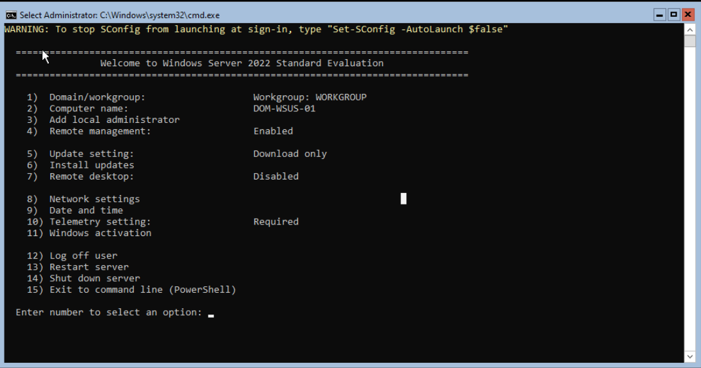
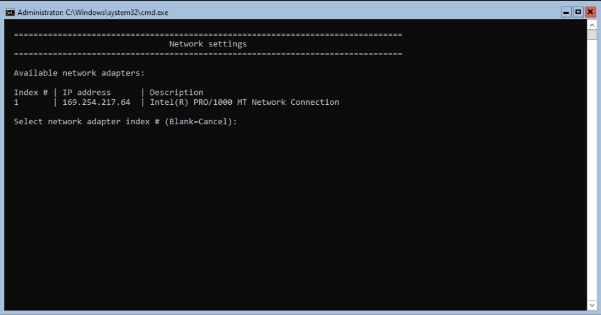
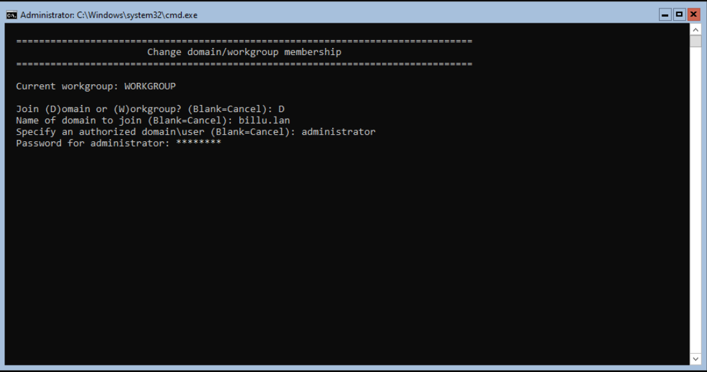
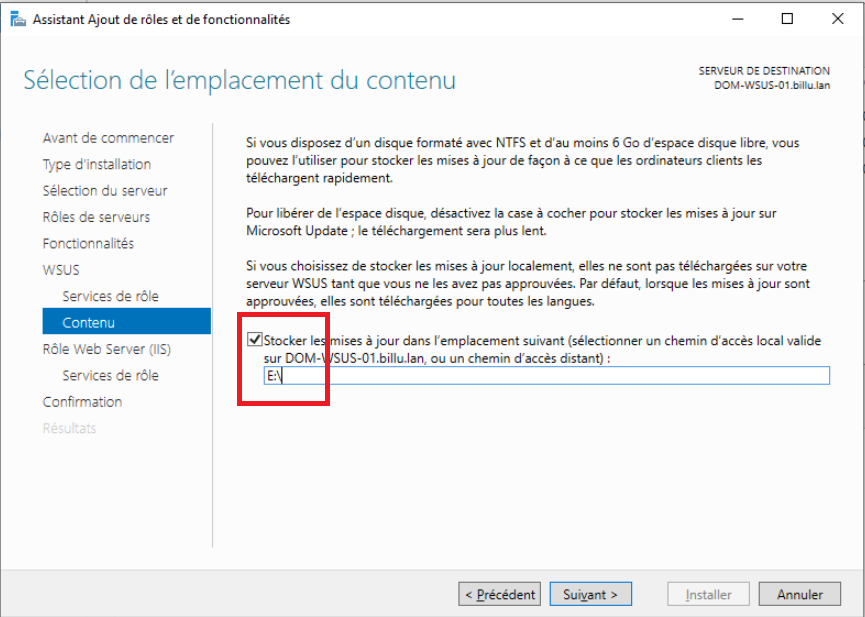

1. [Prérequis](#1-prérequis) 
2. [Architecture ](#2-architecture) 
3. [Configurationn réseau du serveur WSUS ](#3-configuration-reseau-du-serveur-WSUS) 
4. [Configuration DNS sur le serveur WSUS](#4-Configuration DNS sur le serveur WSUS)
5. [Jonction du serveur WSUS au domaine billu.lan](#4-Jonction-du-serveur-WSUS-au-domaine-billu.lan)
6. [Installation WSUS dans l'AD DOM-AD-01](#6-installation-WSUS-dans-l-ad-dom-ad-01)
7. [Installation du rôle WSUS](#7-installation-du-role-WSUS)

---
## 1. Prérequis

#### Matériel
- **Type** : VM sous Proxmox
- **RAM** : 2048 Mo
- **CPU** : 2 CPU
- **Disque dur** : 32 Go
- **Carte réseau** : 1 interface réseau  **VMBR412**

#### Logiciel
- **Système d'exploitation** : Windows Server 2022 core

#### Accès réseau
- Accès au réseau VLAN 120
- Accès Internet pour téléchargement des outils

---
## 2. Architecture 

Le Serveur **"ZABBIX"** est positionné sur le **VLAN 130 SERVEUR**.

**Configuration réseau** :
- **Nom de la machine** : `G1-DOM-WSUS-01`
- **VLAN** : `120`
- **Adresse IP** : `172.16.12.3/29`
- **Passerelle** : `172.16.12.6`
- **DNS :** `172.16.12.1` 
- **Nom de domaine** : `billu.lan`

---
## 3. Configuration réseau du serveur WSUS (Server Core)

À l’arrivée sur l’interface **SConfig**, l’objectif est de configurer une **adresse IP statique** afin d’intégrer correctement le serveur au réseau et au domaine.

### Accès aux paramètres réseau
- Appuyer sur **8** puis **Entrée** pour accéder à la configuration réseau.

Vous arrivez dans le menu des paramètres réseau.

### Sélection de la carte réseau
- Choisir la carte réseau à modifier

- Appuyer sur `1` et  **Entrée**

### Configuration de l’adresse IP
Dans le menu **Network Adapter Settings** :

- Appuyer sur **1** pour accéder aux paramètres IP

Renseigner les champs suivants :
- **S** (Static)
- **Adresse IP** : `172.16.12.3`
- **Masque** : `255.255.255.248`
- **Passerelle** : `172.16.12.6`

- Appuyer sur `ENTREE` pour valider la configuration.
---
## 4. Configuration DNS sur le serveur WSUS

Toujours dans le menu de configuration de la carte réseau :
### Paramétrage du serveur DNS

- Appuyer sur **2** pour accéder à **Set DNS Server**

Renseigner :
- **Preferred DNS** : `172.16.12.1`
- **Alternate DNS** : laisser vide (Entrée)

Ce DNS correspond au **serveur AD DS / DNS**.

---
## 5. Jonction du serveur WSUS au domaine billu.lan

- Appuyer sur `1` : Domain/workgroup
- Taper `D`
- Entrer le nom du domaine `billu.lan`
- Le user : `administrator`
- Le MDP :`Azerty1*`

Le serveur va ensuite redémarre et dans l'interface vous devez voir : `Domain:billu.lan`

---
## 6. Installation WSUS dans l’AD DOM-AD-01

Depuis le `PC ADMIN`, ouvrir **Gestionnaire de serveur**.
### Ajout du serveur DOM-WSUS-01 :
- Dans `Gérer` → `Ajouter des serveurs`
- Rechercher le serveur `DOM-WSUS-01` par son nom.
- Le sélectionner et l’ajouter.

---
## 7. Installation du rôle WSUS

Depuis le `PC ADMIN`, ouvrir **Gestionnaire de serveur**
- Cliquer sur `Gérer`
- Cliquer sur `Ajouter des rôles et fonctionnalités`
- Cliquer sur `suivant`  x 2
- Sélectionner un serveur : `DOM-WSUS-01`
- Cocher `Windows Server Update Service`
- Cliquer sur `Ajouter des fonctionnalités
- Cliquer sur `suivant`  x4

- Mettre la lettre du lecteur : `E:\`
- Cliquer sur `suivant`  x3
- Cliquer sur `Installer`
- Cliquer sur `Fermer`

![image05][Ressources/05_install_wsus.png]
- Cliquer sur le drapeau jaune
- Cliquer sur `Lancer les tâches de post-installation`

Le Rôle WSUS est installé sur le serveur `DOM-WSUS-01`

---

