---
## 1. Configuration Interface de Zabbix

 * **Mettre le langage en Français :**

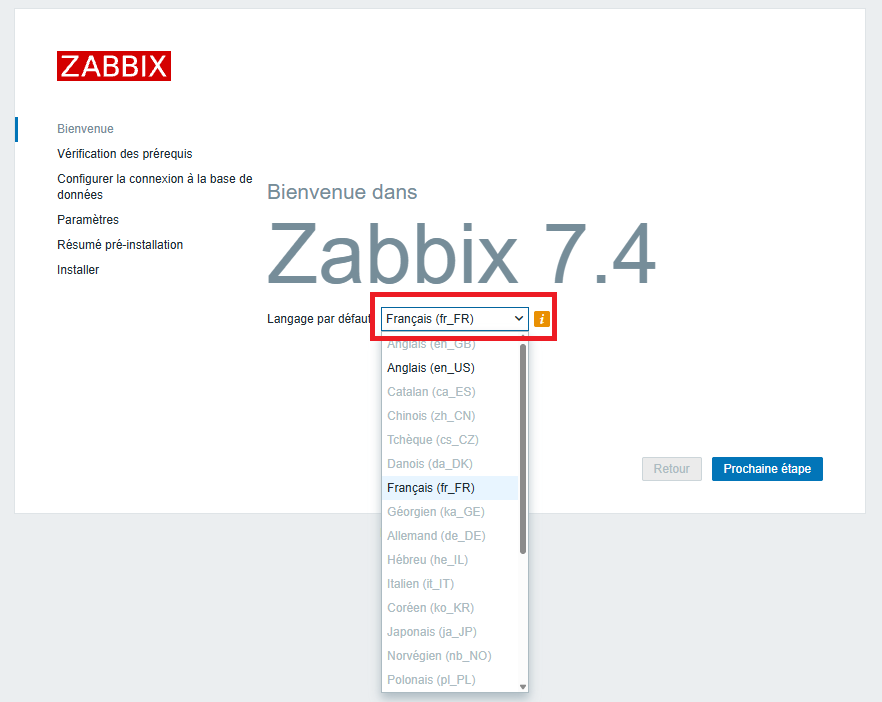

Cliquer sur **"Prochaine étape"**

- **Vérification des Prérequis :**

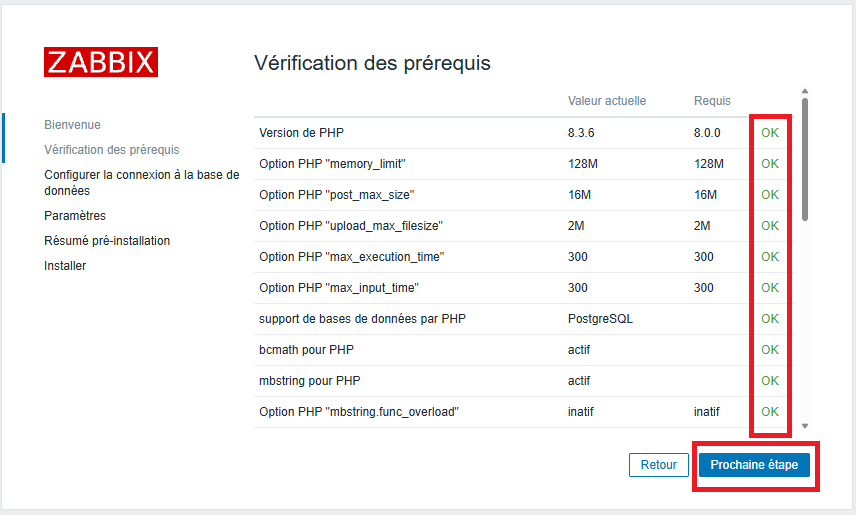

Si tous est OK cliquer sur **"Prochaine étape"**

 - **Configurer la connexion à la base de données:**

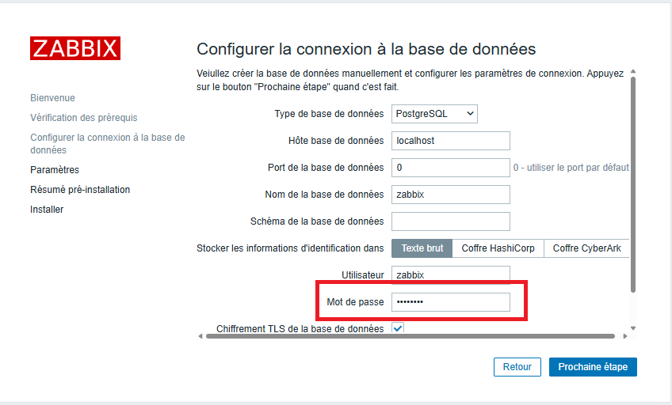

Entrer le Mot de Passe : `Azerty1*`

Cliquer sur **"Prochaine étape"**


- **Paramètres :**

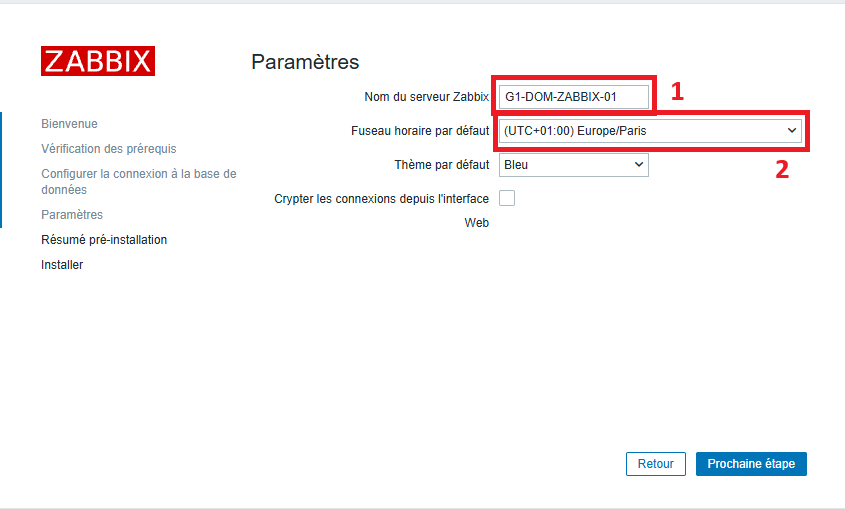

Entrer le nom du serveur Zabbix :`G1-DOM-ZABBIX-01`
Fuseau horaire : `Europe/Paris`

Cliquer sur **"Prochaine étape"**

- **Résumé pré-installation:**

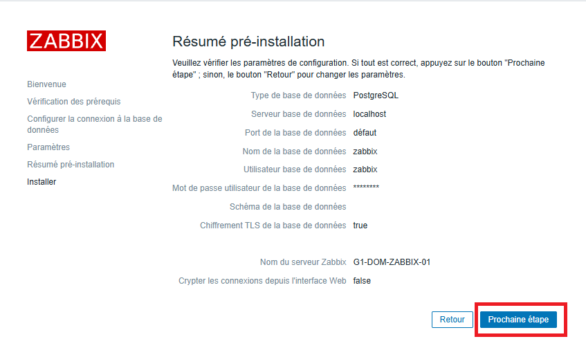

Cliquer sur **"Prochaine étape"**

- **Fin de la configuration :** 

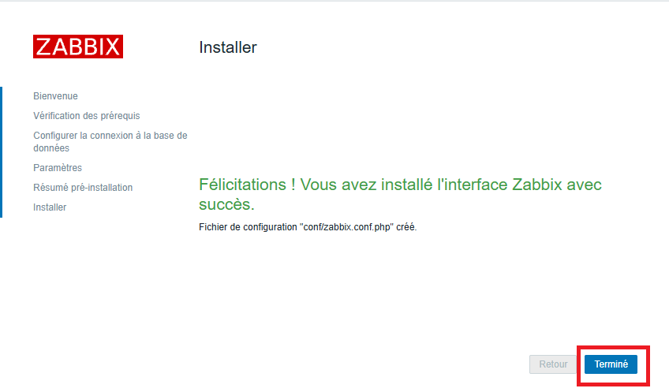

Cliquer sur **"Terminer"**

- **1ère connexion :

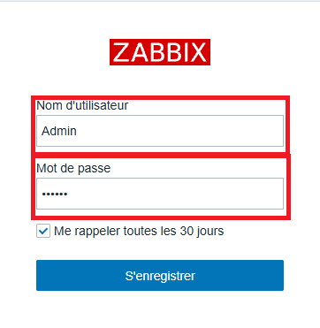
Nom d'utilisateur : `Admin`
Mot de passe : `zabbix`

Cliquer sur **"S'enregistrer"**

- **Voici l'interface une fois connecter:**

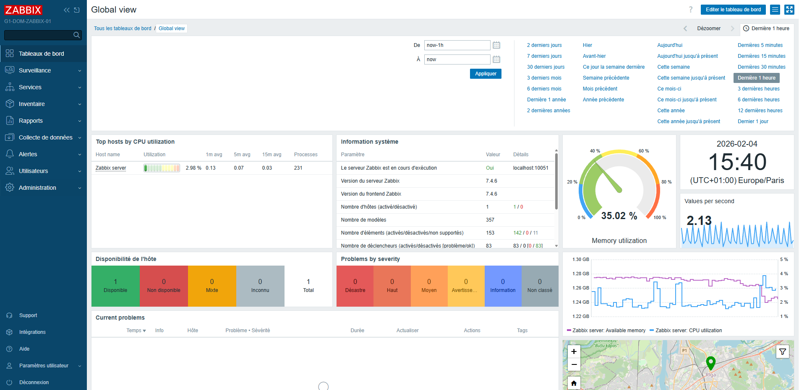

---
## 2. Création des compte utilisateurs

Depuis l'interface d’accueil :
 - Cliquer sur l'onglet : `Utilisateurs`
 - Cliquer sur :`Utilisateurs'
 - En haut à droite cliquer ensuite sur :`Créér un utilisateur`

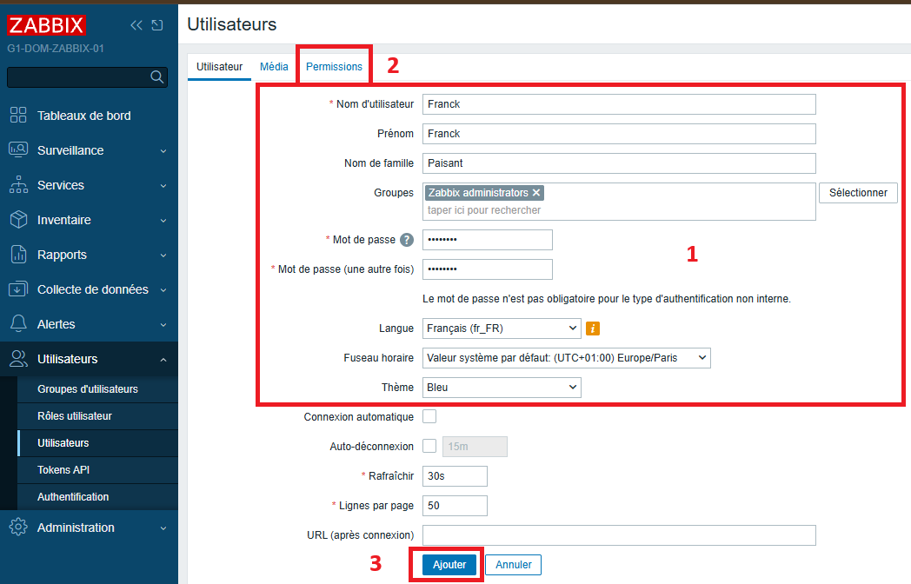

- Compléter les champs demandés
- Cliquer sur :`Permissions`

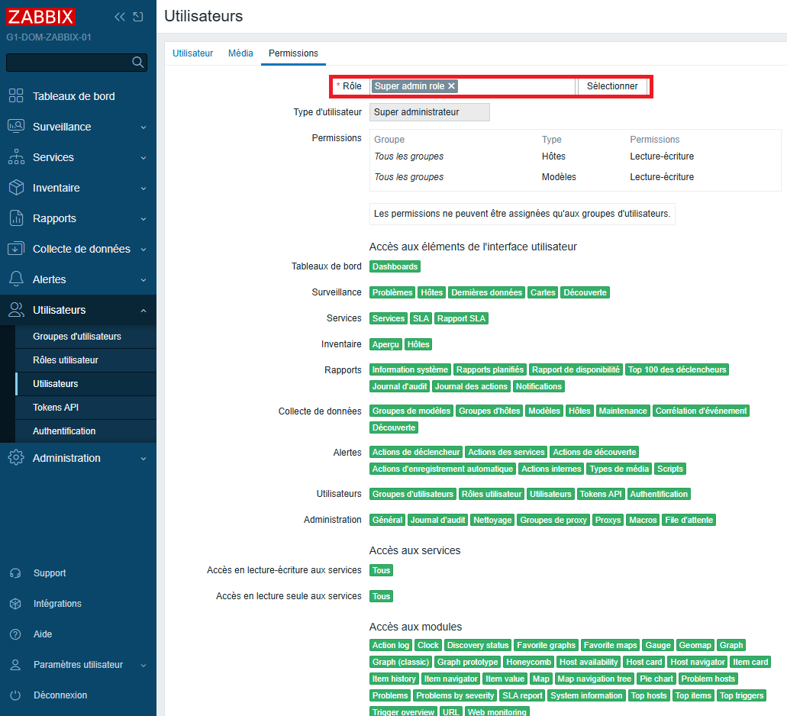

- Sélectionner le rôle
- Cliquer sur : `Ajouter`

Répéter l'opération pour tous les utilisateurs :

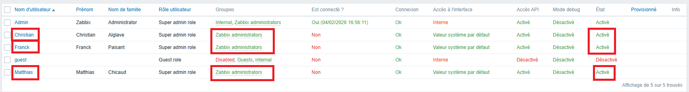

---
## 3. Désactivation du profil GUEST et ADMIN

Depuis la console central :

- Cliquer sur l'onglet : `Utilisateurs`
- Cliquer sur : `Utilisateurs`
- Cliquer sur : `Admin`

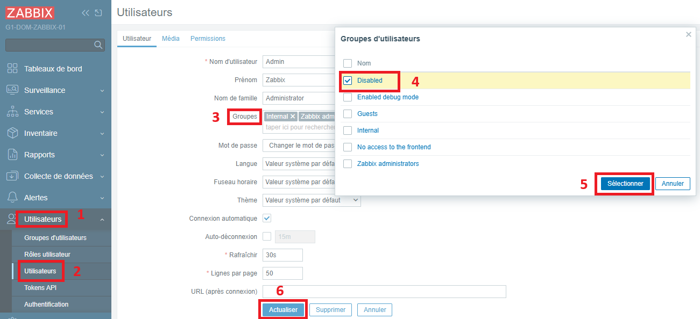

- Sélectionner : `Groupes`
- Cocher : `Disabled`
- Cliquer : `Sélectionner`
- Cliquer sur : `Actualiser`

idem pour l'utilisateur : `guest`

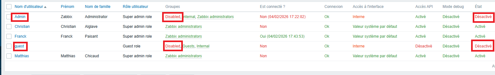

---
## 4. Installation des agents

#### 4.1 Serveur ADDS/DNS

`G1-DOM-AD-01` sous Windows server 2016 +

Depuis notre serveur il faut se rendre sur le site officiel de **"ZABBIX"** :

```
https://www.zabbix.com/download_agents
```

![image_16][Ressources/16_config_zabbix.png]
- Cliquer sur les différentes cases qui correspondent a notre serveur.

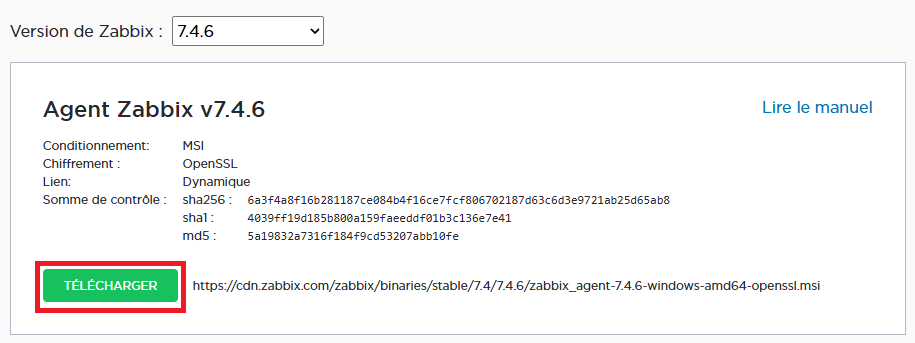
 - Cliquer sur `TELECHARGER`

Une fois télécharger cliquer sur le fichier dans la partie "Downloads"

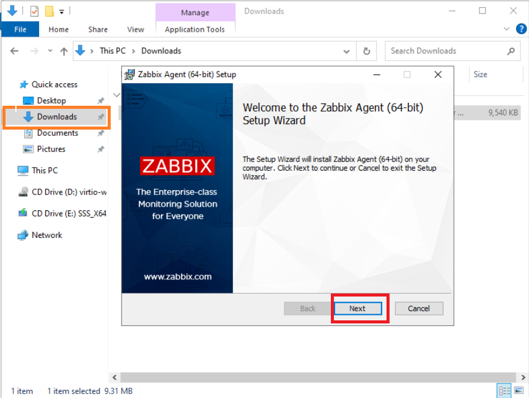

- Cliquer sur `Next`  et suivre les instructions 

![image_19][Ressources/19_config_zabbix.png]

- Indiquer l'adresse IP du serveur "ZABBIX" : `172.16.13.3`
- Cliquer sur `Next` et terminer l'installation.

- Vérification de l'agent **"ZABBIX"*

Aller dans l'application `services ` du serveur :

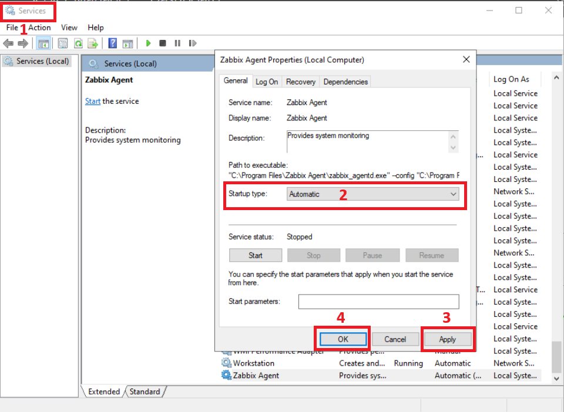

- Dans l'onglet Startup Type : `Automatic`
- Cliquer sur : `Apply` et `OK`
Cela va permettre que le service démarre automatiquement a la mise en route du serveur.

Revenir sur l'interface du serveur **"ZABBIX"** : `G1-DOM-ZABBIX-01`

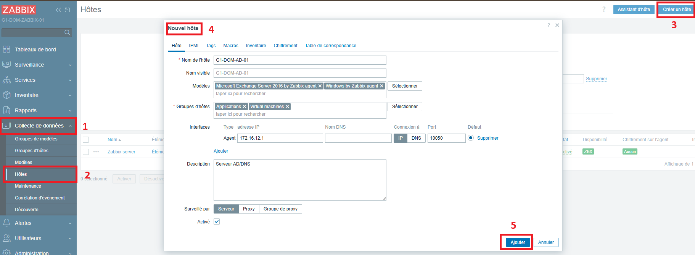

- Dans l'onglet `Collecte de données`
- Cliquer sur `Hôtes`
- Cliquer sur `Créér un hôte`
- Compléter la fenêtre `Nouvel hôte`
- Cliquer sur `Ajouter`

Après Actualisation 

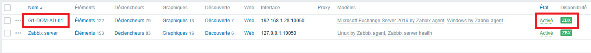


