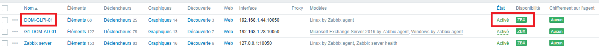
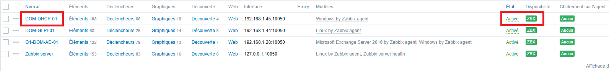
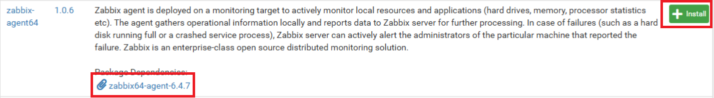
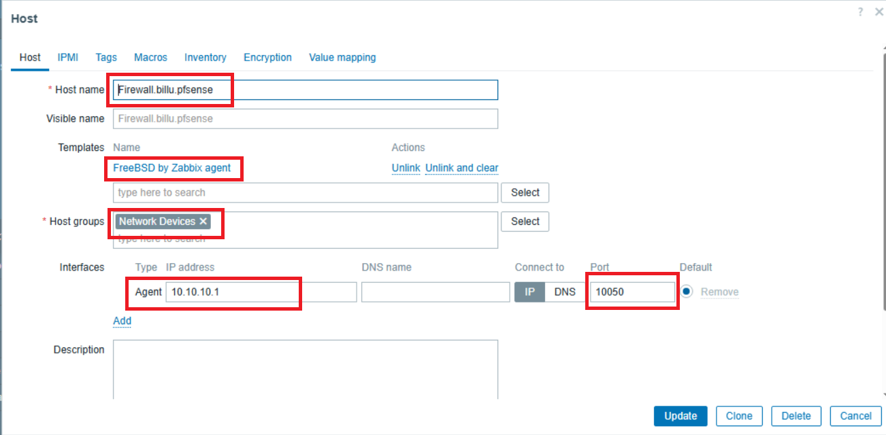
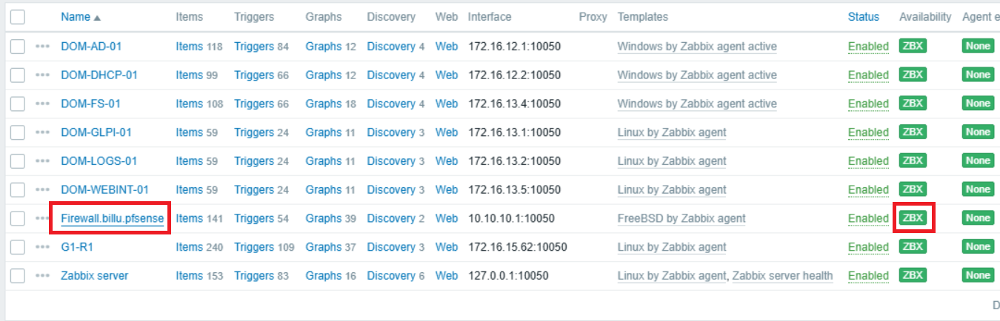

1. [Configuration Interface de Zabbix](#1-configuration-interface-de-zabbix) 
2. [Création des compte utilisateurs](#2-création-des-compte-utilisateurs) 
3. [Désactivation du profil GUEST et ADMIN](#3-désactivation-du-profil-guest-et-admin) 
4. [Installation des agents](#4-installation-des-agents) 
	- 4.1 [Installation sur DOM-AD-01](#41-installation-sur-dom-ad-01) 
	- 4.2 [Installation sur DOM-GLPI-01](#42-installation-sur-dom-glpi-01) 
	- 4.3 [Installation sur DOM-DHCP-01](#43-installation-sur-dom-dhcp-01) 
	- 4.4 [Installation sur PFSENSE](#44-installation-sur-pfsense)

---
## 1. Configuration Interface de Zabbix

 * **Mettre le langage en Français :**


Cliquer sur **"Prochaine étape"**

- **Vérification des Prérequis :**


Si tous est OK cliquer sur **"Prochaine étape"**

 - **Configurer la connexion à la base de données:**


Entrer le Mot de Passe : `Azerty1*`

Cliquer sur **"Prochaine étape"**


- **Paramètres :**


Entrer le nom du serveur Zabbix :`G1-DOM-ZABBIX-01`
Fuseau horaire : `Europe/Paris`

Cliquer sur **"Prochaine étape"**

- **Résumé pré-installation:**


Cliquer sur **"Prochaine étape"**

- **Fin de la configuration :** 


Cliquer sur **"Terminer"**

- **1ère connexion :


Nom d'utilisateur : `Admin`
Mot de passe : `zabb#### 4.3 Installation sur DOM-DHCP-01ix`

Cliquer sur **"S'enregistrer"**

- **Voici l'interface une fois connecter:**


---
## 2. Création des compte utilisateurs

Depuis l'interface d’accueil :
 - Cliquer sur l'onglet : `Utilisateurs`
 - Cliquer sur :`Utilisateurs'
 - En haut à droite cliquer ensuite sur :`Créér un utilisateur`


- Compléter les champs demandés
- Cliquer sur :`Permissions`


- Sélectionner le rôle
- Cliquer sur : `Ajouter`

Répéter l'opération pour tous les utilisateurs :


---
## 3. Désactivation du profil GUEST et ADMIN

Depuis la console central :

- Cliquer sur l'onglet : `Utilisateurs`
- Cliquer sur : `Utilisateurs`
- Cliquer sur : `Admin`


- Sélectionner : `Groupes`
- Cocher : `Disabled`
- Cliquer : `Sélectionner`
- Cliquer sur : `Actualiser`

idem pour l'utilisateur : `guest`


---
## 4. Installation des agents

#### 4.1 Installation sur DOM-AD-01

`G1-DOM-AD-01` sous Windows server 2016 +

Depuis notre serveur il faut se rendre sur le site officiel de **"ZABBIX"** :

```
https://www.zabbix.com/download_agents
```

![image_16][Ressources/16_config_zabbix.png]
- Cliquer sur les différentes cases qui correspondent a notre serveur.


 - Cliquer sur `TELECHARGER`

Une fois télécharger cliquer sur le fichier dans la partie "Downloads"


- Cliquer sur `Next`  et suivre les instructions 

![image_19][Ressources/19_config_zabbix.png]

- Indiquer l'adresse IP du serveur "ZABBIX" : `172.16.13.3`
- Cliquer sur `Next` et terminer l'installation.

- Vérification de l'agent **"ZABBIX"*

Aller dans l'application `services ` du serveur :


- Dans l'onglet Startup Type : `Automatic`
- Cliquer sur : `Apply` et `OK`
Cela va permettre que le service démarre automatiquement a la mise en route du serveur.

Revenir sur l'interface du serveur **"ZABBIX"** : `G1-DOM-ZABBIX-01`


- Dans l'onglet `Collecte de données`
- Cliquer sur `Hôtes`
- Cliquer sur `Créér un hôte`
- Compléter la fenêtre `Nouvel hôte`
- Cliquer sur `Ajouter`

Après Actualisation 


Pour tout ajout de Zabbix-agent sous Windows graphique suivre cette procédure.

---
#### 4.2 Installation sur DOM-GLPI-01

Depuis le PC `ADMIN` se connecter en "SSH" sur `DOM-GLPI-01`

```powershell
ssh wilder@DOM-GLPI-01
```

- Télécharger directement le paquet agent :
```bash
wget https://repo.zabbix.com/zabbix/7.0/debian/pool/main/z/zabbix/zabbix-agent2_7.0.6-1+debian12_amd64.deb
```

- Installer :
```bash
sudo dpkg -i zabbix-agent2_7.0.6-1+debian12_amd64.deb
```

- Si ils manquent des dépendances :
```bash
sudo apt --fix-broken install
```

- Modification du fichier de configuration "Zabbix" :
```shell
sudo nano /etc/zabbix/zabbix_agent.conf
```

- Modifier les lignes suivantes :
`Server=172.16.13.3`
`ServerActive=172.16.13.3`
`Hostname=DOM-GLPI-01`
Enregistrer et sortir du fichier

- Démarrage du service :
```shell
sudo systemctl restart zabbix-agent2
sudo systemctl enable zabbix-agent2
sudo systemctl status zabbix-agent2
```

Depuis le `PC-ADMIN` se connecter sur l'interface du serveur **"ZABBIX"** : `G1-DOM-ZABBIX-01` :

- Dans l'onglet `Collecte de données`
- Cliquer sur `Hôtes`
- Cliquer sur `Créér un hôte`
- Compléter la fenêtre `Nouvel hôte`
- Cliquer sur `Ajouter`

Après Actualisation 



Pour tout ajout de Zabbix-agent sous `DEBIAN` suivre cette procédure.
Oubliez pas d'adapter vos commandes.
`G1-R1`
`DOM-LOGS-01`
`DOM-WEBINT-01`

---
#### 4.3 Installation sur DOM-DHCP-01

Version "Windows Server" core .

Depuis le PC `ADMIN` se connecter en "SSH" sur `DOM-DHCP-01`
```powershell
ssh wilder@DOM-DHCP-01
```

- Se placer dans le bon répertoire avant le téléchargement :
```powershell
cd C:\Users\Administrator
```

- Télécharger Zabbix Agent 2 :
```powershell
Invoke-WebRequest -Uri "https://cdn.zabbix.com/zabbix/binaries/stable/7.0/7.0.5/zabbix_agent2-7.0.5-windows-amd64-openssl.msi" -OutFile "zabbix_agent2.msi"
```

- Lancer l'installation et attendre quel se termine :
```powershell
Start-Process msiexec.exe -ArgumentList '/i', 'C:\Users\Administrator\zabbix_agent2.msi', '/qn', 'SERVER=172.16.13.3', 'SERVERACTIVE=172.16.13.3', 'HOSTNAME=DOM-DHCP-01' -Wait
```

- Vérifier le service :
```powershell
Get-Service "Zabbix Agent 2" | Select-Object Name, Status, StartType
```

- Configurer le démarrage Automatique :
```powershell
Set-Service -Name "Zabbix Agent 2" -StartupType Automatic
```

Depuis le `PC-ADMIN` se connecter sur l'interface web du serveur **"ZABBIX"** : `DOM-ZABBIX-01` :

- Dans l'onglet `Collecte de données`
- Cliquer sur `Hôtes`
- Cliquer sur `Créér un hôte`
- Compléter la fenêtre `Nouvel hôte`
- Cliquer sur `Ajouter`

Après Actualisation 


Pour tout ajout de Zabbix-agent sous `Windows Core` suivre cette procédure.
Oubliez pas d'adapter vos commandes.
`DOM-FS-01`

---
#### 4.4 Installation sur PFSENSE

Depuis le `PC-ADMIN` se connecter sur l'interface web du serveur **"PFsense"** :

- Cliquer sur l'onglet `System`
- Cliquer sur `Package Manager`
- Cliquer sur `Available Packages`
- Cliquer sur `zabbix64-agent-6.4.7`



- Cliquer sur `Confirm`

Une fois l'installation terminer 

 Cliquer sur l'onglet `Services` puis `Zabbix Agent 6.4`

- Cocher le case `Enable Zabbix Agent service`
- Dans la case `Server` mettre IP du serveur Zabbix `172.16.13.3`
- Dans la case `Hostname` indiquer le nom du pfsense `Firewall.billu.pfsense`
- Laisser les autres options par défauts.
- Cliquer sur `Save`

Il Faut créé un règle entre pfsense et le serveur zabbix

- Cliquer sur l'onglet `Firewall` puis `Rules`
- Cliquer sur l'interface `LAN`
- Cliquer sur `ADD` avec la flèche vers le haut
- Dans la case `Action` mettre `Pass`
- Dans la case `Protocole` mettre `TCP/UDP`
- Dans la case `Source` mettre `Address or Alias` et indiquer IP du serveur Zabbix `172.16.13.3`
- Dans la case `Destination` mettre `LAN subnets`
- Dans la case `Destination Port Range` mettre dans les deux cases `10050`
- Dans la case `Description` mettre `Zabbix agent`
- Cliquer sur `Save`
- Cliquer sur `Apply Changes`

Maintenant se connecter sur l'interface web du serveur **"ZABBIX"** :      `DOM-ZABBIX-01` :

- Dans l'onglet `Collecte de données`
- Cliquer sur `Hôtes`
- Cliquer sur `Créér un hôte`
- Compléter la fenêtre `Nouvel hôte`


- Cliquer sur `Ajouter`




