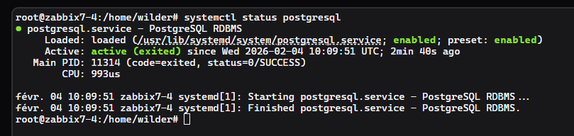
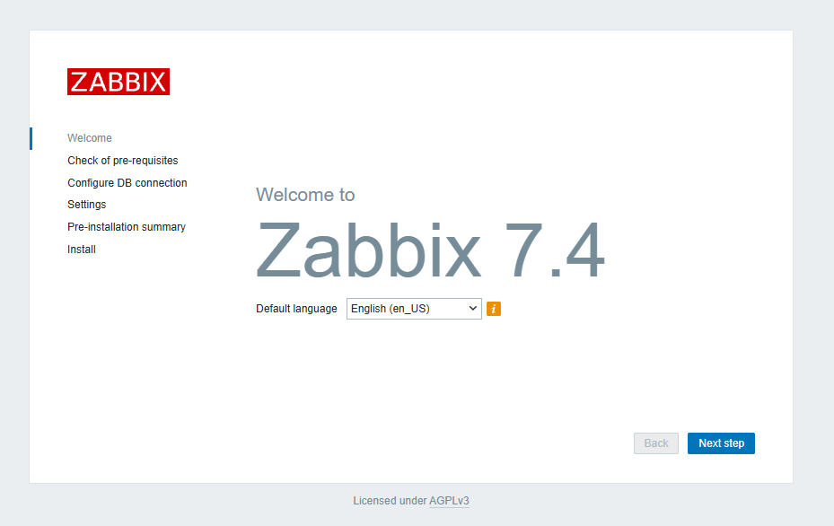

1. [Prérequis](#1-prérequis) 
2. [Architecture et positionnement](#2-architecture-et-positionnement) 
3. [Installation de la BDD "Postgresql"](#3-installation-de-la-bdd-postgresql) 
4. [Installation de "Zabbix"](#4-installation-de-zabbix)


---
## 1. Prérequis

#### Matériel
- **Type** : VM sous Proxmox
- **RAM** : 1028 Mo
- **CPU** : 2 CPU
- **Disque dur** : 40 Go
- **Carte réseau** : 1 interface réseau  **VMBR412**

#### Logiciel
- **Système d'exploitation** : Ubuntu -24.04.3-Server

#### Accès réseau
- Accès au réseau VLAN 130
- Accès Internet pour téléchargement des outils

---
## 2. Architecture et positionnement

Le Serveur **"ZABBIX"** est positionné sur le **VLAN 130 SERVEUR**.

**Configuration réseau** :
- **Nom de la machine** : `G1-DOM-ZABBIX-01`
- **VLAN** : `130`
- **Adresse IP** : `172.16.13.3/24`
- **Passerelle** : `172.16.13.6`
- **DNS :** `172.16.12.1` 
- **Nom de domaine** : `billu.lan`

**Justification du positionnement** :

Le serveur Zabbix est déployé dans le **VLAN 130 (Serveurs)** pour les raisons suivantes : 
- **Centralisation de la supervision** : Positionnement stratégique au cœur de l'infrastructure pour superviser l'ensemble des équipements réseau et serveurs de BillU  
- **Sécurité et segmentation réseau** : Isolation dans le VLAN Serveurs limite l'exposition aux risques tout en permettant les communications nécessaires. 
- **Performance de supervision** : Latence minimale pour la collecte SNMP et les agents Zabbix déployés sur les équipements supervisés 
- **Architecture évolutive** : Permet l'ajout futur de sondes de supervision additionnelles et l'extension du périmètre de monitoring
- **Accessibilité ** : Interface web accessible depuis le VLAN 60 (DSI)

---
## 3. Installation de la BDD "Postgresql"

Voici les commandes à exécuter :

- Passer en  **"root"** :

```bash
sudo -s
```

- Mettre à jour le système :

```bash
apt update && apt upgrade -y
```

- Installer "postgresql" :

```bash
apt install postgresql postgresql-contrib -y
```

- Vérification que "Postgresql" fonctionne :

```bash
systemctl status postgresql
```



## 4. Installation de "Zabbix"

- Installation du dépôt **"Zabbix"**:

```bash
wget https://repo.zabbix.com/zabbix/7.4/release/ubuntu/pool/main/z/zabbix-release/zabbix-release_latest_7.4+ubuntu24.04_all.deb
```

```bash
dpkg -i zabbix-release_latest_7.4+ubuntu24.04_all.deb
```

```bash
apt update
```

- Installez le serveur **"Zabbix"**, l'interface et l'agent :

```bash
apt install zabbix-server-pgsql zabbix-frontend-php php8.3-pgsql zabbix-apache-conf zabbix-sql-scripts zabbix-agent
```

- Création de la base de données initiale

```bash
sudo -u postgres createuser --pwprompt zabbix
sudo -u postgres createdb -O zabbix zabbix
```

Il seras demander de saisir un mot de passe : **"Azerty1"**

- Importation du schémas initial et les données :

```bash
zcat /usr/share/zabbix/sql-scripts/postgresql/server.sql.gz | sudo -u zabbix psql zabbix
```

- Configuration de la base de données pour le serveur **"Zabbix"**

Modification dans le fichier : `/etc/zabbix/zabbix_server.conf`

```bash
nano /etc/zabbix/zabbix_server.conf
```

On décommente la ligne  : `DBPassword=`

On ajoute notre mot de passe : `DBPassword=Azerty1*`

On sauvegarde  : `CTRL + O` et on ferme le fichier : `CTRL + X`

- Démarrer les processus du serveur et de l'agent Zabbix :

```bash
systemctl restart zabbix-server zabbix-agent apache2
systemctl enable zabbix-server zabbix-agent apache2
```

- Ouverture de la page Web de l'interface utilisateur de Zabbix :

Effectuer cette opération depuis le poste Admin `G1-PC-ADMIN` :

`http://172.16.13.3/zabbix`


