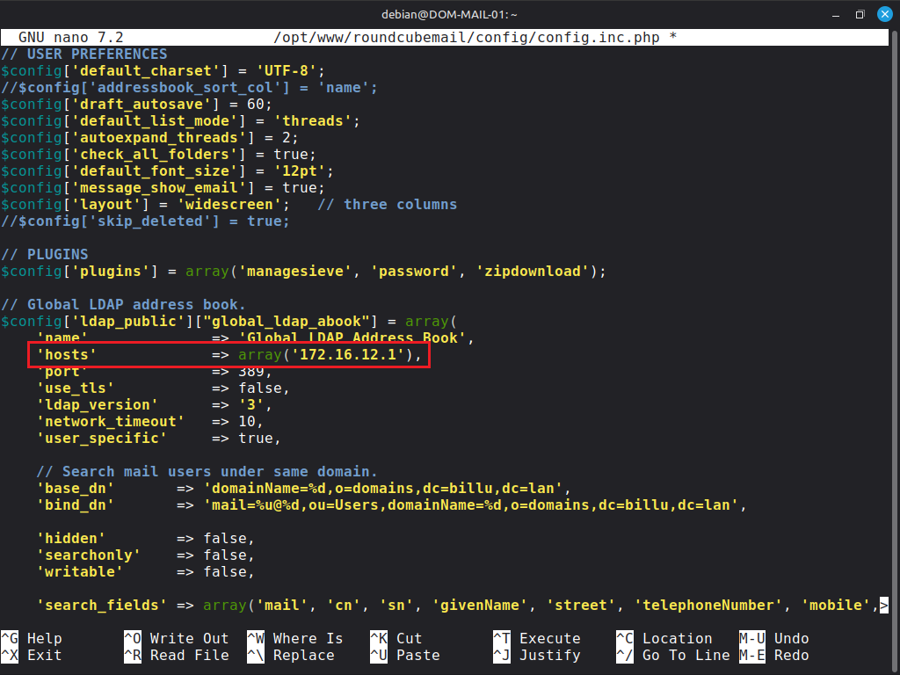

# Guide de configuration - iRedMail & Active Directory

---

## Sommaire

1. [Préparation Active Directory](#1-préparation-active-directory)
   - 1.1 [Créer le compte de service svc-mail](#11-créer-le-compte-de-service-svc-mail)
   - 1.2 [Vérifier la connexion depuis le serveur mail](#12-vérifier-la-connexion-depuis-le-serveur-mail)

2. [Intégration AD dans Postfix](#2-intégration-ad-dans-postfix)
   - 2.1 [Sauvegarder la configuration Postfix](#21-sauvegarder-la-configuration-postfix)
   - 2.2 [Désactiver les paramètres iRedMail non utilisés avec l'AD](#22-désactiver-les-paramètres-iredmail-non-utilisés-avec-lad)
   - 2.3 [Configurer le domaine et le transport](#23-configurer-le-domaine-et-le-transport)
   - 2.4 [Créer le fichier transport](#24-créer-le-fichier-transport)
   - 2.5 [Créer les fichiers de requêtes LDAP](#25-créer-les-fichiers-de-requêtes-ldap)
   - 2.6 [Redémarrer Postfix](#26-redémarrer-postfix)
   - 2.7 [Vérifier les requêtes Postfix](#27-vérifier-les-requêtes-postfix)

3. [Intégration AD dans Dovecot](#3-intégration-ad-dans-dovecot)
   - 3.1 [Sauvegarder la configuration Dovecot](#31-sauvegarder-la-configuration-dovecot)
   - 3.2 [Modifier /etc/dovecot/dovecot-ldap.conf](#32-modifier-etcdovecotdovecot-ldapconf)
   - 3.3 [Modifier les permissions du fichier](#33-modifier-les-permissions-du-fichier)
   - 3.4 [Redémarrer Dovecot](#34-redémarrer-dovecot)
   - 3.5 [Vérifier l'authentification](#35-vérifier-lauthentification)

4. [Intégration AD dans Roundcube (carnet d'adresses global)](#4-intégration-ad-dans-roundcube-carnet-dadresses-global)
   - 4.1 [Modifier la configuration Roundcube](#41-modifier-la-configuration-roundcube)

5. [Tests et validation](#5-tests-et-validation)
   - 5.1 [Plan de tests complet](#51-plan-de-tests-complet)

6. [Dépannage](#6-dépannage)
   - 6.1 [Dovecot — auth failed](#61-dovecot--auth-failed)
   - 6.2 [Postfix — postmap ne retourne rien](#62-postfix--postmap-ne-retourne-rien)
   - 6.3 [Port 389 bloqué — utiliser le port 3268](#63-port-389-bloqué--utiliser-le-port-3268)

7. [Récapitulatif de l'architecture](#7-récapitulatif-de-larchitecture)
   - 7.1 [Fichiers de configuration modifiés](#71-fichiers-de-configuration-modifiés)
   - 7.2 [Ports et protocoles](#72-ports-et-protocoles)

---

## 1. Préparation Active Directory (Serveur Active Directory)

### 1.1 Créer le compte de service svc-mail

**Si ce n'est pas encore fait !**

- Sur le serveur Active Directory, exécuter en PowerShell :

```powershell
New-ADUser `
  -Name "svc-mail" `
  -SamAccountName "svc-mail" `
  -UserPrincipalName "svc-mail@billu.lan" `
  -Path "OU=DSI,OU=BilluUsers,DC=billu,DC=lan" `
  -AccountPassword (ConvertTo-SecureString "Azerty1*" -AsPlainText -Force) `
  -PasswordNeverExpires $true `
  -CannotChangePassword $true `
  -Enabled $true `
  -Description "Compte de service iRedMail - Lecture LDAP"
```

### 1.2 Vérifier la connexion depuis le serveur mail

- Entrer la commande suivante pour vérifier la connexion

```bash
ldapsearch -x \
  -H ldap://172.16.12.1 \
  -D "svc-mail@billu.lan" \
  -w 'Azerty1*' \
  -b "OU=BilluUsers,DC=billu,DC=lan" \
  "(objectClass=user)" \
  sAMAccountName userPrincipalName
```

---

## 2. Intégration AD dans Postfix (Serveur Debian iRedMail)

### 2.1 Sauvegarder la configuration Postfix

```bash
cp /etc/postfix/main.cf /etc/postfix/main.cf.bak
```

### 2.2 Désactiver les paramètres iRedMail non utilisés avec l'AD

```bash
postconf -e virtual_alias_maps=''
postconf -e sender_bcc_maps=''
postconf -e recipient_bcc_maps=''
postconf -e relay_domains=''
postconf -e relay_recipient_maps=''
postconf -e sender_dependent_relayhost_maps=''
```

### 2.3 Configurer le domaine et le transport

```bash
postconf -e smtpd_sasl_local_domain='billu.lan'
postconf -e virtual_mailbox_domains='billu.lan'
postconf -e transport_maps='hash:/etc/postfix/transport'
postconf -e smtpd_sender_login_maps='proxy:ldap:/etc/postfix/ad_sender_login_maps.cf'
postconf -e virtual_mailbox_maps='proxy:ldap:/etc/postfix/ad_virtual_mailbox_maps.cf'
postconf -e virtual_alias_maps='proxy:ldap:/etc/postfix/ad_virtual_group_maps.cf'
```

### 2.4 Créer le fichier transport

1) Créer le fichier de transport 
```bash
nano /etc/postfix/transport
```
2) Entrer les données suivante :
```
billu.lan   dovecot
```

3) Compiler le fichier de transport
```bash
postmap hash:/etc/postfix/transport
```

### 2.5 Créer les fichiers de requêtes LDAP

- **ad_sender_login_maps.cf**

1) Créer le fichier `ad_sender_login_maps.cf`
```bash
nano /etc/postfix/ad_sender_login_maps.cf
```
2) Entrer les données suivantes et sauvegarder le fichier
```ini
server_host     = 172.16.12.1
server_port     = 389
version         = 3
bind            = yes
start_tls       = no
bind_dn         = svc-mail@billu.lan
bind_pw         = Azerty1*
search_base     = OU=BilluUsers,DC=billu,DC=lan
scope           = sub
query_filter    = (&(userPrincipalName=%s)(objectClass=person)(!(userAccountControl:1.2.840.113556.1.4.803:=2)))
result_attribute= userPrincipalName
debuglevel      = 0
```

- **ad_virtual_mailbox_maps.cf**

1) Créer le fichier `ad_virtual_mailbox_maps.cf`

```bash
nano /etc/postfix/ad_virtual_mailbox_maps.cf
```
2) Entrer les données suivantes et sauvegarder le fichier

```ini
server_host     = 172.16.12.1
server_port     = 389
version         = 3
bind            = yes
start_tls       = no
bind_dn         = svc-mail@billu.lan
bind_pw         = Azerty1*
search_base     = OU=BilluUsers,DC=billu,DC=lan
scope           = sub
query_filter    = (&(objectClass=person)(userPrincipalName=%s))
result_attribute= userPrincipalName
result_format   = %d/%u/Maildir/
debuglevel      = 0
```

- **ad_virtual_group_maps.cf**

1) Créer le fichier `ad_virtual_group_maps.cf`
```bash
nano /etc/postfix/ad_virtual_group_maps.cf
```
2) Entrer les données suivantes et sauvegarder le fichier

```ini
server_host     = 172.16.12.1
server_port     = 389
version         = 3
bind            = yes
start_tls       = no
bind_dn         = svc-mail@billu.lan
bind_pw         = Azerty1*
search_base     = OU=BilluUsers,DC=billu,DC=lan
scope           = sub
query_filter    = (&(objectClass=group)(mail=%s))
special_result_attribute = member
leaf_result_attribute = mail
result_attribute= userPrincipalName
debuglevel      = 0
```

### 2.6 Redémarrer Postfix

```bash
postfix check
systemctl restart postfix
```

### 2.7 Vérifier les requêtes Postfix

```bash
postmap -q marie.meyer@billu.lan ldap:/etc/postfix/ad_virtual_mailbox_maps.cf
# Attendu : billu.lan/marie.meyer/Maildir/

postmap -q marie.meyer@billu.lan ldap:/etc/postfix/ad_sender_login_maps.cf
# Attendu : marie.meyer@billu.lan
```

---

## 3. Intégration AD dans Dovecot

### 3.1 Sauvegarder la configuration Dovecot

```bash
cp /etc/dovecot/dovecot-ldap.conf /etc/dovecot/dovecot-ldap.conf.bak
```

### 3.2 Modifier /etc/dovecot/dovecot-ldap.conf

```bash
nano /etc/dovecot/dovecot-ldap.conf
```

Remplacer **tout le contenu** par :

```ini
hosts           = 172.16.12.1:389
ldap_version    = 3
auth_bind       = yes
dn              = svc-mail@billu.lan
dnpass          = Azerty1*
base            = OU=BilluUsers,DC=billu,DC=lan
scope           = subtree
deref           = never

iterate_attrs   = userPrincipalName=user
iterate_filter  = (&(userPrincipalName=*)(objectClass=person)(!(userAccountControl:1.2.840.113556.1.4.803:=2)))

user_filter     = (&(userPrincipalName=%u)(objectClass=person)(!(userAccountControl:1.2.840.113556.1.4.803:=2)))
pass_filter     = (&(userPrincipalName=%u)(objectClass=person)(!(userAccountControl:1.2.840.113556.1.4.803:=2)))

pass_attrs      = 
default_pass_scheme = CRYPT

user_attrs      = mail=master_user,mail=user,=home=/var/vmail/vmail1/%Ld/%Ln/,=mail=maildir:~/Maildir/
```

### 3.3 Modifier les permissions du fichier

```bash
chmod 600 /etc/dovecot/dovecot-ldap.conf
chown dovecot:dovecot /etc/dovecot/dovecot-ldap.conf
```

> Ces permissions sont requises : trop ouvertes, Dovecot refuse de lire le fichier et retourne `temp_fail` à l'authentification.

### 3.4 Redémarrer Dovecot

```bash
systemctl restart dovecot
```

### 3.5 Vérifier l'authentification

```bash
doveadm auth test marie.meyer@billu.lan 'Azerty1*'
# Attendu : passdb: marie.meyer@billu.lan auth succeeded
```

---

## 4. Intégration AD dans Roundcube (carnet d'adresses global)

### 4.1 Modifier la configuration Roundcube

```bash
nano /opt/www/roundcubemail/config/config.inc.php
```
- Trouver la ligne "`$config['ldap_public']["global_ldap_abook"] = array(`" et modifier l'adresse de la ligne `hosts` par l'adresse du serveur AD




---

## 5. Tests et validation

### 5.1 Plan de tests complet

```
TEST 1 — Connectivité réseau
─────────────────────────────
□ ping 172.16.12.1 réussit
□ nc -zv 172.16.12.1 389 réussit (port LDAP AD)

TEST 2 — LDAP vers l'AD
─────────────────────────
□ ldapsearch avec svc-mail@billu.lan retourne des utilisateurs

TEST 3 — Postfix → AD
──────────────────────
□ postmap -q marie.meyer@billu.lan ldap:/etc/postfix/ad_virtual_mailbox_maps.cf
  → retourne : billu.lan/marie.meyer/Maildir/

TEST 4 — Dovecot → AD (CRITIQUE)
──────────────────────────────────
□ doveadm auth test marie.meyer@billu.lan 'Azerty1*'
  → retourne : passdb: marie.meyer@billu.lan auth succeeded

TEST 5 — Roundcube
────────────────────
□ Connexion https://172.16.13.5/mail/ avec marie.meyer@billu.lan
□ Autocomplétion carnet d'adresses AD fonctionne
```

---

## 6. Dépannage

### 6.1 Dovecot — auth failed

```bash
nano /etc/dovecot/conf.d/10-logging.conf
# auth_verbose = yes
# auth_debug = yes

systemctl restart dovecot
doveadm auth test marie.meyer@billu.lan 'Azerty1*'
```

| Message dans les logs | Cause | Solution |
|---|---|---|
| `Can't contact LDAP server` | AD injoignable | Vérifier `nc -zv 172.16.12.1 389` |
| `Invalid credentials` | Mauvais mot de passe svc-mail | Vérifier `dnpass` dans dovecot-ldap.conf |
| `No such object` | Base DN incorrecte | Vérifier `base =` |
| `user not found` | Filtre trop restrictif | Tester avec filtre simplifié `(userPrincipalName=%u)` |

### 6.2 Postfix — postmap ne retourne rien

```bash
# Activer le debug
# debuglevel = 1 dans le fichier .cf concerné
postmap -q marie.meyer@billu.lan ldap:/etc/postfix/ad_virtual_mailbox_maps.cf
tail -20 /var/log/mail.log
```

### 6.3 Port 389 bloqué — utiliser le port 3268

```bash
nc -zv 172.16.12.1 3268
# Si ça fonctionne, remplacer 389 par 3268 dans tous les fichiers de configuration
```

---

## 7. Récapitulatif de l'architecture

### 7.1 Fichiers de configuration modifiés

| Fichier | Rôle | 
|---|---|---|
| `/etc/postfix/main.cf` | Paramètres globaux Postfix |
| `/etc/postfix/transport` | Transport mail pour billu.lan | 
| `/etc/postfix/ad_sender_login_maps.cf` | Vérification expéditeurs SMTP |
| `/etc/postfix/ad_virtual_mailbox_maps.cf` | Vérification destinataires | 
| `/etc/postfix/ad_virtual_group_maps.cf` | Groupes AD comme listes |
| `/etc/dovecot/dovecot-ldap.conf` | Auth Dovecot via AD |
| `/opt/www/roundcubemail/config/config.inc.php` | Carnet d'adresses global AD |

### 7.2 Ports et protocoles

| Port | Protocole | Usage |
|---|---|---|
| 389 | LDAP | Requêtes vers l'AD (172.16.12.1) |
| 993 | IMAPS | Clients mail (SSL/TLS) |
| 143 | IMAP | Clients mail (STARTTLS) |
| 587 | SMTP | Envoi authentifié (STARTTLS) |
| 25 | SMTP | Réception MX |
| 443 | HTTPS | Roundcube / iRedAdmin |

---

## Références

- [Documentation officielle iRedMail — Intégration AD](https://docs.iredmail.org/active.directory.html)
- [Guide d'installation iRedMail sur Debian](https://docs.iredmail.org/install.iredmail.on.debian.ubuntu.html)
- [Documentation Dovecot LDAP](https://doc.dovecot.org/configuration_manual/authentication/ldap/)

---
