# Guide d'installation — iRedMail + Active Directory

## Sommaire

1. [Prérequis et infrastructure](#1-prérequis-et-infrastructure)
   - 1.1 [Schéma d'infrastructure](#11-schéma-dinfrastructure)
   - 1.2 [Tableau des serveurs](#12-tableau-des-serveurs)
   - 1.3 [Informations AD](#13-informations-ad)
   - 1.4 [Prérequis système](#14-prérequis-système)

2. [Préparation du serveur Debian](#2-préparation-du-serveur-debian)
   - 2.1 [Configurer le hostname](#21-configurer-le-hostname)
   - 2.2 [Configurer /etc/hosts](#22-configurer-etchosts)
   - 2.3 [Configurer le DNS](#23-configurer-le-dns)
   - 2.4 [Vérifications réseau préalables](#24-vérifications-réseau-préalables)
   - 2.5 [Mise à jour du système](#25-mise-à-jour-du-système)

3. [Installation d'iRedMail avec OpenLDAP](#3-installation-diredmail-avec-openldap)
   - 3.1 [Télécharger iRedMail](#31-télécharger-iredmail)
   - 3.2 [Lancer l'installateur](#32-lancer-linstallateur)
   - 3.3 [Assistant d'installation — Réponses complètes](#33-assistant-dinstallation--réponses-complètes)
   - 3.4 [Conserver les informations d'installation](#34-conserver-les-informations-dinstallation)
   - 3.5 [Redémarrer après installation](#35-redémarrer-après-installation)

4. [Vérification post-installation](#4-vérification-post-installation)
   - 4.1 [Vérifier les services](#41-vérifier-les-services)
   - 4.2 [Vérifier les ports](#42-vérifier-les-ports)
   - 4.3 [Vérifier l'accès web](#43-vérifier-laccès-web)

---

## 1. Préparation du système

### 1.1 Pré-requis

- Système d'exploitation : Debian 12
- RAM : minimum 2 Go 
- Disque : minimum 20 Go
- Connexion : Root ou Sudo (`apt install sudo`)
- Hostname FQDN : `DOM-MAIL-01.billu.lan`
- Port 389 ouvert vers le serveur AD (172.16.12.1)
- Ports mail : 25, 587, 465, 143, 993


### 1.2 Connexion en root

```bash
su -
```
*Ou utilisez `sudo` si votre utilisateur est dans le groupe sudoers*


### 1.3 Configurer le hostname
- Configurer le hostname du serveur

```bash
hostnamectl set-hostname DOM-MAIL-01.billu.lan
```
- Vérifier le hostname dans le terminal

```bash
hostname 
```  

### 1.4 Configurer /etc/hosts

```bash
nano /etc/hosts
```

```
127.0.0.1       localhost
172.16.13.5     DOM-MAIL-01.billu.lan    DOM-MAIL-01

# Contrôleur de domaine AD
172.16.12.1     DOM-AD-01.billu.lan      DOM-AD-01
```
- Vérifier le FQDN 

```bash
hostname -f     
```

> `hostname -f` doit retourner le FQDN complet. iRedMail se base dessus pour configurer tous les services.

### 1.5 Configurer le DNS

```bash
nano /etc/resolv.conf
```

```
domain billu.lan
search billu.lan
nameserver 172.16.12.1
nameserver 8.8.8.8
```

### 1.6 Installation des outils nécessaire

- Mettre à jour le gestionnaire de paquets

```bash
apt update && apt upgrade -y
```

- Installer les outils nécessaires
```bash
apt install ldap-utils net-tools dnsutils curl wget nano -y 
```
```bash
# Test de connectivité vers l'AD
ping -c 3 172.16.12.1

# Test du port LDAP (INDISPENSABLE)
nc -zv 172.16.12.1 389
# Attendu : Connection to 172.16.12.1 389 port [tcp/ldap] succeeded!
```

### 1.7 Création de l'utilisateur de service mail dans Active Directory

- **Opération à effectuer sur le serveur Active directory**

```powershell
New-ADUser `
  -Name "svc-mail" `
  -SamAccountName "svc-mail" `
  -UserPrincipalName "svc-mail@billu.lan" `
  -Path "OU=DSI,OU=BilluUsers,DC=billu,DC=lan" `
  -AccountPassword (ConvertTo-SecureString "Azerty1*" -AsPlainText -Force) `
  -PasswordNeverExpires $true `
  -CannotChangePassword $true `
  -Enabled $true `
  -Description "Compte de service iRedMail - Lecture LDAP"
```

- **Retourner sur le serveur mail Debian**

```bash
#  Test LDAP avec le compte de service
ldapsearch -x -H ldap://172.16.12.1 \
  -D "svc-mail@billu.lan" \
  -w 'Azerty1*' \
  -b "OU=BilluUsers,DC=billu,DC=lan" \
  "(objectClass=user)" sAMAccountName userPrincipalName
```

> Ne passez à l'étape suivante que si le test LDAP retourne bien des utilisateurs.

---

## 3. Installation d'iRedMail avec OpenLDAP

### 3.1 Télécharger iRedMail

```bash
cd /root
wget https://github.com/iredmail/iRedMail/archive/refs/tags/1.7.4.tar.gz
tar xvf 1.7.4.tar.gz
cd iRedMail-1.7.4
```

### 3.2 Lancer l'installateur

```bash
chmod +x iRedMail.sh
bash iRedMail.sh
```

### 3.3 Assistant d'installation iRedMail

- Sélectionner `YES`

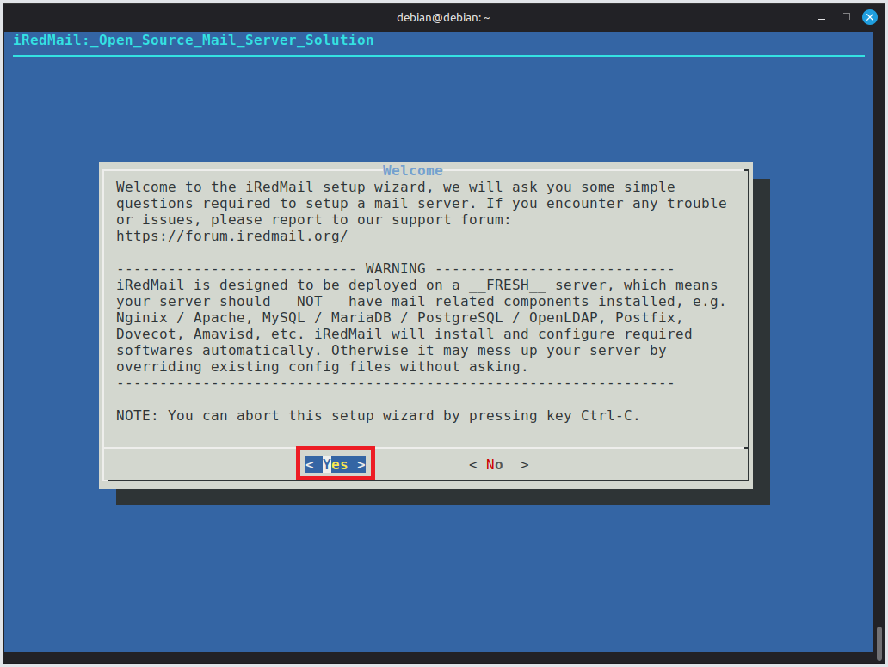

1) Laisser par défaut `/var/mail`
2) Cliquer sur **Next**


1) Sélectionner Nginx
2) Cliquer sur **Next**

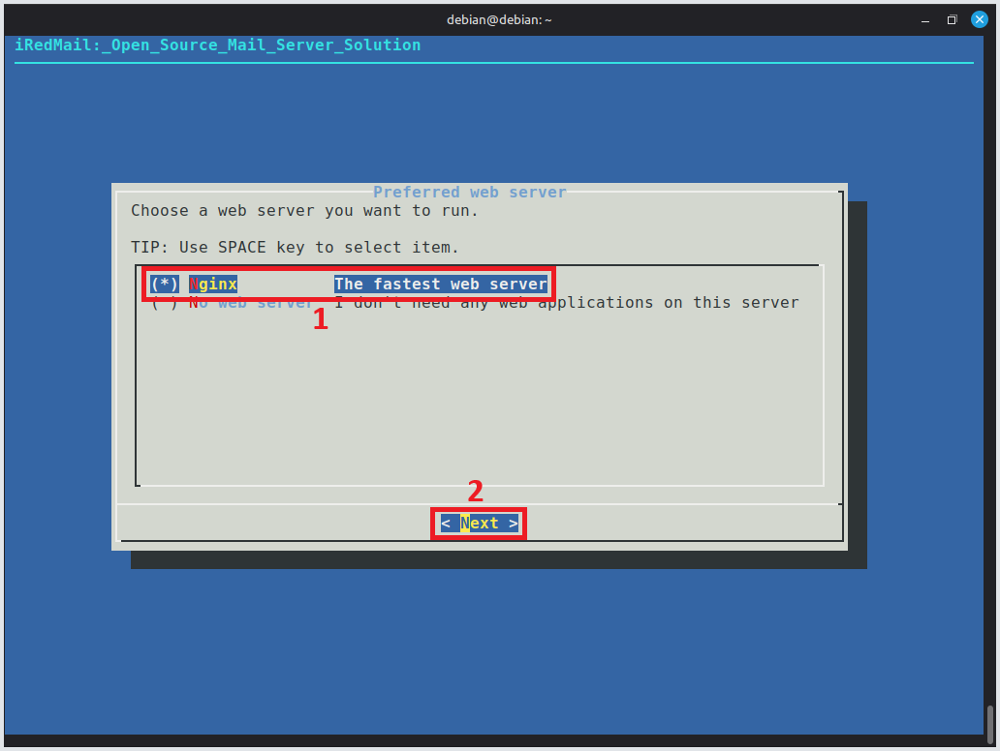

1) Sélectionner **OpenLDAP** 
2) Cliquer sur **Next**
> IMPORTANT : Sans OpenLDAP la synchronisation avec Active Directory ne sera pas possible

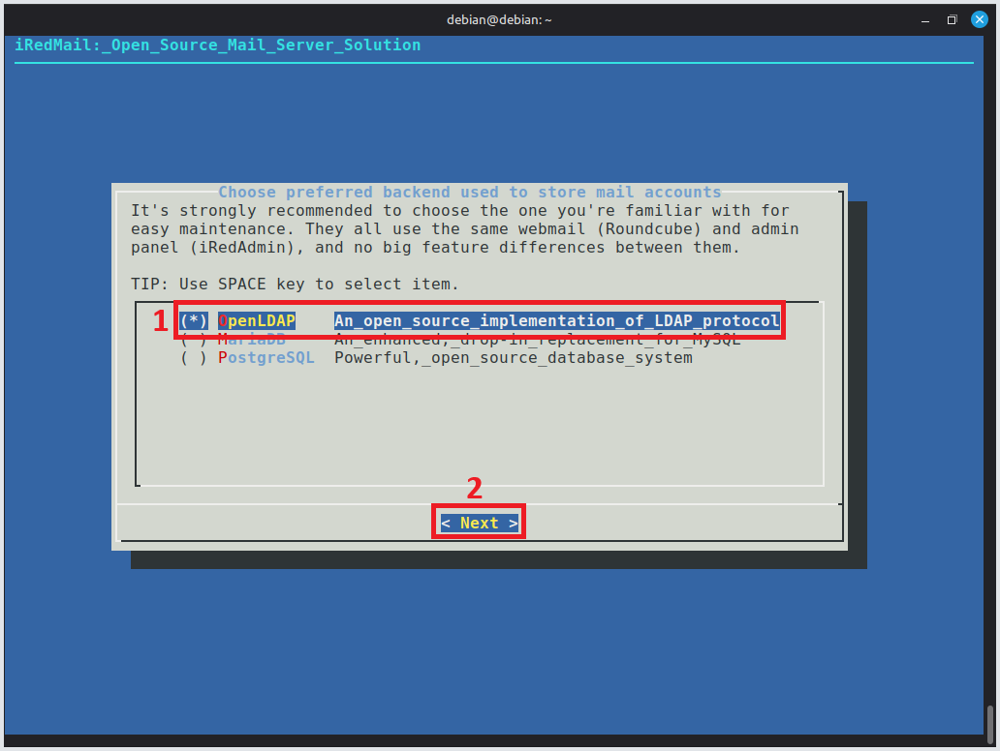

- Entrer `dc=billu,dc=lan`

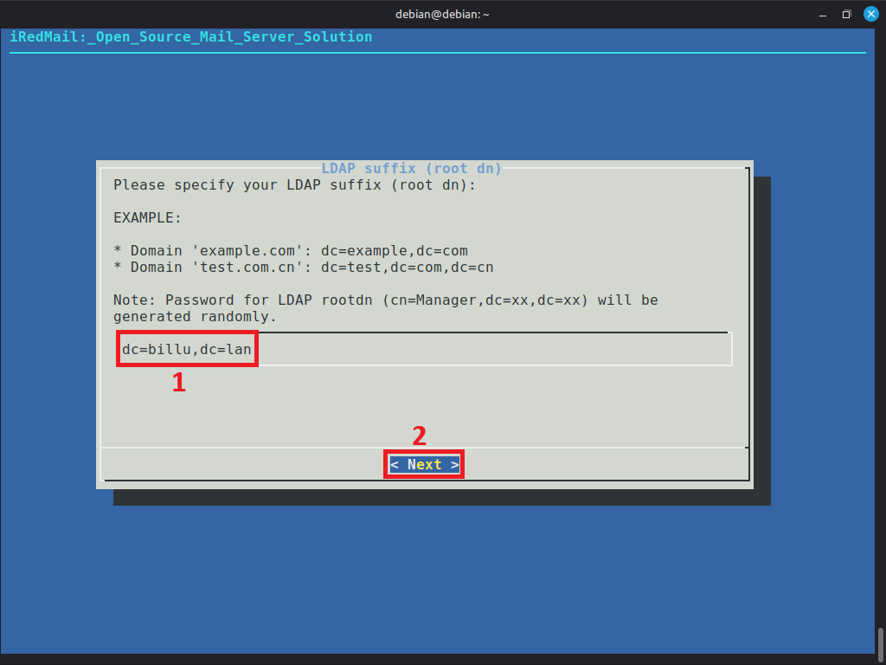

- Entrer le mot de passe Administrateur OpenLDAP `Azerty1*`

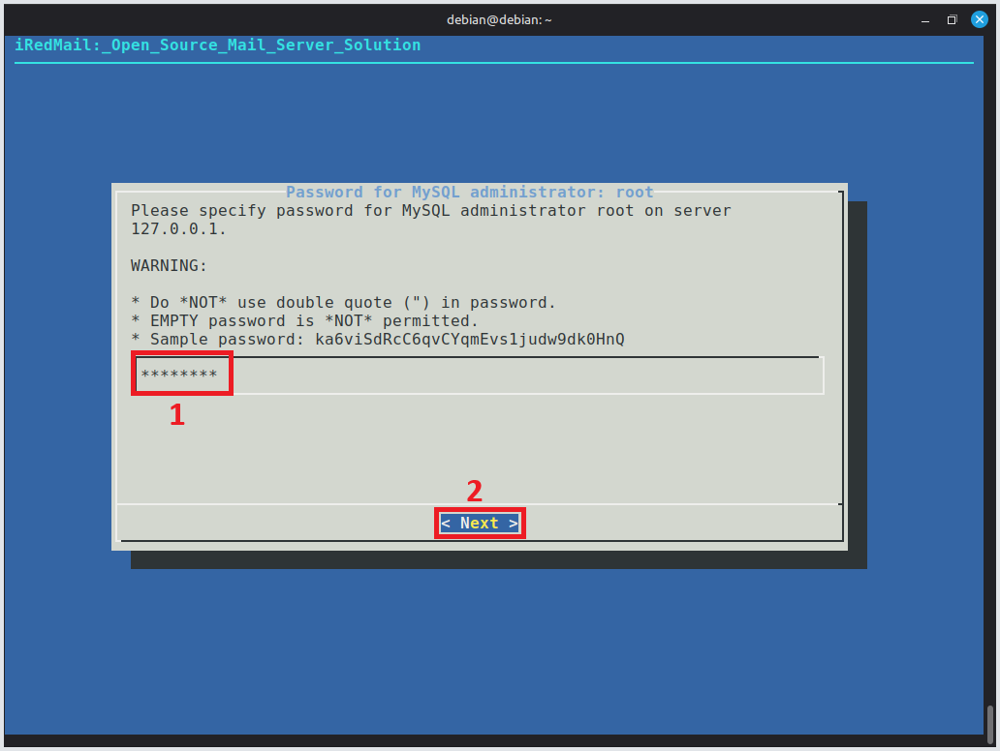

1) Entrer le domain mail principal `billu.lan`
2) Cliquer sur **Next**

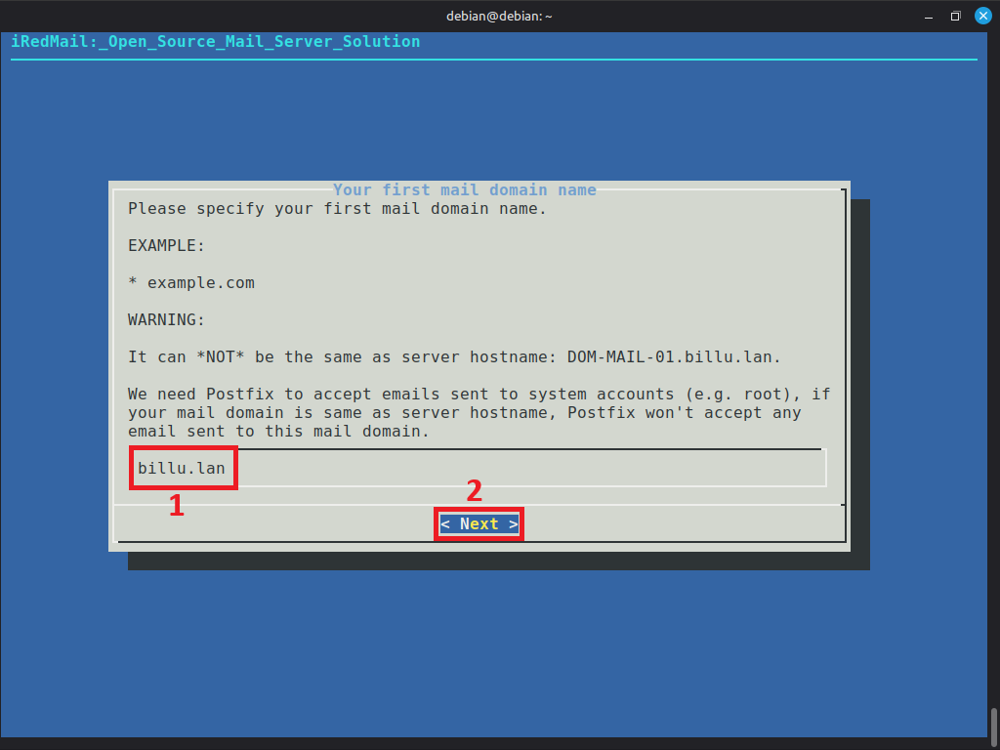

1) Entrer le mot de passe Administrateur mail `Azerty1*`

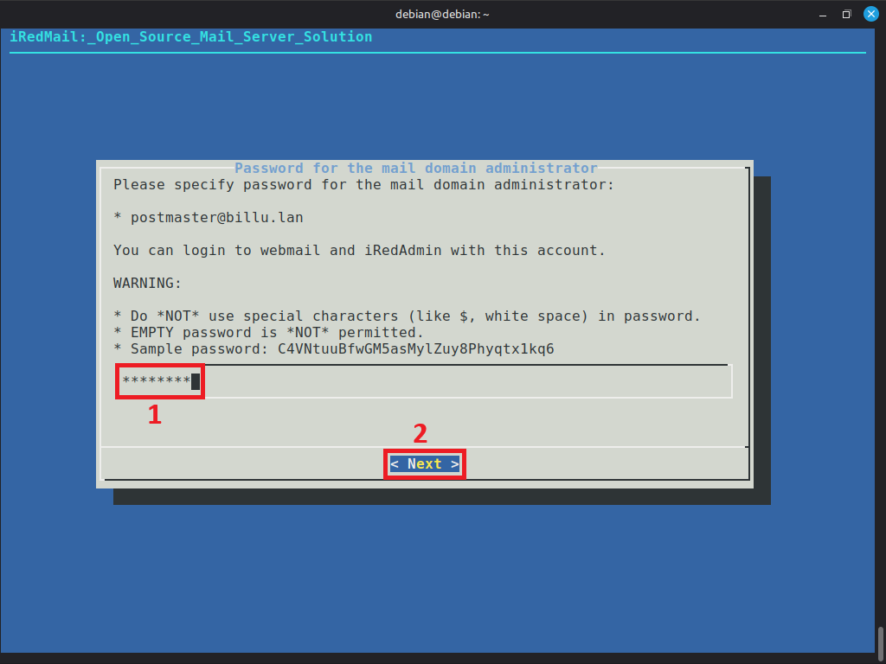

```
Compte : postmaster@billu.lan
Mot de passe : Azerty1*
```

1) Sélectionner tous les composants 
2) Cliquer sur **Next**

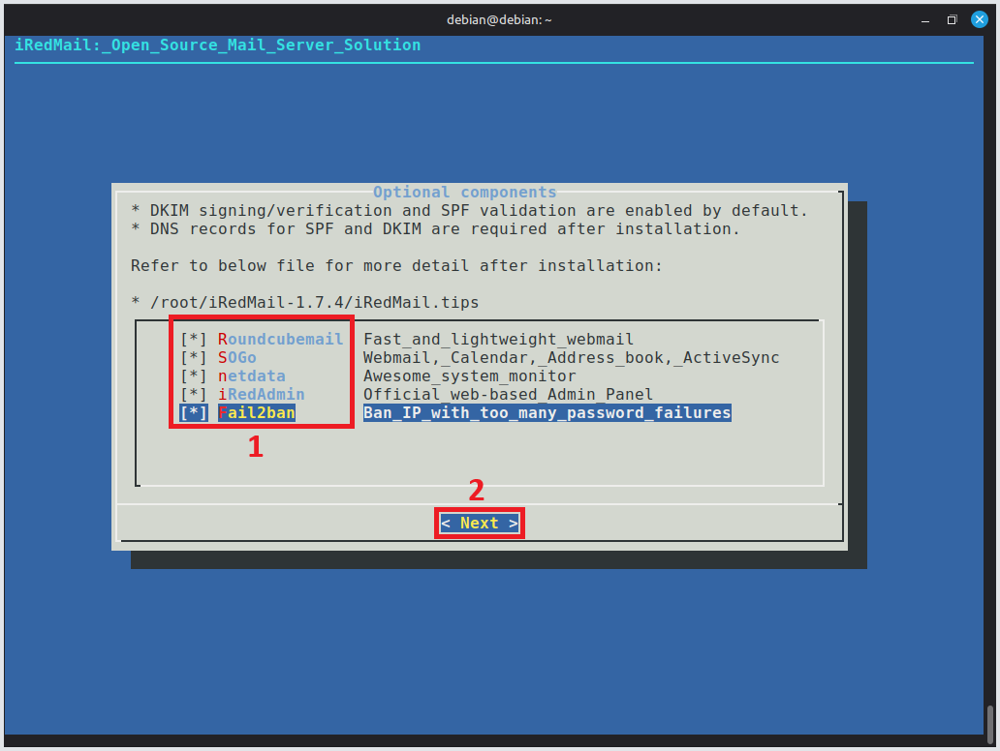

- Entrer `Y` pour finaliser l'installation 

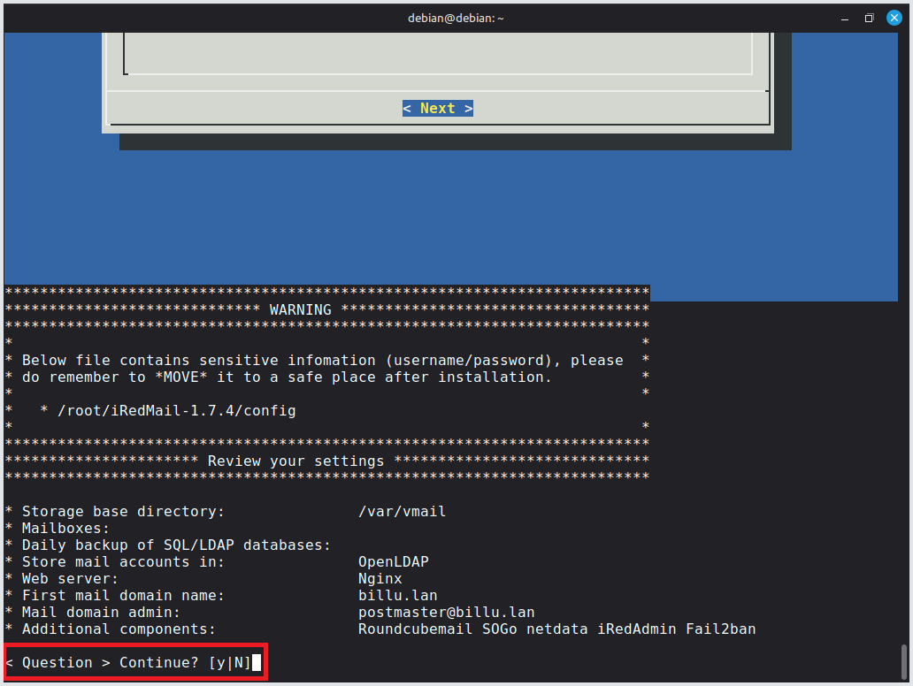


> L'installation peut prendre quelques minutes

- Pour les 2 questions, entrer `Y`

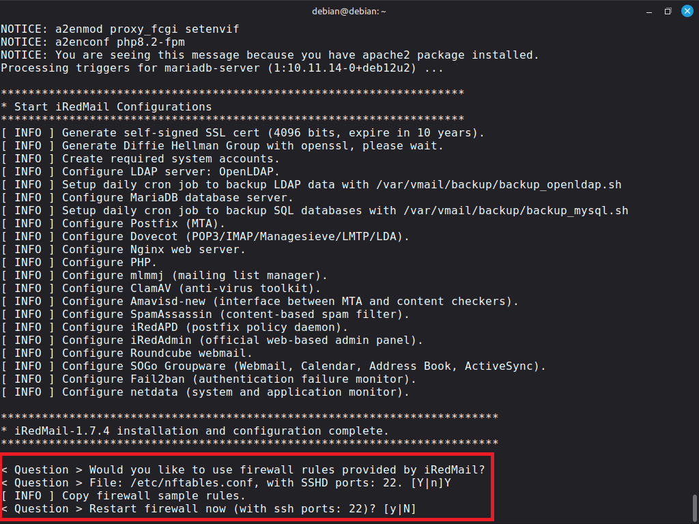

- Confirmation de fin d'installation 

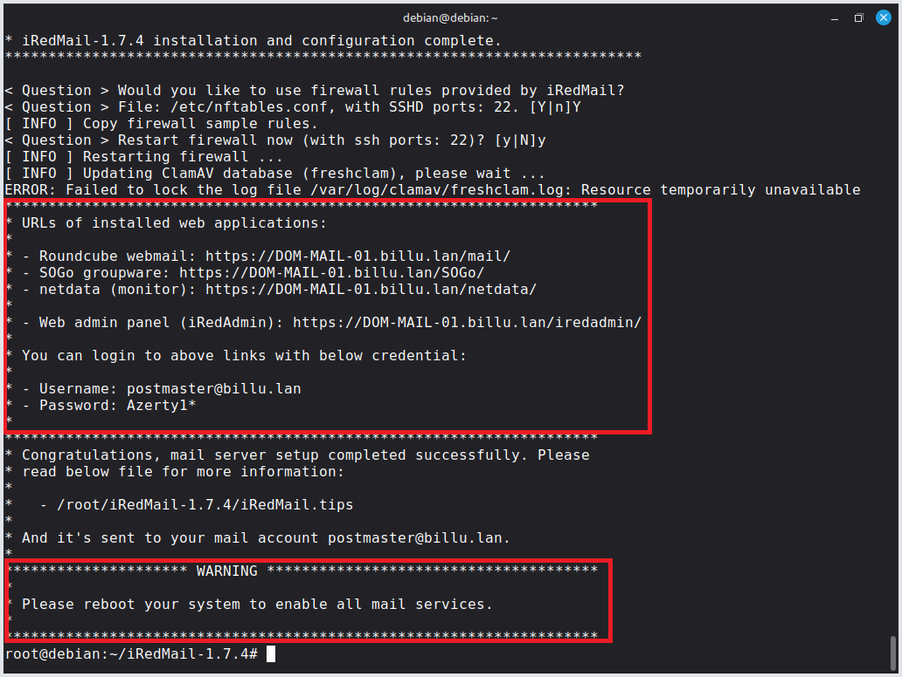


### 3.4 Redémarrer après installation

```bash
reboot
```

---

## 4. Vérification post-installation

### 4.1 Vérifier les services

```bash
systemctl status postfix
systemctl status dovecot
systemctl status slapd
systemctl status nginx
systemctl status amavis
```


### 4.2 Vérifier l'accès web

- **Roundcube** : https://172.16.13.5/mail/
- **iRedAdmin** : https://172.16.13.5/iredadmin/

> **Rappel :** 
Compte : postmaster@billu.lan
Mot de passe : Azerty1*
