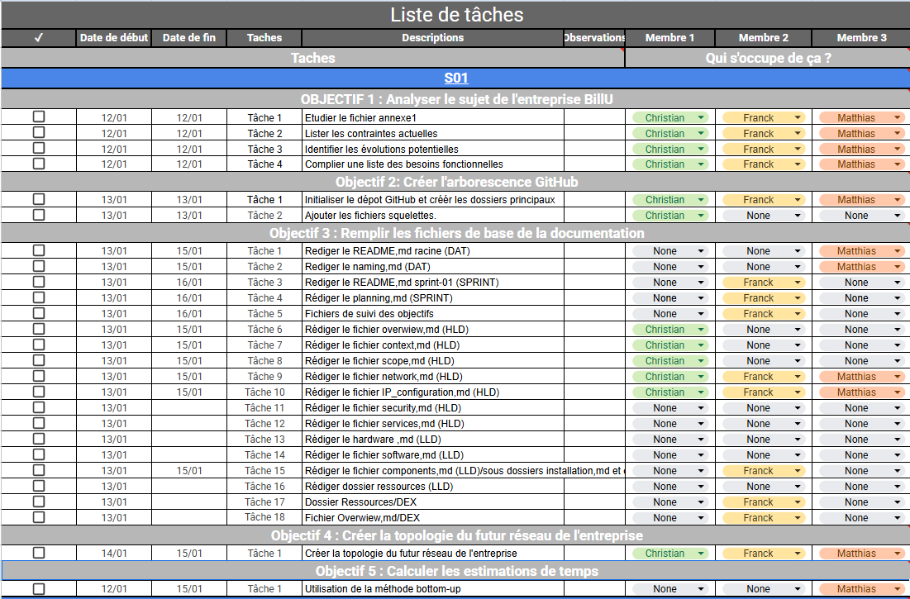

## Sommaire

1. [Sprint 1](#1-sprint-1)
	- [1.1 Liste des objectifs principaux](#11-liste-des-objectifs-principaux)
	- [1.2 Liste des tâches de chaque objectifs](#12-liste-des-taches-de-chaque-objectifs)
	- [1.3 Organisation chronologique](#13-organisation-chronologique)
	- [1.4 Prérequis](#14-prerequis)
	- [1.5 Estimation du temps par objectifs](#15-estimation-du-temps-par-objectifs)
	- [1.6 Estimation du temps par tâches](#16-estimation-du-temps-par-taches)
	- [1.7 Synthèse](#17-syntheses)
2. [Sprint 2](#2-sprint-2)
	- [2.1 Liste des objectifs principaux](#21-liste-des-objectifs-principaux)
	- [2.2 Liste des tâches de chaque objectifs](#22-liste-des-taches-de-chaque-objectifs)
	- [2.3 Organisation chronologique](#23-organisation-chronologique)
	- [2.4 Prérequis](#24-prerequis)
	- [2.5 Estimation du temps par objectifs](#25-estimation-du-temps-par-objectifs)
	- [2.6 Estimation du temps par tâches](#26-estimation-du-temps-par-taches)
	- [2.7 Synthèse](#27-syntheses)
3. [Sprint 3](#3-sprint-3)
	- [3.1 Liste des objectifs principaux](#31-liste-des-objectifs-principaux)
	- [3.2 Liste des tâches de chaque objectifs](#32-liste-des-taches-de-chaque-objectifs)
	- [3.3 Organisation chronologique](#33-organisation-chronologique)
	- [3.4 Prérequis](#34-prerequis)
	- [3.5 Estimation du temps par objectifs](#35-estimation-du-temps-par-objectifs)
	- [3.6 Estimation du temps par tâches](#36-estimation-du-temps-par-taches)
	- [3.7 Synthèse](#37-syntheses)
4. [Sprint 4](#4-sprint-4)
    - [4.1 Liste des objectifs principaux](#41-liste-des-objectifs-principaux)
	- [4.2 Liste des tâches de chaque objectifs](#42-liste-des-taches-de-chaque-objectifs)
	- [4.3 Organisation chronologique](#43-organisation-chronologique)
	- [4.4 Prérequis](#44-prerequis)
	- [4.5 Estimation du temps par objectifs](#45-estimation-du-temps-par-objectifs)
	- [4.6 Estimation du temps par tâches](#46-estimation-du-temps-par-taches)
	- [4.7 Synthèse](#47-syntheses)
5. [Sprint 5](#5-sprint-5)
	- [5.1 Liste des objectifs principaux](#51-liste-des-objectifs-principaux)
	- [5.2 Liste des tâches de chaque objectifs](#52-liste-des-taches-de-chaque-objectifs)
	- [5.3 Organisation chronologique](#53-organisation-chronologique)
	- [5.4 Prérequis](#54-prerequis)
	- [5.5 Estimation du temps par objectifs](#55-estimation-du-temps-par-objectifs)
	- [5.6 Estimation du temps par tâches](#56-estimation-du-temps-par-taches)
	- [5.7 Synthèse](#57-syntheses)
6. [Sprint 6](#6-sprint-6)
	- [6.1 Liste des objectifs principaux](#61-liste-des-objectifs-principaux)
	- [6.2 Liste des tâches de chaque objectifs](#62-liste-des-taches-de-chaque-objectifs)
	- [6.3 Organisation chronologique](#63-organisation-chronologique)
	- [6.4 Prérequis](#64-prerequis)
	- [6.5 Estimation du temps par objectifs](#65-estimation-du-temps-par-objectifs)
	- [6.6 Estimation du temps par tâches](#66-estimation-du-temps-par-taches)
	- [6.7 Synthèse](#67-syntheses)

## 1. Sprint 1

Ce sprint se concentre sur l'analyse initiale du sujet sur l'entreprise **BillU** et la mise en place de la structure de la documentation.
Ainsi que la topologie du réseau.
### 1.1 Liste des objectifs principaux

- Analyser le sujet de l'entreprise BillU (contexte,départements,sites,matériel existant,sécurité).
- Créer l'arborescence sur Github pour la documentation globale du projet (dossiers racine: architecture,components,opérations,sprints et les fichiers type README.md,naming.md,etc).
- Remplir les fichiers de base de la documentation (type overview.md,scope.md etc..., en suivant les types DAT/HLD/LLD/DEX)
- Créer la Topologie du futur réseau de l'entreprise BillU.
- Calculer et valider les estimations de temps total du projet (en JH/ETP).
### 1.2 Liste des tâches de chaque objectifs

- **Objectif 1**: Analyser le sujet de l'entreprise BillU
	- Etudier le fichier p3-sprint-1-annexe-1-entreprise-1-BillU.md
	- Lister les contraintes actuelles.
	- Identifié les évolutions potentielles.
	- Compiler une liste des besoins fonctionnelles.
	
- **Objectif 2:** Créer l'arborescence GitHub
	- Initialisé le dépot GitHub et créer les dossiers principaux.
	- Ajouter les fichiers squelettes.

- **Objectif 3:** Remplir les fichiers de base de la documentation
	- Rédiger le README.md racine (DAT) ainsi que le fichier naming.md
	- Rédiger le README.md sprint-01 ainsi que le fichier planning.md
	- Rédiger les fichiers HLD
	- Rédiger les fichiers LLD
	- Rediger les fichiers DEX
	- Rediger le Suivi des objectifs de projet

- **Objectif 4:** Créer la topologie du futur réseau de l'entreprise

- **Objectif 5:** Calculer les estimations de temps
	- On a utilisé la méthode bottom-up.

### 1.3 Organisation chronologique

- **Jour 1 :** Analyse du sujet et des objectifs , lectures des annexes (réunion d'équipe).
- **Jour 2-3 :** Création de l'arborescence Github et remplissage initial des fichiers. 
- **Jour 3-4 :** Création de la Topologie du nouveau réseau.
- **Jour 5 :** Revue et validation du fichier de suivi des objectifs,présentation de fin de sprint (démo sur la topologie du nouveau SI et de l'arborescence de notre documentation)
### 1.4 Prérequis

- Accès au fichier du projet et aux annexes.
- Validation des rôles de chacun.
- Outils : GitHub, Draw.io, Obsidian (Google Sheets et Google Docs)

### 1.5 Estimation du temps par objectifs

- Objectif 1: **1.5 JH**

- Objectif 2: **0.5 JH**

- Objectif 3: **9 JH**

- Objectif 4: **3 JH**

- Objectif 5: **0.6 JH**

### 1.6 Estimation du temps par tâches

- **Objectif 1**:
			- Tâche 1 : **0.5 JH** 
			- Tâche 2 : **0.4 JH**
			- Tâche 3 : **0.3 JH**
			- Tâche 4 : **0.3 JH**

- **Objectif 2**:
			- Tâche 1 : **0.2 JH**
			- Tâche 2 : **0.3 JH**

- **Objectif 3**:
			- Tâche 1 : **1.5 JH**
			- Tâche 2 : **1.5 JH**
			- Tâche 3 : **4 JH**
			- Tâche 4 : **1 JH**
			- Tâche 5 : **0.5 JH**
			- Tâche 6 : **0.5 JH**

- **Objectif 4**:
			- Tâche 1 : **3 JH**

- **Objectif 5**:
			- Tâche 1 : **0.6 JH**

### 1.7 Synthèse

## 2. Sprint 2

### 2.1 Liste des objectifs principaux

### 2.2 Liste des tâches de chaque objectifs

### 2.3 Organisation chronologique

### 2.4 Prérequis

### 2.5 Estimation du temps par objectifs

### 2.6 Estimation du temps par tâches

### 2.7 Synthèse

## 3. Sprint 3

### 3.1 Liste des objectifs principaux

### 3.2 Liste des tâches de chaque objectifs

### 3.3 Organisation chronologique

### 3.4 Prérequis

### 3.5 Estimation du temps par objectifs

### 3.6 Estimation du temps par tâches

### 3.7 Synthèse

## 4. Sprint 4

### 4.1 Liste des objectifs principaux

### 4.2 Liste des tâches de chaque objectifs

### 4.3 Organisation chronologique

### 4.4 Prérequis

### 4.5 Estimation du temps par objectifs

### 4.6 Estimation du temps par tâches

### 4.7 Synthèse

## 5. Sprint 5

### 5.1 Liste des objectifs principaux

### 5.2 Liste des tâches de chaque objectifs

### 5.3 Organisation chronologique

### 5.4 Prérequis

### 5.5 Estimation du temps par objectifs

### 5.6 Estimation du temps par tâches

### 5.7 Synthèse

## 6. Sprint 6

### 6.1 Liste des objectifs principaux

### 6.2 Liste des tâches de chaque objectifs

### 6.3 Organisation chronologique

### 6.4 Prérequis

### 6.5 Estimation du temps par objectifs

### 6.6 Estimation du temps par tâches

### 6.7 Synthèse
