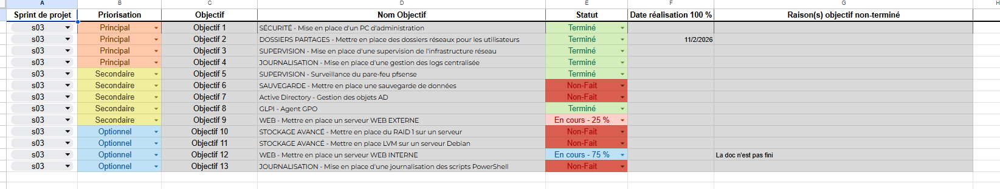

## Sommaire

1. [Sprint 1](#1-sprint-1)
	- [1.1 Liste des objectifs principaux](#11-liste-des-objectifs-principaux)
	- [1.2 Liste des tâches de chaque objectifs](#12-liste-des-taches-de-chaque-objectifs)
	- [1.3 Organisation chronologique](#13-organisation-chronologique)
	- [1.4 Prérequis](#14-prerequis)
	- [1.5 Estimation du temps par objectifs](#15-estimation-du-temps-par-objectifs)
	- [1.6 Estimation du temps par tâches](#16-estimation-du-temps-par-taches)
	- [1.7 Synthèse](#17-syntheses)
2. [Sprint 2](#2-sprint-2)
	- [2.1 Liste des objectifs principaux](#21-liste-des-objectifs-principaux)
	- [2.2 Liste des tâches de chaque objectifs](#22-liste-des-taches-de-chaque-objectifs)
	- [2.3 Organisation chronologique](#23-organisation-chronologique)
	- [2.4 Prérequis](#24-prerequis)
	- [2.5 Estimation du temps par objectifs](#25-estimation-du-temps-par-objectifs)
	- [2.6 Estimation du temps par tâches](#26-estimation-du-temps-par-taches)
	- [2.7 Synthèse](#27-syntheses)
3. [Sprint 3](#3-sprint-3)
	- [3.1 Liste des objectifs principaux](#31-liste-des-objectifs-principaux)
	- [3.2 Liste des tâches de chaque objectifs](#32-liste-des-taches-de-chaque-objectifs)
	- [3.3 Organisation chronologique](#33-organisation-chronologique)
	- [3.4 Prérequis](#34-prerequis)
	- [3.5 Estimation du temps par objectifs](#35-estimation-du-temps-par-objectifs)
	- [3.6 Estimation du temps par tâches](#36-estimation-du-temps-par-taches)
	- [3.7 Synthèse](#37-syntheses)
4. [Sprint 4](#4-sprint-4)
    - [4.1 Liste des objectifs principaux](#41-liste-des-objectifs-principaux)
	- [4.2 Liste des tâches de chaque objectifs](#42-liste-des-taches-de-chaque-objectifs)
	- [4.3 Organisation chronologique](#43-organisation-chronologique)
	- [4.4 Prérequis](#44-prerequis)
	- [4.5 Estimation du temps par objectifs](#45-estimation-du-temps-par-objectifs)
	- [4.6 Estimation du temps par tâches](#46-estimation-du-temps-par-taches)
	- [4.7 Synthèse](#47-syntheses)
5. [Sprint 5](#5-sprint-5)
	- [5.1 Liste des objectifs principaux](#51-liste-des-objectifs-principaux)
	- [5.2 Liste des tâches de chaque objectifs](#52-liste-des-taches-de-chaque-objectifs)
	- [5.3 Organisation chronologique](#53-organisation-chronologique)
	- [5.4 Prérequis](#54-prerequis)
	- [5.5 Estimation du temps par objectifs](#55-estimation-du-temps-par-objectifs)
	- [5.6 Estimation du temps par tâches](#56-estimation-du-temps-par-taches)
	- [5.7 Synthèse](#57-syntheses)
6. [Sprint 6](#6-sprint-6)
	- [6.1 Liste des objectifs principaux](#61-liste-des-objectifs-principaux)
	- [6.2 Liste des tâches de chaque objectifs](#62-liste-des-taches-de-chaque-objectifs)
	- [6.3 Organisation chronologique](#63-organisation-chronologique)
	- [6.4 Prérequis](#64-prerequis)
	- [6.5 Estimation du temps par objectifs](#65-estimation-du-temps-par-objectifs)
	- [6.6 Estimation du temps par tâches](#66-estimation-du-temps-par-taches)
	- [6.7 Synthèse](#67-syntheses)

## 1. Sprint 1

Ce sprint se concentre sur l'analyse initiale du sujet sur l'entreprise **BillU** et la mise en place de la structure de la documentation.
Ainsi que la topologie du réseau.
### 1.1 Liste des objectifs principaux

- Analyser le sujet de l'entreprise BillU (contexte,départements,sites,matériel existant,sécurité).
- Créer l'arborescence sur Github pour la documentation globale du projet (dossiers racine: architecture,components,opérations,sprints et les fichiers type README.md,naming.md,etc).
- Remplir les fichiers de base de la documentation (type overview.md,scope.md etc..., en suivant les types DAT/HLD/LLD/DEX)
- Créer la Topologie du futur réseau de l'entreprise BillU.
- Calculer et valider les estimations de temps total du projet (en JH/ETP).
### 1.2 Liste des tâches de chaque objectifs

- **Objectif 1**: Analyser le sujet de l'entreprise BillU
	- Etudier le fichier p3-sprint-1-annexe-1-entreprise-1-BillU.md
	- Lister les contraintes actuelles.
	- Identifié les évolutions potentielles.
	- Compiler une liste des besoins fonctionnelles.
	
- **Objectif 2:** Créer l'arborescence GitHub
	- Initialisé le dépot GitHub et créer les dossiers principaux.
	- Ajouter les fichiers squelettes.

- **Objectif 3:** Remplir les fichiers de base de la documentation
	- Rédiger le README.md racine (DAT) ainsi que le fichier naming.md
	- Rédiger le README.md sprint-01 ainsi que le fichier planning.md
	- Rédiger les fichiers HLD
	- Rédiger les fichiers LLD
	- Rediger les fichiers DEX
	- Rediger le Suivi des objectifs de projet

- **Objectif 4:** Créer la topologie du futur réseau de l'entreprise

- **Objectif 5:** Calculer les estimations de temps
	- On a utilisé la méthode bottom-up.

### 1.3 Organisation chronologique

- **Jour 1 :** Analyse du sujet et des objectifs , lectures des annexes (réunion d'équipe).
- **Jour 2-3 :** Création de l'arborescence Github et remplissage initial des fichiers. 
- **Jour 3-4 :** Création de la Topologie du nouveau réseau.
- **Jour 5 :** Revue et validation du fichier de suivi des objectifs,présentation de fin de sprint (démo sur la topologie du nouveau SI et de l'arborescence de notre documentation)
### 1.4 Prérequis

- Accès au fichier du projet et aux annexes.
- Validation des rôles de chacun.
- Outils : GitHub, Draw.io, Obsidian (Google Sheets et Google Docs)

### 1.5 Estimation du temps par objectifs

- Objectif 1: **1.5 JH**

- Objectif 2: **0.5 JH**

- Objectif 3: **9 JH**

- Objectif 4: **3 JH**

- Objectif 5: **0.6 JH**

### 1.6 Estimation du temps par tâches

- **Objectif 1**:
			- Tâche 1 : **0.5 JH** 
			- Tâche 2 : **0.4 JH**
			- Tâche 3 : **0.3 JH**
			- Tâche 4 : **0.3 JH**

- **Objectif 2**:
			- Tâche 1 : **0.2 JH**
			- Tâche 2 : **0.3 JH**

- **Objectif 3**:
			- Tâche 1 : **1.5 JH**
			- Tâche 2 : **1.5 JH**
			- Tâche 3 : **4 JH**
			- Tâche 4 : **1 JH**
			- Tâche 5 : **0.5 JH**
			- Tâche 6 : **0.5 JH**

- **Objectif 4**:
			- Tâche 1 : **3 JH**

- **Objectif 5**:
			- Tâche 1 : **0.6 JH**

### 1.7 Synthèse

## 2. Sprint 2

Ce sprint se concentre sur la mise en place des services coeur de l'infrastructure de BillU et sur la centralisation de la gestion des postes et des utilisateurs.

L'objectif principal est de disposer, en fin de sprint, d'une infrastructure Active DIrectory fonctionnelle, intégrant kes services essentiels (AD DS, DNS, DHCP) ainsi qu'une première couche de sécurité via un firewall dédié.

### 2.1 Liste des objectifs principaux

- ACTIVE DIRECTORY - Création d'un domaine AD DS
- GPO - Mise en place de GPO
- DNS - Mise en place d'un serveur DNS
- DHCP - Mise en place d'un serveur DHCP
- SÉCURITÉ - Gestion d'un firewall pfSense

### 2.2 Liste des tâches de chaque objectifs

**Objectif 1 – Active Directory (7,5 JH – Prioritaire)**
Tâches :
- Préparation et planification du domaine Active Directory
- Installation du rôle AD DS
- Création de la structure des OU
- Création des groupes de sécurité
- Tests de fonctionnement et validation
- Rédaction de la documentation (LLD + DEX)

**Objectif 2 – GPO : Mise en place des stratégies de groupe (3 JH – Prioritaire)**

Tâches :
- Configuration des GPO (sécurité, utilisateurs, postes)
- Tests d’application des stratégies
- Documentation associée

**Objectif 3 – DNS : Mise en place du service DNS (2,5 JH – Prioritaire)**

Tâches :
- Configuration des zones DNS directes
- Configuration des zones DNS inversées
- Vérification de la résolution de noms

**Objectif 4 – DHCP : Mise en place du service DHCP (4,5 JH – Prioritaire)**

Tâches :
- Installation du rôle DHCP
- Configuration des étendues DHCP par VLAN
- Configuration des réservations
- Tests et validation du service

**Objectif 5 – Sécurité : Firewall pfSense (6 JH – Prioritaire)**

Tâches :
- Installation du firewall pfSense
- Configuration réseau de base
- Mise en place des règles de filtrage initiales
- Validation de la sécurité

### 2.3 Organisation chronologique

Jour 1 :
Prise de conscience des objectifs du sprint
Priorisation des taches
Organisation complète du sprint

Jour 2 :
Fin organisation du sprint
Mise en place de l'arborescence du domaine Active Directory

Jour 3 :
Préparation du domaine Active Directory
Installation AD DS
Début configuration DNS

Jour 4 :
Création des OU
Configuration DNS (zones directes / inversées)
Début configuration DHCP
Installation et configuration pfSense

Jour 5 :
Création présentation intermédiaire
Entrainement présentation intermédiaire
Présentation intermédiaire

Jour 6 :
Finalisation DHCP
Tests réseau (résolution, attribution IP)
Configuration GPO
Mise en place du routeur

Jour 7 :
Finalisation du routeur
Configuration IP helper sur routeur

Jour 8 :
Installation PC ADMIN
Installation PC CLIENT
Début configuration service GLPI

Jour 9 :
Tests globaux (AD, DNS, DHCP, GPO, firewall)
Mise à jour de la documentation
Revue de sprint et démonstration

Jour 10 :
Création présentation
Entrainement présentation
Présentation

### 2.4 Prérequis
Sprint 1 validé (documentation et topologie réseau)

Accès aux VM serveurs et clients

Plan d’adressage réseau validé

Outils :
- Hyperviseur
- pfSense
- Windows Server
- Linux ubuntu
- Windows 10
- GLPI
- GitHub
- Obsidian / Markdown

### 2.5 Estimation du temps par objectifs

| Objectif              | Charge estimée |
| --------------------- | -------------- |
| Active Directory      | 7,5 JH         |
| GPO                   | 3 JH           |
| DNS                   | 2,5 JH         |
| DHCP                  | 4,5 JH         |
| Firewall pfSense      | 6 JH           |
| **Total prioritaire** | **23,5 JH**    |

### 2.6 Estimation du temps par tâches

### 2.7 Synthèse
À l’issue du Sprint 2, l’infrastructure BillU dispose :
- D’un domaine Active Directory opérationnel
- D’une gestion centralisée des utilisateurs et des postes
- De services réseau fonctionnels (DNS, DHCP)
- D’une première couche de sécurité périmétrique
- D'un routage fonctionnels
- D'un service GLPI en cours de configuration
- De machine cliente Windows, Linux
- D'un PC d'administration
- D’une documentation technique alignée avec les standards DAT / HLD / LLD / DEX

## 3. Sprint 3

### 3.1 Liste des objectifs principaux

Objectif 1 : Mise en place d'un PC d'administration
Objectif 2 : Mise en place des Dossiers Partagés
Objectif 3 : Supervision ZABBIX
Objectif 4 : Journalisation GRAYLOG
Objectif 5 : Surveillance du Pare-feu Pfsense
Objectif 6 : GLPI - Agent GPO
Objectif 7: Mise en place d'un serveur WEB EXTERNE

### 3.2 Liste des tâches de chaque objectifs

**Objectif 1 - Mise en place d'un PC d'administration**
Tâches :
- Installation PC admin Windows
- Installation Outils d'administration serveur Windows
- Installation Outils et Logiciel multi OS
- Installation Outils d'administration Serveur Linux
- Documentation

**Objectif 2 - Mise en place des Dossiers Partagés**
Tâches :
- Mettre en place des dossiers réseaux pour les utilisateurs
- Sécurité de partage des dossiers par groupe AD 
- Mappage des lecteurs sur les clients (au choix)Lettre de mappage réseau I : Dossier individuel
- Lettre de mappage réseau J: Dossier de Service   
- Lettre de mappage réseau K: Dossier de département
- Documentation

**Objectif 3 - Supervision ZABBIX**
Tâches :
- Installation de Zabbix
- Installation de Zabbix Agent   
- Mise en place de dashboard 
-  Documentation

**Objectif 4 - Journalisation GRAYLOG**
Tâches :
- Installation de Zabbix
- Installation de Zabbix Agent   
- Mise en place de dashboard 
-  Documentation

**Objectif 5 - Surveillance du pare-feu Pfsense*
Tâches :
- Installation de Zabbix Agent
- Mise en place de dashboard  
-  Documentation

---
### 3.3 Organisation chronologique
Le Sprint 3 s'organise en 4 phases successives sur 2 semaines, en respectant les dépendances techniques entre les objectifs : 
### Phase 1 : Préparation (Jours 1-2) 
**Objectif 1 - PC d'administration**
- Installation et configuration complète du poste d'administration
- Installation des outils d'administration Windows (RSAT, PowerShell, consoles MMC)
- Installation des outils multi-OS (PuTTY, WinSCP, Notepad++, Wireshark)
- Installation des outils Linux (SSH client, scripts de connexion)
- Documentation des procédures d'installation et configuration 
### Phase 2 : Infrastructure de données (Jours 3-4)
**Objectif 2 - Dossiers Partagés** 
- Création de l'arborescence des dossiers sur le serveur de fichiers 
- Configuration des groupes AD pour la gestion des permissions 
- Mise en place de la sécurité NTFS et de partage 
- Configuration du mappage des lecteurs réseau (I:, J:, K:)
- Tests d'accès par utilisateurs et groupes 
- Documentation complète de la structure 
### Phase 3 : Supervision et surveillance (Jours 5-8)
**Objectif 3 - Supervision Zabbix** 
- Installation du serveur Zabbix (Jour 5) 
- Configuration de la base de données 
- Installation des agents Zabbix sur les serveurs Windows et Linux (Jour 6)
- Création des dashboards de supervision (Jour 7) 
- Documentation
**Objectif 4 - Journalisation Graylog** *(en parallèle)* 
- Installation de Graylog (MongoDB, Elasticsearch, Graylog Server) (Jour 5)
- Configuration des inputs pour recevoir les logs (Jour 6)
- Configuration des agents sur les serveurs (Jour 7)
- Création des dashboards de journalisation (Jour 8) 
- Documentation 
 **Objectif 5 - Surveillance du pare-feu pfSense**
- Installation de l'agent Zabbix sur pfSense (Jour 7)
- Configuration des templates de supervision pfSense 
- Intégration dans les dashboards Zabbix (Jour 8)
- Configuration de l'envoi de logs vers Graylog
- Documentation 
 
### Phase 4 : Services complémentaires (Jours 9-10)
**Objectif 6 - GLPI Agent par GPO**
- Préparation du package d'installation de l'agent GLPI 
- Création de la GPO de déploiement 
- Tests sur un groupe pilote
- Déploiement général 
- Documentation 

**Objectif 7 - Serveur Web Externe** 
- Installation du serveur web (Apache/Nginx) 
- Configuration des règles NAT sur pfSense 
- Configuration SSL/TLS
- Tests d'accessibilité externe 
- Documentation
---
### 3.4 Prérequis
#### Prérequis généraux Sprint 3

- Infrastructure réseau opérationnelle (VLANs, routage inter-VLANs)
-  Active Directory fonctionnel avec OUs, groupes et utilisateurs créés
-  Serveurs Windows Server et Linux déployés et accessibles 
-  pfSense configuré avec règles de pare-feu de base  
- Connexion Internet opérationnelle pour téléchargements
-  Accès administrateur sur tous les équipements

---
### 3.5 Estimation du temps par objectifs

| Objectif              | Charge estimée |
| --------------------- | -------------- |
| PC Admin              | JH             |
| Dossiers Partagés     | JH             |
| Supervision           | JH             |
| Journalisation        | JH             |
| Surveillance pare-feu | JH             |
| GLPI -Agent           |                |
| **Total prioritaire** | ** JH**        |

### 3.6 Estimation du temps par tâches

### 3.7 Synthèse

## 4. Sprint 4

### 4.1 Liste des objectifs principaux

- WEB – Mise en place d’un serveur WEB EXTERNE (DMZ)
- GESTION DE PARC – Déploiement WDS
- SÉCURITÉ – Mise en place d’un serveur WSUS
- MESSAGERIE – Mise en place d’un serveur RedMail
- VOIP – Mise en place d’un serveur de téléphonie IP
- AD – Script RH automatisé

### 4.2 Liste des tâches de chaque objectifs

#### Objectif 1 – Serveur WEB EXTERNE (Apache)

Tâches :
- Préparation et installation du serveur Web en DMZ
- Configuration réseau et règles firewall/NAT
- Tests de connectivité interne et externe
- Installation Apache
- Configuration Apache (VirtualHost)
- Déploiement site vitrine
- Documentation complète (LLD + DEX)

#### Objectif 2 – WDS (Windows Deployment Services)

Tâches :
- Préparation et installation du serveur WDS
- Configuration des services réseau associés
- Import et organisation des images de déploiement
- Paramétrage PXE et validation des services
- Tests fonctionnels complets de déploiement
- Documentation

#### Objectif 3 – WSUS

Tâches :
- Installation et configuration du serveur WSUS
- Création et configuration des GPO de mise à jour
- Création des groupes WSUS
- Gestion des mises à jour (approbation, synchronisation)
- Documentation

#### Objectif 4 – Messagerie (RedMail)

Tâches :
- Préparation de l’installation
- Installation de RedMail
- Post-installation (DNS, SPF, DKIM si simulé)
- Configuration
- Documentation

#### Objectif 5 – VOIP

Tâches :
- Installation serveur VoIP
- Configuration réseau et tests internes
- Documentation

#### Objectif 6 – AD – Script RH

Tâches :
- Script modification comptes AD
- Script désactivation comptes / OU désactivés
- Script féminisation des intitulés
- Documentation

### 4.3 Organisation chronologique

### 4.4 Prérequis

### 4.5 Estimation du temps par objectifs

| Objectif            | Charge estimée |
| ------------------- | -------------- |
| Serveur WEB EXTERNE | 3 JH           |
| WDS                 | 5 JH           |
| WSUS                | 3 JH           |
| Messagerie          | 3 JH           |
| VOIP                | 2 JH           |
| Scripts AD          | 2 JH           |
| **Total estimé**    | **18 JH**      |

### 4.6 Estimation du temps par tâches

### 4.7 Synthèse

- L’entreprise dispose d’un site web accessible depuis l’extérieur
- Les postes peuvent être déployés automatiquement via PXE
- Les mises à jour Windows sont centralisées et maîtrisées
- Une messagerie interne est hébergée sur l’infrastructure
- Une solution VOIP interne est fonctionnelle
- L’administration AD est partiellement automatisée

## 5. Sprint 5

### 5.1 Liste des objectifs principaux

### 5.2 Liste des tâches de chaque objectifs

### 5.3 Organisation chronologique

### 5.4 Prérequis

### 5.5 Estimation du temps par objectifs

### 5.6 Estimation du temps par tâches

### 5.7 Synthèse

## 6. Sprint 6

### 6.1 Liste des objectifs principaux

### 6.2 Liste des tâches de chaque objectifs

### 6.3 Organisation chronologique

### 6.4 Prérequis

### 6.5 Estimation du temps par objectifs

### 6.6 Estimation du temps par tâches

### 6.7 Synthèse
