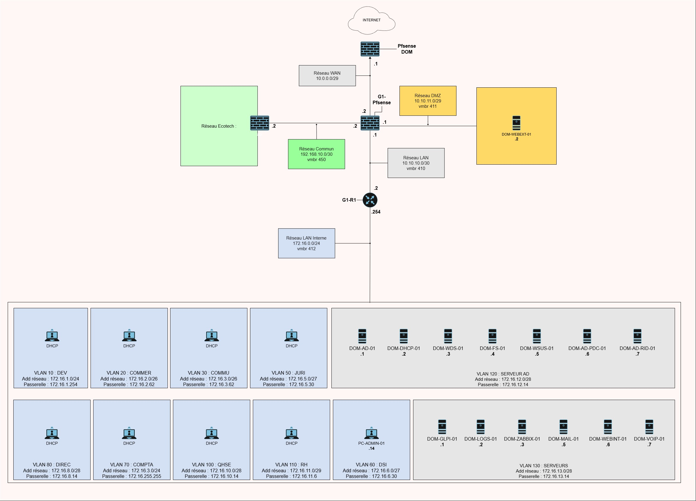
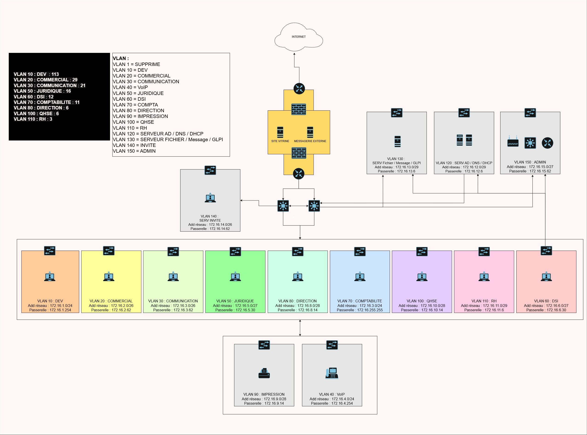

# 

## 1. Contexte

Ce document présente le schéma final de l’infrastructure réseau mise en place dans le cadre du projet 3.

Seuls les éléments **complètement fonctionnels** (statut "Terminé") sont représentés.

---

## 2. Schéma actuel

---

## 3. Schéma initial (Sprint 1)

---

## 4. Description des éléments du schéma

| ID              | Nom Machine       | Type | Adresse IP        | Fonction                          | Réseau (vmbr/VLAN) |
|-----------------|------------------|------|-------------------|-----------------------------------|--------------------|
| G1-pfSense      | Firewall         | VM   | 10.0.0.1          | Pare-feu / NAT / Routage          | WAN / LAN / DMZ    |
| DOM-WEBEXT-01   | DOM-WEBEXT-01    | CT   | 10.10.11.2/29     | Serveur web externe (DMZ)         | VLAN 411 (DMZ)     |
| G1-R1           | VyOS             | VM   | 10.10.0.254       | Routeur inter-VLAN                | LAN (vmbr410)      |

### VLAN 120 - Serveurs AD

| ID              | Nom Machine       | Type | Adresse IP        | Fonction                          | Réseau (vmbr/VLAN) |
|-----------------|------------------|------|-------------------|-----------------------------------|--------------------|
| DOM-AD-01       | DOM-AD-01        | VM   | 172.16.12.1/28    | Active Directory / DNS            | VLAN 120           |
| DOM-DHCP-01     | DOM-DHCP-01      | VM   | 172.16.12.2/28    | DHCP                              | VLAN 120           |
| DOM-WDS-01      | DOM-WDS-01       | VM   | 172.16.12.3/28    | Déploiement postes (WDS)          | VLAN 120           |
| DOM-FS-01       | DOM-FS-01        | VM   | 172.16.12.4/28    | Serveur de fichiers               | VLAN 120           |
| DOM-WSUS-01     | DOM-WSUS-01      | VM   | 172.16.12.5/28    | WSUS                              | VLAN 120           |
| DOM-AD-PDC-01   | DOM-AD-PDC-01    | VM   | 172.16.12.6/28    | Contrôleur de domaine (PDC)       | VLAN 120           |
| DOM-AD-RID-01   | DOM-AD-RID-01    | VM   | 172.16.12.7/28    | Contrôleur de domaine (RID)       | VLAN 120           |

### VLAN 130 - Serveurs

| ID              | Nom Machine       | Type | Adresse IP        | Fonction                          | Réseau (vmbr/VLAN) |
|-----------------|------------------|------|-------------------|-----------------------------------|--------------------|
| DOM-GLPI-01     | DOM-GLPI-01      | CT   | 172.16.13.1/28    | GLPI                              | VLAN 130           |
| DOM-LOGS-01     | DOM-LOGS-01      | CT   | 172.16.13.2/28    | Graylog                           | VLAN 130           |
| DOM-ZABBIX-01   | DOM-ZABBIX-01    | VM   | 172.16.13.3/28    | Supervision                       | VLAN 130           |
| DOM-MAIL-01     | DOM-MAIL-01      | CT   | 172.16.13.5/28    | Messagerie (iRedMail)             | VLAN 130           |
| DOM-WEBINT-01   | DOM-WEBINT-01    | CT   | 172.16.13.6/28    | Web interne                       | VLAN 130           |
| DOM-VOIP-01     | DOM-VOIP-01      | VM   | 172.16.13.7/28    | Téléphonie (FreePBX)              | VLAN 130           |

### VLAN Utilisateurs

| ID              | Nom Machine       | Type | Adresse IP        | Fonction                          | Réseau (vmbr/VLAN) |
|-----------------|------------------|------|-------------------|-----------------------------------|--------------------|
| PC-ADMIN-01     | PC-ADMIN-01      | VM   | 172.16.6.14       | Poste administration              | VLAN 60            |
---

## 5. Plan d’adressage réseau

### 5.1 Réseaux principaux

#### WAN
- Réseau : 10.0.0.0/29
- Passerelle : 10.0.0.1 (pfSense)

#### DMZ
- Réseau : 10.10.11.0/29
- Passerelle : 10.10.11.1 (pfSense)

#### COMMUN
- Réseau : 192.168.10.0/30
- Passerelle : 192.168.10.1 (pfSense)

#### Réseau LAN (interconnexion)
- Réseau : 10.10.10.0/30
- Passerelle : 10.10.10.1 (pfSense)
- Routeur : 10.10.10.2 (VyOS)

#### Réseau interne global
- Réseau : 172.16.0.0/24
- Passerelle : 172.16.0.254

---

### 5.2 VLAN / Réseaux spécifiques

| VLAN ID | Nom         | Plage IP          | Passerelle        | Description            |
|--------|-------------|-------------------|-------------------|------------------------|
| 10     | DEV         | 172.16.1.0/24     | 172.16.1.254      | Développeurs           |
| 20     | COMMER  | 172.16.2.0/26     | 172.16.2.62       | Service commercial     |
| 30     | COMMU | 172.16.3.0/26   | 172.16.3.62       | Communication          |
| 50     | JURI   | 172.16.5.0/27     | 172.16.5.30       | Juridique              |
| 60     | DSI         | 172.16.6.0/27     | 172.16.6.30       | IT                     |
| 70     | COMPTA      | 172.16.3.0/24     | 172.16.3.255      | Comptabilité           |
| 80     | DIREC   | 172.16.8.0/28     | 172.16.8.14       | Direction              |
| 100    | QHSE        | 172.16.10.0/28    | 172.16.10.14      | Qualité / sécurité     |
| 110    | RH          | 172.16.11.0/29    | 172.16.11.6       | Ressources humaines    |
| 120    | SERVEUR AD  | 172.16.12.0/28    | 172.16.12.14      | AD / DNS / DHCP        |
| 130    | SERVEURS    | 172.16.13.0/28    | 172.16.13.14      | Services applicatifs   |
| 411    | DMZ         | 10.10.11.0/29     | 10.10.11.1        | Zone exposée           |

---

## 6. Nomenclature utilisée

Les noms des équipements respectent la nomenclature définie dans le projet :

- Serveurs : `DOM-<ROLE>-<ID>`
- Clients : `PC-<SERV>-<ID>`
- Équipements réseau : `G1-R1`

---

## 7. Remarques

- Les éléments non fonctionnels ou en cours ne sont pas représentés.
- Le schéma est disponible en version modifiable dans le dossier `/Ressources`.
- Les adresses IP et noms peuvent évoluer selon les besoins du projet.

---